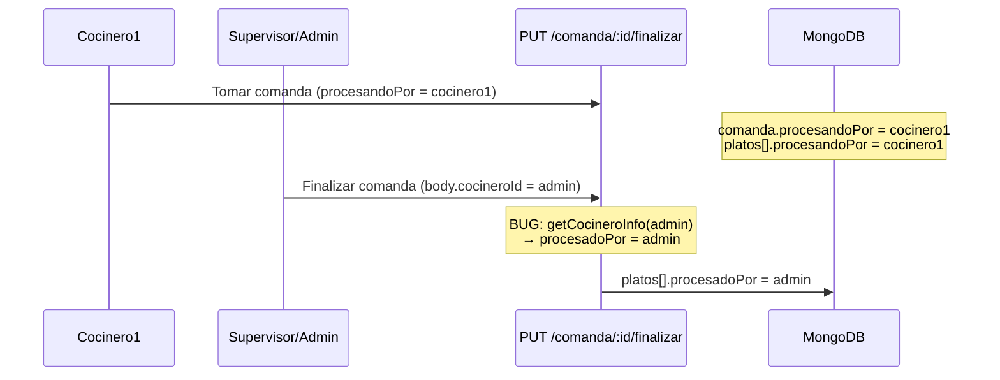

# Análisis: Finalizar comanda (tarjeta) atribuye al supervisor/admin en vez del cocinero

**Fecha:** 9 julio 2026  
**Estado:** Causa raíz identificada y corregida en backend  
**Síntoma:** En vista supervisor, al finalizar la **tarjeta de comanda** (no plato a plato), los platos quedan con `procesadoPor` = admin/supervisor. Debería quedar el **cocinero1** que tomó la comanda.

---

## 1. Veredicto

| Pregunta | Respuesta |
|----------|-----------|
| ¿App cocina o backend? | **Backend** |
| ¿Dónde? | `PUT /api/comanda/:id/finalizar` en `procesamientoController.js` |
| ¿La app manda mal el ID? | No: manda `userId` del supervisor (correcto para *quién pulsó*). El bug es que el backend **usa ese ID como `procesadoPor`**. |
| ¿Finalizar plato suelto tiene el mismo bug? | **No** — ahí ya se atribuye al cocinero que tomó el plato |

---

## 2. Flujo que reproduce el bug



1. Cocinero1 toma la **comanda completa** (tarjeta).
2. Supervisor/admin, en vista supervisor, selecciona la comanda y pulsa **Finalizar**.
3. App envía `finalizarComanda(comandaId, userId)` con el ID del supervisor.
4. Backend permite el override (OK), pero escribe `procesadoPor` con el supervisor (BUG).
5. En mozos.html / rendimiento / KDS se ve “admin” como cocinero de los platos.

---

## 3. Comparación: plato vs comanda

### Finalizar plato — correcto

```javascript
// PUT .../plato/:platoId/finalizar
if (plato.procesandoPor.cocineroId !== cocineroId && esSupervisor) {
  cocineroAtribuidoId = plato.procesandoPor.cocineroId; // ← titular
  // finalizadoPor = supervisor
}
procesadoPor = getCocineroInfo(cocineroAtribuidoId);
```

### Finalizar comanda — bug (antes del fix)

```javascript
// PUT .../comanda/:id/finalizar
if (comanda.procesandoPor.cocineroId !== cocineroId && esSupervisor) {
  // Solo loggea — NO cambia a quién se atribuye
}
const cocineroInfo = await getCocineroInfo(cocineroId); // ← ID del supervisor
platos[i].procesadoPor = { ...cocineroInfo };           // ← BUG
```

---

## 4. Evidencia en app (no es la causa)

`comandastyle.jsx` / `ComandaStyleSupervi.jsx`:

```javascript
await finalizarComanda(comandaId, userId); // userId = quien está logueado
```

Eso es esperado: el body indica **quién ejecuta**. La atribución de preparación debe resolverse en backend con `procesandoPor` del titular.

---

## 5. Fix aplicado

En `PUT /comanda/:id/finalizar`:

| Campo | Valor correcto |
|-------|----------------|
| `procesadoPor` | Cocinero de `plato.procesandoPor` o, si falta, `comanda.procesandoPor` |
| `finalizadoPor` | Supervisor/admin que pulsó Finalizar (solo en override) |
| Contador `incrementarPlatosPreparados` | Al cocinero atribuido, no al supervisor |
| Socket `emitComandaFinalizada` | Info del cocinero atribuido |

---

## 6. Cómo probar

1. Reiniciar backend.
2. Cocinero1 toma una comanda completa.
3. En vista supervisor, finalizar esa tarjeta de comanda.
4. Verificar en BD / modal Ver completo / rendimiento: `procesadoPor` = cocinero1; `finalizadoPor` = supervisor/admin.
5. Control: finalizar un plato suelto como supervisor → sigue atribuyendo al cocinero (sin regresión).
