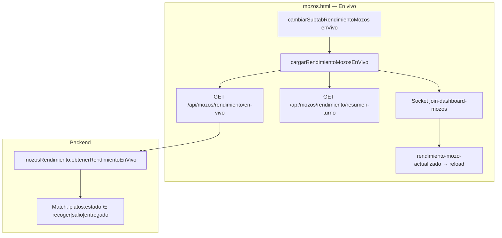
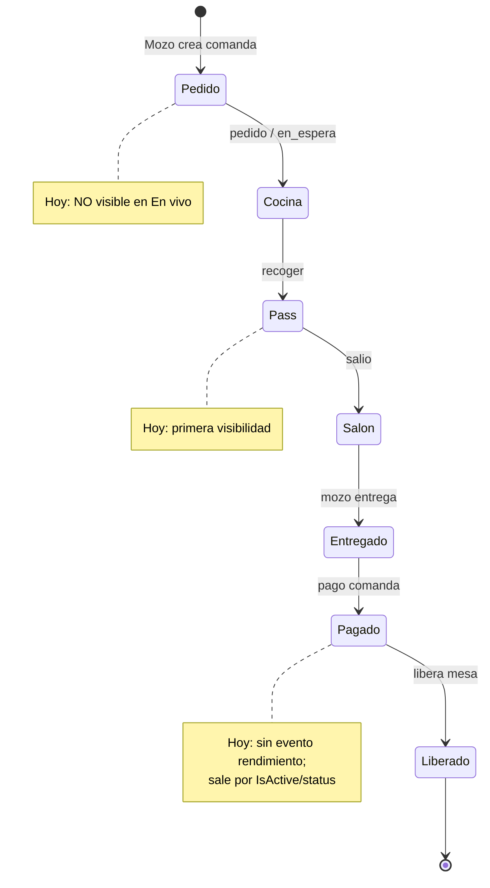

# Análisis y plan: Rendimiento en vivo no muestra pedidos del mozo

**Versión:** 1.0  
**Fecha:** 9 julio 2026  
**Estado:** MVP implementado (Opción A — ciclo abierto, método mínimo)  
**Implementado:** 9 julio 2026 — filtro ampliado + sockets en `emitNuevaComanda` / `emitComandaActualizada` / `emitMesaActualizada`  
**Síntoma reportado:** En `mozos.html` → Rendimiento → **En vivo**, al crear un pedido desde la app de mozos **no aparece** la comanda en la tabla.  
**Expectativa de negocio:** El en vivo debe mostrar **todas las acciones del mozo** desde que **agrega el pedido** hasta que **libera la mesa** tras completar el pago de la comanda.  
**Referencia previa:** [`PLAN_RENDIMIENTO_MOZOS_MOZOS_HTML.md`](./PLAN_RENDIMIENTO_MOZOS_MOZOS_HTML.md) (v1.1 — alcance original más estrecho)

---

## 1. Resumen ejecutivo

No es un fallo de socket ni de permisos en el caso típico. El panel **sí funciona**, pero con un **criterio de inclusión demasiado estrecho**:

| Qué espera el negocio | Qué hace el código hoy |
|-----------------------|------------------------|
| Ver la comanda **desde que el mozo la crea** (`pedido` / `en_espera`) | Solo incluye comandas con al menos un plato en `recoger`, `salio` o `entregado` |
| Seguirla hasta **pago + liberación de mesa** | Al pagar, la comanda suele salir del snapshot (`IsActive` / `status: pagado`) sin evento de rendimiento |
| Refresco al crear pedido | `emitRendimientoMozoActualizado` **no se dispara** al crear comanda |

**Conclusión:** Si el mozo solo “hace un pedido”, los platos quedan en `pedido`/`en_espera` → el API devuelve lista vacía → UI muestra *“Sin comandas activas en salón.”* Eso es coherente con el filtro actual, **no** con la expectativa de negocio.

---

## 2. Reproducción del síntoma

1. Abrir admin → `mozos.html` → **Rendimiento** → sub-tab **En vivo**.
2. En la app de mozos, un mozo crea/envía una comanda a una mesa.
3. En el panel: KPIs en 0 (o sin cambio) y mensaje vacío.
4. (Opcional) Pulsar **Actualizar** o esperar auto-refresh / socket → sigue vacío.

**Condición para que *sí* aparezca hoy:** cocina debe marcar al menos un plato como `recoger` o `salio` (o el mozo ya entregó algo y aún hay platos en esos estados).

---

## 3. Arquitectura actual (qué hay implementado)



| Capa | Archivo | Rol |
|------|---------|-----|
| UI | `public/mozos.html` | Sub-tab En vivo, KPIs, lista por mozo, auto-refresh, socket |
| API | `controllers/mozosController.js` | `GET .../rendimiento/en-vivo`, `/resumen-turno`, `/historial` |
| Query | `repository/mozosRendimiento.repository.js` | `obtenerRendimientoEnVivo()` |
| Socket | `socket/events.js` | `emitRendimientoMozoActualizado` → room `dashboard-mozos` |
| Emisores | `comandaController.js` | Solo en cambio de estado de plato y `salir-cocina` |

---

## 4. Causa raíz (código)

### 4.1 Filtro del snapshot en vivo — causa principal

En `mozosRendimiento.repository.js` → `obtenerRendimientoEnVivo`:

```javascript
const match = {
  IsActive: true,
  'platos.estado': { $in: ['recoger', 'salio', 'entregado'] },
  'platos.eliminado': { $ne: true },
  'platos.anulado': { $ne: true }
};
```

Luego, al armar la respuesta, **vuelve a filtrar** platos activos solo a esos tres estados:

```javascript
const platosActivos = (c.platos || []).filter(p =>
  !p.eliminado && !p.anulado &&
  ['recoger', 'salio', 'entregado'].includes(p.estado)
);
```

| Estado del plato al crear pedido | ¿Entra al en vivo? |
|----------------------------------|--------------------|
| `pendiente` | ❌ |
| `pedido` | ❌ |
| `en_espera` | ❌ |
| `recoger` | ✅ |
| `salio` | ✅ |
| `entregado` | ✅ (parcial; ver §4.4) |
| `pagado` | ❌ |

El mensaje de UI *“Sin comandas activas en salón”* refleja este diseño (fase salón), no el ciclo completo del mozo.

### 4.2 Socket no se emite al crear el pedido

`POST /comanda` emite `emitNuevaComanda`, pero **no** `emitRendimientoMozoActualizado`.

`emitRendimientoMozoActualizado` solo se llama desde:

| Origen | Cuándo |
|--------|--------|
| `PUT .../plato/:platoId/estado` | Tras cambiar estado (p. ej. → `entregado`) |
| `PUT .../salir-cocina` | Plato → `salio` |

Por tanto, aunque se ampliara el filtro, **crear un pedido no refrescaría** el panel hasta un poll manual o otro evento.

### 4.3 Socket no se emite al pagar / liberar mesa

Al completar pago y liberar mesa (flujo de tickets / aprobación), se actualiza `status` / `IsActive` de la comanda, pero **no** hay emisión a `dashboard-mozos`. El panel puede quedar mostrando una comanda “fantasma” hasta el siguiente refresh manual, o no enterarse del cierre.

### 4.4 Desalineación con el plan original vs. negocio

El plan v1.1 (`PLAN_RENDIMIENTO_MOZOS_MOZOS_HTML.md`) definió el en vivo como **operación de salón** (pass → entrega):

- Aparece al pasar a `salio`
- Sale al pasar a `entregado` (y entra al registro)

La expectativa actual del negocio es más amplia:

```text
Crear pedido  →  cocina  →  pass  →  entrega  →  pago  →  liberar mesa
     ▲______________________________________________________________▲
                    Debe verse en "En vivo"
```

Eso es un **cambio de producto**, no solo un bug de UI.

### 4.5 Otros riesgos secundarios (no explican el vacío al crear)

| Riesgo | Impacto | Notas |
|--------|---------|-------|
| Filtro `filtroMozoRendimiento` en UI | Puede ocultar al mozo correcto | Verificar que esté en “Todos los mozos” |
| Permisos `ver-reportes` / `ver-mozos` | 403 → lista vacía por catch | Revisar Network si aplica |
| `comanda.mozos` null | Agrupa en `desconocido` | Pedido sin mozo asignado |
| Solo `entregado` sin `recoger`/`salio` | Puede seguir en snapshot | Criterio de salida incompleto vs. pago/liberación |
| Campo `cocinerosActivos` en respuesta en vivo | Naming confuso | Es count de mozos con comandas; no bloquea |

---

## 5. Ciclo de vida esperado vs. implementado



| Hito | Visible hoy | Debe ser visible (negocio) | Evento socket hoy |
|------|-------------|----------------------------|-------------------|
| Mozo agrega / envía pedido | ❌ | ✅ | ❌ rendimiento |
| Plato en cocina (`pedido`/`en_espera`) | ❌ | ✅ | ❌ / parcial vía otros sockets |
| Aviso `recoger` | ✅ | ✅ | ✅ si cambia estado |
| `salio` (agarrable) | ✅ | ✅ | ✅ |
| `entregado` | ✅ (si aún match) | ✅ hasta pago | ✅ |
| `pagado` / mesa liberada | ❌ (sale del match) | ✅ último frame o salida limpia | ❌ |

---

## 6. Plan de corrección

### Principio rector

**En vivo = comandas activas del mozo en el turno**, desde creación hasta liberación post-pago.  
**Registro (historial)** = comandas ya cerradas / entregadas en rango de fechas (se mantiene; no mezclar con en vivo).

### Fase 0 — Validación rápida (sin código)

1. En Network, llamar `GET /api/mozos/rendimiento/en-vivo` justo después de crear el pedido → confirmar `mozos: []`.
2. En Mongo, verificar la comanda: `platos[].estado` ∈ `pedido`/`en_espera` y `mozos` = ObjectId del mozo.
3. Avanzar un plato a `salio` desde cocina → confirmar que **entonces** aparece.  
   → Si 1–3 se cumplen, el diagnóstico de §4 queda cerrado.

### Fase 1 — Ampliar criterio de inclusión (backend) — **P0**

**Archivo:** `src/repository/mozosRendimiento.repository.js`

Nuevo match sugerido para en vivo:

```javascript
const match = {
  IsActive: true,
  mozos: { $ne: null },
  status: { $nin: ['pagado', 'completado', 'cancelado'] },
  'platos.eliminado': { $ne: true },
  'platos.anulado': { $ne: true },
  // Al menos un plato activo no pagado (ciclo abierto)
  'platos.estado': {
    $in: ['pendiente', 'pedido', 'en_espera', 'recoger', 'salio', 'entregado']
  }
};
```

Cambios asociados:

| Cambio | Detalle |
|--------|---------|
| Devolver **todos** los platos activos de la comanda | No filtrar solo `recoger|salio|entregado` en el `$map` / post-filtro |
| KPIs | `pendientesSalio` / `pendientesRecoger` se mantienen; añadir p. ej. `comandasEnCurso`, `platosEnCocina` |
| Agrupación | Seguir por `comanda.mozos` |
| Límite | Mantener `$limit: 200` o subir si el salón es grande |

**Criterio de salida del en vivo:**

- Comanda `status ∈ {pagado, completado, cancelado}` **o**
- `IsActive === false` tras liberación de mesa **o**
- Todos los platos activos en `pagado` (si el flujo marca platos así antes del status)

### Fase 2 — Emitir socket en todo el ciclo — **P0**

Emitir `global.emitRendimientoMozoActualizado({ tipo, mozoId, comandaId, ... })` en:

| Evento | Tipo sugerido | Archivo / flujo |
|--------|---------------|-----------------|
| Comanda creada | `comanda_creada` | `POST /comanda` tras `emitNuevaComanda` |
| Platos agregados a comanda existente | `platos_agregados` | endpoints de agregar platos |
| Cambio estado plato | ya existe | `comandaController` |
| `salir-cocina` | ya existe | `comandaController` |
| Pago / ticket aprobado / mesa liberada | `comanda_cerrada` / `mesa_liberada` | `ticketAprobacion.repository` / `boucherPagoService` / cierre mesa |

En UI (`mozos.html`): el listener actual ya recarga en vivo; solo asegurar debounce (ya ~500 ms) y que `autoRefresh` esté ON.

### Fase 3 — Ajustes de UI en En vivo — **P1**

| Ajuste | Motivo |
|--------|--------|
| Cambiar copy vacío: *“Sin comandas activas del equipo”* (no solo “en salón”) | Alinea expectativa |
| Badges para `pedido` / `en_espera` / `pendiente` / `pagado` | Ya hay helpers; verificar cobertura |
| KPI “Comandas en curso” | Visibilidad inmediata al crear pedido |
| Fase visual: Cocina / Pass / Salón / Cobro | Opcional; mejora lectura |
| Timers | Cocina desde `pedido`/`en_espera`; mozo desde `salio` (como ahora) |

### Fase 4 — Registro vs En vivo — **P1**

| Vista | Incluye |
|-------|---------|
| **En vivo** | Ciclo abierto (Fase 1) |
| **Registro** | Histórico del día/rango; comandas con entregas o cerradas |

Revisar `obtenerHistorialComandasMozos` para que comandas solo en `pedido` **no** ensucien el registro (hoy el match `enCurso` ya exige `recoger|salio|entregado` — coherente).

### Fase 5 — Pruebas de aceptación — **P0**

| # | Caso | Resultado esperado |
|---|------|--------------------|
| 1 | Mozo crea comanda nueva | Aparece en En vivo en &lt; 2 s (socket o refresh) |
| 2 | Mozo agrega platos a comanda abierta | Lista de platos se actualiza |
| 3 | Cocina: `en_espera` → `recoger` → `salio` | Badges y KPIs cambian sin salir de la fila |
| 4 | Mozo marca `entregado` | Ratio entregados sube; comanda sigue visible |
| 5 | Pago completo + liberación mesa | Comanda **desaparece** del en vivo; queda en Registro si aplica |
| 6 | Filtro por mozo | Solo ese mozo |
| 7 | Auto-actualizar OFF | No recarga por socket; botón Actualizar sí |
| 8 | Dos mozos en paralelo | Dos bloques / comandas correctas |

---

## 7. Archivos a tocar

| Prioridad | Archivo | Cambio |
|-----------|---------|--------|
| P0 | `src/repository/mozosRendimiento.repository.js` | Ampliar match + devolver todos los platos activos |
| P0 | `src/controllers/comandaController.js` | Emitir rendimiento al crear / agregar platos |
| P0 | Flujos de pago/liberación (`ticketAprobacion.repository.js`, `boucherPagoService.js`, etc.) | Emitir `comanda_cerrada` / `mesa_liberada` |
| P1 | `public/mozos.html` | KPIs, copy, badges, opcional fase |
| P1 | `docs/PLAN_RENDIMIENTO_MOZOS_MOZOS_HTML.md` | Actualizar alcance: ciclo completo, no solo salón |
| — | App mozos | Sin cambios obligatorios si el backend emite bien |

---

## 8. Estimación y orden de trabajo

| Orden | Trabajo | Esfuerzo relativo |
|-------|---------|-------------------|
| 1 | Fase 0 validación en staging/prod | 15–30 min |
| 2 | Fase 1 filtro + respuesta completa | 0.5–1 d |
| 3 | Fase 2 sockets creación + cierre | 0.5–1 d |
| 4 | Fase 3 UI | 0.5 d |
| 5 | Fase 5 pruebas E2E salón | 0.5 d |

**MVP mínimo para desbloquear el reporte:** Fase 1 + emisión en `POST /comanda` + emisión al liberar mesa. Con eso, “el mozo hace un pedido y lo veo en vivo hasta que se libera” queda cubierto.

---

## 9. Decisión de producto (confirmar antes de codear)

El plan original limitaba el en vivo a **fase salón**. El negocio pide **ciclo completo**.

| Opción | Descripción | Recomendación |
|--------|-------------|---------------|
| **A — Ciclo completo** | Desde crear pedido hasta liberar post-pago | **Recomendada** (alineada al reporte) |
| **B — Dos sub-vistas** | “Cocina/pedido” + “Salón (pass)” | Más UI; útil si el panel se satura |
| **C — Mantener solo salón** | Documentar que hay que esperar a `salio` | Rechaza la expectativa actual |

**Propuesta:** implementar **Opción A** según este documento y actualizar el plan v1.1 para que no contradiga el comportamiento.

---

## 10. Checklist de implementación

- [ ] Confirmar Opción A (o B) con negocio
- [ ] Ampliar `obtenerRendimientoEnVivo` (match + platos completos + salida por pagado/liberado)
- [ ] Emitir socket en creación de comanda / alta de platos
- [ ] Emitir socket en pago / liberación de mesa
- [ ] Ajustar KPIs y copy en `mozos.html`
- [ ] Pruebas de aceptación §6 Fase 5
- [ ] Actualizar `PLAN_RENDIMIENTO_MOZOS_MOZOS_HTML.md` (alcance ciclo completo)

---

## 11. Veredicto

| Pregunta | Respuesta |
|----------|-----------|
| ¿Está roto el panel? | Parcialmente: funciona para fase salón; **no** para el ciclo que el negocio espera |
| ¿Por qué no vi el pedido del mozo? | Los platos estaban en `pedido`/`en_espera` y el API los excluye |
| ¿Hay que tocar la app de mozos? | No para el MVP; el gap está en backend + criterio de snapshot (+ sockets) |
| ¿Siguiente paso? | Fase 0 (confirmar en Network/Mongo) → Fase 1+2 (filtro + eventos) |

---

## 12. Implementación MVP (método mínimo — 9 jul 2026)

Enfoque elegido: **ampliar el snapshot + enganchar sockets en emisores centrales** (sin tocar cada flujo de pago/app).

| Cambio | Archivo |
|--------|---------|
| Match ciclo abierto (`pendiente`…`entregado`), excluye `pagado`/`completado`/`cancelado` | `mozosRendimiento.repository.js` |
| Devuelve todos los platos activos + KPIs `comandasEnCurso` / `platosEnCocina` | idem |
| `emitRendimientoMozoActualizado` desde `emitNuevaComanda` | `socket/events.js` |
| Idem desde `emitComandaActualizada` (alta platos, pago, cierre) | idem |
| Idem desde `emitMesaActualizada` si mesa → `libre`/`pagado` | idem |
| KPIs + copy vacío en En vivo | `public/mozos.html` |

**Cómo probar:** reiniciar backend → `mozos.html` → Rendimiento → En vivo → crear pedido en app mozos → debe aparecer de inmediato; al liberar mesa tras pago, debe desaparecer.

---

## 13. Fix modal Ver completo — cocinero asignado (9 jul 2026)

**Síntoma:** Al asignar cocinero en KDS, la columna Cocinero del modal Ver completo en `mozos.html` seguía en `—`.

**Causas:**
1. `getCocineroPlatoMozo` usaba `procesadoPor || procesandoPor`; Mongoose devuelve `procesadoPor: { nombre: null }` (truthy) y tapaba `procesandoPor`.
2. `emitPlatoProcesando` / `emitComandaProcesando` solo iban a cocina/mozos, no al namespace `/admin`, así que el modal no se refrescaba en vivo.

**Fix:**
- Helper alineado a `comandas.html` (solo alias/nombre no vacíos) + limpieza en `normalizarComandaMozo`.
- Emitir `plato-procesando` / `plato-liberado` / `comanda-procesando` a `/admin` + `emitRendimientoMozoActualizado`.
- Escuchar esos eventos en `initSocketRendimientoMozo` y recargar el modal abierto.
