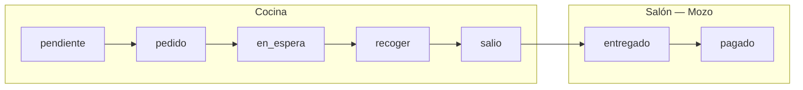

# Plan: Rendimiento en vivo y registro de platos en `mozos.html`

**Versión:** 1.1  
**Fecha:** Julio 2026  
**Proyecto:** Dashboard (`backend-gambusinas/public/mozos.html`) + App Mozos (`gambusinas`) + API  
**Estado:** Planificación — sin implementar  
**Referencia:** [`PLAN_RENDIMIENTO_COCINEROS_COCINEROS_HTML.md`](./PLAN_RENDIMIENTO_COCINEROS_COCINEROS_HTML.md) · [`comandas.html`](../public/comandas.html) (modal Ver comanda) · implementación parcial en [`cocineros.html`](../public/cocineros.html)

---

## Resumen ejecutivo

Extender **`mozos.html`** con una vista operativa de **rendimiento en vivo** y un **registro de platos en tabla**, alineada con lo que ya existe en `cocineros.html` (sub-tabs *En vivo* / *Registro de platos*), pero centrada en la responsabilidad del mozo: **recoger platos del pass y entregarlos al comensal**.

| Objetivo | Descripción |
|----------|-------------|
| **Vista en vivo** | Platos pendientes de recoger (`salio`) y en tránsito, agrupados por mozo, con temporizadores desde que salieron de cocina |
| **Registro por comanda** | Tabla donde **cada fila es una comanda** del mozo, mostrando **todos sus platos** y el avance por estado |
| **Tiempos cocina vs mozo** | Por comanda: tiempo en cocina, tiempo de atención del mozo y **diferencia** entre ambos |
| **Ver completo** | Botón por fila → modal con detalle completo de la comanda **en tiempo real** (patrón `comandas.html`) |
| **Métricas de servicio** | Tiempo pass → entrega, SLA de salón, ranking por mozo |
| **Coherencia visual** | Mismo estilo dark + gold + cards que `mozos.html` y `cocineros.html` |
| **Fuente de verdad** | Comandas + `tiempos.salio` / `tiempos.entregado` + atribución al mozo |

La sección **Rendimiento** actual de `mozos.html` (ventas, propinas, heatmap, gráficos Chart.js) **se mantiene**; el nuevo bloque se añade como sub-sección operativa dentro de Rendimiento o como cuarto tab dedicado (*Operación en vivo*).

---

## 1. Contexto — qué existe hoy

### 1.1 `mozos.html` (dashboard)

| Elemento | Estado actual |
|----------|---------------|
| Secciones | Principal · Rendimiento · Meta |
| Rendimiento | KPIs de tickets, ranking ventas/propinas, gráficos, heatmap de productividad por hora |
| Datos | `GET /api/propinas/mozos-dashboard`, bouchers, catálogo de mozos |
| Socket | `mozo-rendimiento-update` (ventas/propinas), `mozos-conectados` |
| Estilo | Tailwind + Alpine, cards `mozos-kpi-card`, acentos gold |
| Registro de platos | **No existe** |

### 1.2 `cocineros.html` — patrón a replicar

El tab **Rendimiento en vivo** ya implementado en cocineros incluye:

| Sub-tab | Contenido |
|---------|-----------|
| **En vivo** | KPIs turno, platos en curso por cocinero, timers, socket `rendimiento-cocinero-actualizado` |
| **Registro de platos** | KPIs resumen, filtros (cocinero, fecha, búsqueda), vista Detalle (tabla) y Resumen (por cocinero / por plato) |
| API | `GET /api/cocineros/rendimiento/en-vivo`, `/resumen-turno`, `/historial` |

La tabla de detalle en cocineros muestra:

| Columna | Significado cocinero |
|---------|---------------------|
| Estado | `EN CURSO` / `LISTO` |
| Cocinero | Quién tomó el plato |
| Plato | Nombre + categoría |
| Comanda | `#comandaNumber` |
| Mesa | `M{nummesa}` |
| Tomado | `procesandoPor.timestamp` |
| Entregado | `tiempos.recoger` |
| Tiempo total | Tomado → listo |

### 1.3 Catálogo completo de estados de plato

El sistema maneja **siete estados** de plato. La tabla y el modal deben representarlos todos con badge y color coherentes (reutilizar `estadoLabel` / clases de `comandas.html`):

| Estado | Fase | Responsable | Visible para mozo | Acción del mozo |
|--------|------|-------------|-------------------|-----------------|
| `pendiente` | Pre-cocina | Sistema | Sí (informativo) | Ninguna — aún no enviado |
| `pedido` | Cocina | Cocina | Sí | Ninguna — en preparación |
| `en_espera` | Cocina | Cocina | Sí | Ninguna — en cola KDS |
| `recoger` | Pass | Cocina | Sí | **Solo aviso** RECOGER — no agarrable |
| `salio` | Salón | Cocina → Mozo | Sí | **Puede agarrar** y marcar entregado |
| `entregado` | Salón | Mozo | Sí | Confirmado al comensal |
| `pagado` | Caja | Mozo/Cajero | Sí | Cerrado operativamente |

Estados excluidos de conteos: platos con `eliminado: true` o `anulado: true`.



### 1.4 Flujo operativo del mozo (estados relevantes)

| Estado | Significado para el mozo |
|--------|--------------------------|
| `recoger` | Plato listo; **solo aviso** — aún no salió del pass |
| `salio` | Plato **disponible para agarrar** del pass |
| `entregado` | Mozo **agarró y entregó** al comensal |

**Definición de negocio — “plato que agarra el mozo”:**

Un plato cuenta como **agarrado por el mozo** cuando pasa a `entregado`. El momento en que quedó disponible para recoger es `tiempos.salio`.

**Unidad de la tabla — la comanda completa:**

Cada fila del registro representa **una comanda asignada al mozo** (`comanda.mozos`), no un plato suelto. Dentro de la fila se listan **todos los platos** de esa comanda con su estado individual (ej. `3/5 entregados · 1 salió · 1 recoger`). El mozo atiende la comanda como un todo; las métricas de tiempo se calculan a nivel comanda y se desglosan por plato en el modal.

### 1.5 Modelo de datos relevante (`comanda.model.js`)

```javascript
// A nivel comanda
mozos: ObjectId          // Mozo asignado a la comanda
mozoNombre: String       // Desnormalizado

// A nivel plato
estado: 'recoger' | 'salio' | 'entregado' | ...
tiempos: {
  recoger: Date,   // Cocina marcó listo
  salio: Date,     // Cocina confirmó salida del pass
  entregado: Date  // Mozo confirmó entrega
}
```

**Campos que existen en cocineros pero NO en mozos (gap):**

| Campo cocinero | Equivalente mozo | Estado |
|----------------|------------------|--------|
| `procesandoPor` | — | No aplica |
| `procesadoPor` | **`entregadoPor`** (propuesto) | **No existe** |
| Atribución al tomar | Atribución al entregar | Solo `comanda.mozos` hoy |

### 1.6 Deuda detectada

| # | Problema | Impacto |
|---|----------|---------|
| 1 | No hay `entregadoPor` en el subdocumento `platos` | No se sabe con certeza **qué mozo** entregó si la comanda tiene mozo distinto al que ejecutó la acción |
| 2 | `cambiarEstadoPlato` no persiste `usuarioId` del mozo en el plato | El historial de estados de comanda tiene `usuario: null` en muchos casos |
| 3 | Sin endpoints `/api/mozos/rendimiento/*` | Imposible cargar registro desde el dashboard |
| 4 | Sin socket `rendimiento-mozo-actualizado` | Solo refresh manual |
| 5 | Sección Rendimiento de `mozos.html` es 100 % comercial | No hay vista operativa de platos en pass / entregados |
| 6 | Registro cocineros es **por plato**; mozos necesita **por comanda** | Hay que diseñar agregación distinta en API |
| 7 | Sin modal de detalle ni socket en modal | No hay “ver comanda en vivo” desde mozos.html |

---

## 2. Definición de métricas

### 2.1 Métricas por plato (detalle en modal)

| Métrica | Fórmula | Uso |
|---------|---------|-----|
| **Tiempo de entrega (mozo)** | `tiempos.entregado − tiempos.salio` | SLA salón, fila de plato en modal |
| **Espera en pass** | `tiempos.salio − tiempos.recoger` | Diagnóstico: plato listo pero cocina no lo sacó |
| **Tiempo cocina (plato)** | `tiempos.recoger − tiempos.en_espera` (o `procesadoPor.tomadoEn → recoger`) | Columna cocinero en modal |
| **Tiempo total salón** | `tiempos.entregado − tiempos.recoger` | Desde “listo” hasta “entregado” |

### 2.2 Métricas por comanda (columnas principales de la tabla)

Estas métricas son el **corazón del registro** pedido por negocio: cuánto tardó cocina vs cuánto tardó el mozo en atender la comanda completa.

| Métrica | Fórmula | Descripción |
|---------|---------|-------------|
| **Tiempo cocina (comanda)** | `max(platos.tiempos.recoger) − min(platos.tiempos.en_espera \| pedido)` sobre platos activos | Desde que entró a cocina hasta que el **último** plato quedó listo (`recoger`) |
| **Tiempo mozo (comanda)** | `max(platos.tiempos.entregado) − min(platos.tiempos.salio)` sobre platos con `salio` | Desde que el **primer** plato salió del pass hasta que el **último** fue entregado |
| **Diferencia cocina ↔ mozo** | `tiempoMozoComanda − tiempoCocinaComanda` | Cuánto más (o menos) tardó la atención de salón respecto a cocina. Positivo = mozo/salón sumó tiempo después de cocina |
| **Tiempo experiencia total** | `max(entregado) − min(pedido \| en_espera)` | Recorrido completo del cliente |
| **Gap pass (comanda)** | Suma o promedio de `(salio − recoger)` por plato | Tiempo muerto entre “listo” y “salió del pass” |

**Reglas de cálculo:**

- Si la comanda está **en curso** (hay platos en `salio` o `recoger` sin entregar), `tiempoMozoComanda` usa `Date.now()` como fin provisional para platos pendientes.
- Si ningún plato tiene `tiempos.salio`, `tiempoMozoComanda` = `null` (comanda aún no llegó a fase mozo).
- La columna **Diferencia** en la tabla muestra valor firmado, ej. `+4m 12s` (mozo más lento que cocina) o `−1m 05s` (mozo más rápido que el bloque cocina).

### 2.3 Métricas agregadas (KPIs y ranking)

| Métrica | Fórmula | Uso |
|---------|---------|-----|
| **Platos entregados (período)** | Count platos `entregado` con `tiempos.entregado` en rango | KPI |
| **Comandas atendidas (período)** | Count comandas con al menos un plato entregado en rango | KPI tabla |
| **Platos pendientes de agarrar (ahora)** | Count platos `estado = salio` | Vista en vivo |
| **Platos en aviso RECOGER** | Count platos `estado = recoger` | Informativo |

### 2.4 SLA configurable (salón)

| Parámetro | Default sugerido | Notas |
|-----------|------------------|-------|
| SLA entrega mozo | **5 min** | Desde `salio` hasta `entregado` |
| SLA amarillo | 3 min | Timer amarillo en vista en vivo |
| SLA rojo | 5 min | Timer rojo + `animate-pulse` |

Ubicación futura: `configLocal.mozos.slaEntregaMinutos` o meta por mozo en `metaMozo`.

### 2.5 Atribución al mozo

| Escenario | Regla |
|-----------|-------|
| Mozo de la comanda entrega el plato | `entregadoPor` = mozo autenticado (`req.userId`) |
| Otro mozo entrega (cobertura) | `entregadoPor` = quien ejecutó; opcional `comanda.mozos` como “mozo titular” |
| Datos legacy sin `entregadoPor` | Fallback: `comanda.mozos` + `mozoNombre` |
| Admin entrega desde panel | `entregadoPor.rol = 'admin'`; excluir de ranking o bucket “Staff” |

---

## 3. Registro de datos — qué capturar

### 3.1 Campo nuevo en `platos` (recomendado fase 1)

```javascript
entregadoPor: {
  mozoId: { type: ObjectId, ref: 'mozos', default: null },
  nombre: { type: String, default: null },
  timestamp: { type: Date, default: null }  // = tiempos.entregado (redundante pero útil)
}
```

Escribir en `PUT /comanda/:id/plato/:platoId/estado` cuando `nuevoEstado === 'entregado'`, usando `req.userId` y nombre del mozo desde BD.

### 3.2 Eventos que disparan actualización

| Evento | Origen | Acción en dashboard |
|--------|--------|---------------------|
| Plato → `salio` | Cocina (`salir-cocina`) | Aparece en “Pendientes de agarrar” |
| Plato → `entregado` | App mozos | Sale de en vivo; entra al registro |
| `plato-actualizado` / `plato-entregado` | Socket `/mozos` y `/admin` | Refrescar snapshot (debounce 500 ms) |
| Reversión `entregado → salio` (si existe) | Admin | Quitar del registro finalizado |

---

## 4. Backend — cambios propuestos

### 4.1 Nuevo repository: `mozosRendimiento.repository.js` (o extender `mozos.repository.js`)

Funciones principales:

| Función | Descripción |
|---------|-------------|
| `obtenerRendimientoEnVivo({ mozoId?, zonaId? })` | Comandas activas del mozo con **todos los platos** y conteo por estado |
| `obtenerResumenTurnoMozos()` | KPIs del día: pendientes, entregados, % SLA, mozos activos |
| `obtenerHistorialComandasMozos({ mozoId, fechaInicio, fechaFin, limite })` | Registro **por comanda** para tabla (no por plato suelto) |
| `calcularMetricasComanda(platos[])` | Helper: `tiempoCocina`, `tiempoMozo`, `diferencia`, resumen estados |

**Criterio de inclusión en historial — agrupado por comanda:**

```javascript
$match: {
  IsActive: true,
  mozos: mozoId || { $ne: null },
  // Comanda entra al registro si tiene al menos un plato en fase salón
  // o si todos los platos ya fueron entregados en el período
  $or: [
    { 'platos.estado': { $in: ['recoger', 'salio', 'entregado', 'pagado'] } },
    { 'platos.tiempos.entregado': { $gte: desde, $lte: hasta } }
  ]
}
// Post-agrupación: una fila por comandaId con platos[] embebido
```

Cada registro de comanda incluye:

```javascript
{
  comandaId, comandaNumber, mesaNum, mozoId, mozoNombre,
  statusComanda,                          // en_espera | recoger | salio | entregado | ...
  estadoRegistro: 'en_curso' | 'completada',
  platos: [{ platoId, platoNombre, estado, tiempos, entregadoPor, procesadoPor, ... }],
  resumenEstados: { pendiente: 0, pedido: 1, en_espera: 0, recoger: 1, salio: 1, entregado: 2, pagado: 0 },
  platosEntregados: 2,
  platosTotal: 5,
  tiempoCocinaSegundos,
  tiempoMozoSegundos,
  diferenciaSegundos,                     // mozo − cocina
  tiempoExperienciaSegundos
}
```

### 4.2 Nuevos endpoints

| Método | Ruta | Permiso | Descripción |
|--------|------|---------|-------------|
| `GET` | `/api/mozos/rendimiento/en-vivo` | `ver-reportes` \| `ver-mozos` | Snapshot platos pendientes + resumen |
| `GET` | `/api/mozos/rendimiento/resumen-turno` | `ver-reportes` | KPIs agregados del día |
| `GET` | `/api/mozos/rendimiento/historial` | `ver-reportes` | Registro de **comandas** atendidas (tabla principal) |
| `GET` | `/api/comanda/:id` | existente | Detalle completo para modal **Ver completo** (reutilizar) |

Query params de `/historial` (igual que cocineros):

- `mozoId` — filtrar por mozo
- `desde`, `hasta` — rango (default: hoy)
- `limite` — default 200, máx 1000

### 4.3 Fix en `comandaController` — persistir `entregadoPor`

Pseudológica al marcar `entregado`:

```javascript
if (nuevoEstado === 'entregado' && usuarioId) {
  const mozoInfo = await mozosRepository.obtenerMozosPorId(usuarioId);
  setFields[`platos.${idx}.entregadoPor`] = {
    mozoId: usuarioId,
    nombre: mozoInfo?.name || mozoInfo?.nombres || 'Mozo',
    timestamp: momento
  };
}
```

Emitir además:

```javascript
global.emitRendimientoMozoActualizado?.({
  tipo: 'plato_entregado',
  mozoId: usuarioId,
  comandaId: id,
  platoId
});
```

### 4.4 Socket — room dashboard mozos

| Evento | Room | Payload |
|--------|------|---------|
| `join-dashboard-mozos` | `dashboard-mozos` | — |
| `rendimiento-mozo-actualizado` | `dashboard-mozos` | `{ tipo, mozoId?, comandaId?, platoId? }` |

Emitir desde: cambio estado `salio` / `entregado`, `salir-cocina`.

### 4.5 Índices MongoDB (recomendado)

```javascript
{ 'platos.entregadoPor.mozoId': 1, 'platos.tiempos.entregado': -1 }
{ 'platos.estado': 1, 'platos.tiempos.salio': -1 }
{ mozos: 1, 'platos.estado': 1 }
```

---

## 5. UI — `mozos.html`

### 5.1 Ubicación en la navegación

**Opción A (recomendada):** Dentro de la sección **Rendimiento** existente, añadir sub-tabs al inicio:

```
[ 📈 Comercial ] [ ⚡ En vivo ] [ 📋 Registro de platos ]
```

- **Comercial** = contenido actual (ranking ventas, gráficos, heatmap).
- **En vivo** / **Registro** = nuevo bloque operativo.

**Opción B:** Cuarto tab principal: `Operación en vivo` (más visible, pero fragmenta Rendimiento).

### 5.2 Wireframe — sub-tab En vivo

Agrupa por **mozo**, y dentro de cada mozo lista **comandas activas** con resumen de platos (no platos sueltos):

```
┌─────────────────────────────────────────────────────────────────────────────┐
│  KPIs turno                                                                 │
│  ┌──────────┐ ┌──────────┐ ┌──────────┐ ┌──────────┐                     │
│  │ Pendientes│ │ Entregados│ │ SLA eq.  │ │ Comandas │                     │
│  │  salio: 8 │ │ hoy: 142 │ │   91%    │ │ activas 6│                     │
│  └──────────┘ └──────────┘ └──────────┘ └──────────┘                     │
├─────────────────────────────────────────────────────────────────────────────┤
│  Filtro: [ Todos los mozos ▼ ]     Auto-actualizar ● ON    🔄 Actualizar   │
├─────────────────────────────────────────────────────────────────────────────┤
│  ┌─ Carlos R. ──────────────── foto ── 2 comandas · 28 platos hoy ────────┐ │
│  │  #1087 · M12 · 3/5 entregados                                            │ │
│  │    LOMO SALTADO [salio] ⏱02:45 · CAUSA [recoger] · ARROZ [entregado]     │ │
│  │    T. cocina 11m · T. mozo 4m · Δ +4m                    [Ver completo]  │ │
│  │  #1090 · M7 · 0/2 entregados                                             │ │
│  │    CHICHARRÓN [recoger] · SOPA [pedido]                  [Ver completo]  │ │
│  └────────────────────────────────────────────────────────────────────────┘ │
└─────────────────────────────────────────────────────────────────────────────┘
```

### 5.3 Wireframe — sub-tab Registro de platos (tabla por comanda)

**Una fila = una comanda del mozo**, con todos sus platos visibles en la misma fila (resumen + chips de estado). A diferencia de `cocineros.html` (una fila por plato), aquí la unidad operativa es la **comanda completa**.

| Columna | Contenido |
|---------|-----------|
| **Estado** | Badge comanda: `EN CURSO` / `ENTREGANDO` / `COMPLETADA` según avance de platos |
| **Mozo** | Nombre + avatar |
| **Comanda** | `#comandaNumber` (clic opcional) |
| **Mesa** | `M{nummesa}` |
| **Platos** | Lista compacta de **todos** los platos: nombre + badge de estado (`pedido`, `recoger`, `salio`, `entregado`, etc.) + ratio `3/5` |
| **T. cocina** | `tiempoCocinaSegundos` de la comanda (MM:SS o Xm) |
| **T. mozo** | `tiempoMozoSegundos` (desde primer `salio` hasta último `entregado`) |
| **Δ vs cocina** | `diferenciaSegundos` con color: verde si mozo ≤ cocina, amarillo/rojo si suma demora |
| **Acciones** | Botón **Ver completo** → abre modal (§5.6) |

Ejemplo de fila en tabla:

```
| EN CURSO | Carlos R. | #1087 | M12 | Lomo[salio] Causa[recoger] Arroz[entregado] (2/3) | 11m 20s | 4m 05s | +4m 05s | [Ver completo] |
```

Vistas adicionales:

| Vista | Contenido |
|-------|-----------|
| **Detalle** | Tabla por **comanda** (filas descritas arriba) |
| **Resumen** | Por mozo (comandas, platos, T. promedio cocina/mozo, % SLA) · Por plato (veces entregado) |

KPIs del registro:

- Pendientes (`salio`)
- Entregados en período
- Tiempo promedio de entrega
- % SLA (≤ 5 min)
- Platos distintos

Filtros:

- Mozo (select)
- Fecha: Hoy · Ayer · 7 días · 30 días · Personalizado
- Búsqueda por nombre de plato

### 5.4 Estilo visual

Reutilizar tokens existentes de `mozos.html`:

| Elemento | Clases / tokens |
|----------|-----------------|
| Cards | `mozos-kpi-card` o `bg-bg-card border border-[rgba(212,175,55,0.25)]` |
| Mozo | Avatar circular, nombre `text-gold font-semibold` |
| Plato pendiente | `text-white font-bold`, mesa en chip `bg-st-libre/20` |
| Timer | `font-mono`; verde / `text-st-esperando` / `text-st-pagado animate-pulse` |
| Badge PENDIENTE | `bg-st-esperando/20 text-st-esperando` |
| Badge ENTREGADO | `bg-st-preparado/20 text-st-preparado` |
| Tabla | Misma estructura que cocineros (`thead bg-bg-sidebar`, hover rows) |

### 5.5 Modal **Ver completo** — comanda en tiempo real

Patrón de referencia: modal `verComanda` en [`comandas.html`](../public/comandas.html) (líneas ~609–915).

#### 5.5.1 Activación

- Botón **Ver completo** en cada fila de la tabla (y en cards de En vivo).
- Método `openComandaMozoModal(comandaId)` — análogo a `openDetailModal(c)` de comandas.

#### 5.5.2 Estructura del modal (reutilizar diseño)

| Bloque | Contenido | Fuente en comandas.html |
|--------|-----------|-------------------------|
| **Header sticky** | `Comanda #N` + badge estado comanda + mesa + mozo | Líneas 614–641 |
| **Loading** | Spinner mientras carga | Líneas 643–649 |
| **Info general** | Creada, enviada a cocina, preparada, mozo, observaciones | Líneas 654–684 |
| **Trazabilidad cocina** | Cocineros, T. promedio, T. total cocina (`getResumenCocineros`) | Líneas 685–710 |
| **Trazabilidad salón** (nuevo) | T. mozo comanda, T. cocina comanda, **Δ diferencia**, platos entregados/total | Nuevo bloque gold |
| **Tabla de platos** | **Todos** los platos con: nombre, cant., complementos, cocinero, T. cocina, T. mozo, **estado** (los 7 estados) | Líneas 713–811 |
| **Timeline** | Creada → En cocina → Preparado → Salió → Entregado → Pagado | Extender timeline de comandas con hito **Salió** |
| **Footer** | Cerrar (sin Editar en v1 — solo lectura para mozos) | Líneas 907–913 |

Ancho: `w-[840px] max-h-[90vh]`, mismas clases `bg-bg-card`, `border-gold/25`, `rounded-2xl`.

#### 5.5.3 Tiempo real en el modal

Replicar el patrón socket de `comandas.html`:

```javascript
// Al abrir modal
this.modalComandaMozo = 'verComanda';
this.loadingComandaMozo = true;
const detalle = await this.loadComandaDetalle(comandaId);  // GET /api/comanda/:id
this.selectedComandaMozo = this.normalizarComanda(detalle);

// Listeners (namespace /admin, ya usado en mozos.html)
this._socketAdmin.on('comanda-actualizada', (data) => {
  const comanda = data.comanda || data;
  if (this.selectedComandaMozo?._id === comanda._id) {
    this.selectedComandaMozo = this.normalizarComanda(comanda);
    this.recalcularMetricasComandaMozo();  // T. cocina, T. mozo, Δ
  }
});
this._socketAdmin.on('plato-actualizado', (data) => {
  if (data?.comanda && this.selectedComandaMozo?._id === data.comanda._id) {
    this.selectedComandaMozo = this.normalizarComanda(data.comanda);
    this.recalcularMetricasComandaMozo();
  }
});
```

Comportamiento esperado:

- Si cocina marca un plato `salio` mientras el modal está abierto → la fila del plato actualiza badge y timer **sin cerrar el modal**.
- Si el mozo entrega desde la app → plato pasa a `entregado` en vivo; actualiza ratio `3/5` → `4/5` y métricas de comanda.
- Indicador visual “● En vivo” en el header del modal cuando `socketLive === true`.

#### 5.5.4 Tabla de platos dentro del modal — columnas

| Columna | Contenido |
|---------|-----------|
| Plato | Nombre, nota, badge para llevar |
| Cant. | Cantidad |
| Complementos | Chips |
| Cocinero | `procesadoPor` / `procesandoPor` |
| T. cocina | `recoger − en_espera` (o timer en curso si `pedido`/`en_espera`) |
| T. mozo | `entregado − salio` (o timer desde `salio` si pendiente) |
| Estado | Badge con **todos** los estados: `pendiente`, `pedido`, `en_espera`, `recoger`, `salio`, `entregado`, `pagado` |

Reutilizar helpers de `comandas.html`: `estadoLabel()`, `getCocineroPlato()`, `getTiempoPreparacion()`, `getResumenCocineros()`.

#### 5.5.5 Bloque nuevo — Trazabilidad de Salón

Insertar debajo de “Trazabilidad de Cocina”:

```
┌─ 🍽️ Trazabilidad de Salón ─────────────────────────────────────────────┐
│  Platos entregados    3 / 5                                            │
│  Tiempo cocina        11m 20s                                          │
│  Tiempo mozo          4m 05s   (desde 1er salio → último entregado)  │
│  Diferencia           +4m 05s  (mozo sumó tiempo tras cocina)         │
│  Gap en pass (prom.)  1m 10s                                           │
└────────────────────────────────────────────────────────────────────────┘
```

### 5.6 Estado Alpine nuevo (`mozosExecutiveApp`)

```javascript
// Sub-sección dentro de Rendimiento
subtabRendimientoMozos: 'comercial', // 'comercial' | 'enVivo' | 'historial'

// En vivo
rendimientoMozosEnVivo: [],
resumenTurnoMozos: {},
rendimientoMozoLoading: false,
filtroMozoRendimiento: '',
autoRefreshRendimientoMozo: true,
rendimientoMozoTick: 0,
rendimientoMozoTimerInterval: null,

// Historial / registro (por comanda)
historialMozos: {
  comandas: [],           // filas de tabla — una por comanda
  pendientesCount: 0,
  resumen: { totalComandas: 0, totalEntregados: 0, tiempoPromedioCocinaSegundos: 0, tiempoPromedioMozoSegundos: 0, porcentajeDentroSLA: 0, porPlato: [], porMozo: [] }
},
historialMozoFiltro: '',
historialMozoFiltroFecha: 'hoy',
historialMozoFiltroPlato: '',       // filtra comandas que contengan plato
historialMozoVista: 'detalle',
historialMozoLoading: false,

// Modal Ver completo (patrón comandas.html)
modalComandaMozo: null,             // null | 'verComanda'
selectedComandaMozo: null,
loadingComandaMozo: false,
metricasComandaMozo: {},            // { tiempoCocina, tiempoMozo, diferencia, resumenEstados }
```

Métodos (paridad con `cocinerosApp`):

| Método | Responsabilidad |
|--------|-----------------|
| `cambiarSubtabRendimientoMozos(sub)` | Cambiar comercial / enVivo / historial |
| `cargarRendimientoMozosEnVivo()` | `GET /api/mozos/rendimiento/en-vivo` + resumen-turno |
| `cargarHistorialMozos()` | `GET /api/mozos/rendimiento/historial` |
| `initSocketRendimientoMozo()` | `join-dashboard-mozos` + listener |
| `startRendimientoMozoTick()` | Timers cada 1 s desde `tiempos.salio` |
| `getHistorialComandasFiltradas()` | Filtro local por nombre de plato (busca dentro de `comandas[].platos`) |
| `openComandaMozoModal(comandaId)` | Abre modal + `loadComandaDetalle` |
| `loadComandaDetalle(comandaId)` | `GET /api/comanda/:id` + `normalizarComanda` (copiar de comandas.html) |
| `recalcularMetricasComandaMozo()` | Calcula T. cocina, T. mozo, Δ en cliente |
| `formatTimer` / `getAlertaTimer` / `colorTiempoEntrega` / `colorDiferencia` | Helpers de tiempo |
| `estadoLabel` / `getCocineroPlato` | Reutilizar de comandas.html o extraer a `public/js/comanda-helpers.js` |

Al entrar a `activeSection === 'rendimiento'` y sub-tab `enVivo` o `historial`: cargar datos + socket.

---

## 6. Integración con App Mozos

| Aspecto | Estrategia |
|---------|------------|
| Acción que alimenta el registro | Mozo marca **Entregar** en platos `salio` → `entregado` |
| Autenticación | `req.userId` del token mozo → `entregadoPor` |
| Tiempo real en app | Sin cambios; el dashboard es solo lectura |
| Platos `recoger` | Mostrar en vivo como “Aviso” (sin timer de entrega), opcional fase 2 |
| Paridad | Mismos platos que ve el mozo en `ComandaDetalleScreen` en estado `salio` |

---

## 7. Permisos y seguridad

| Rol / permiso | Rendimiento comercial | En vivo | Registro de platos |
|---------------|----------------------|---------|-------------------|
| Admin | ✓ | ✓ | ✓ |
| `ver-reportes` | ✓ | ✓ | ✓ |
| `ver-mozos` | ✓ | ✓ (solo lectura) | ✓ (solo lectura) |
| Mozo (propio) | — | ✓ solo su bloque | ✓ solo sus entregas |

---

## 8. Fases de implementación

### Fase 1 — Datos y API (~2–3 días)

1. Añadir `entregadoPor` al schema `platos` en `comanda.model.js`.
2. Persistir `entregadoPor` en `PUT .../estado` → `entregado`.
3. Crear `obtenerHistorialComandasMozos` (agrupación **por comanda**) + `calcularMetricasComanda`.
4. Crear `obtenerRendimientoEnVivo` con comandas activas y todos los platos.
5. Endpoints `/api/mozos/rendimiento/en-vivo`, `/resumen-turno`, `/historial`.
6. Tests: comanda con 5 platos en estados mixtos → métricas cocina/mozo/Δ correctas.

### Fase 2 — UI Tabla + Modal Ver completo (~3–4 días)

1. Sub-tabs en sección Rendimiento de `mozos.html`.
2. Sub-tab **Registro de platos**: tabla **por comanda** con columnas T. cocina, T. mozo, Δ.
3. Botón **Ver completo** por fila.
4. Modal basado en `comandas.html` `verComanda`: header, info, trazabilidad cocina + **salón**, tabla platos (7 estados), timeline.
5. Socket en modal: `comanda-actualizada` + `plato-actualizado` → refresco en vivo.
6. Extraer o copiar `normalizarComanda`, `estadoLabel`, `getResumenCocineros` desde comandas.html.

### Fase 3 — UI En vivo + socket lista (~2 días)

1. Sub-tab **En vivo**: cards por mozo → comandas activas con todos los platos.
2. Socket `join-dashboard-mozos` + `rendimiento-mozo-actualizado` para lista y KPIs.
3. Toggle auto-actualizar + tick local 1 s en timers de platos `salio`.

### Fase 4 — Pulido (opcional, ~1–2 días)

1. SLA configurable en config local.
2. Export CSV del registro (una fila por comanda).
3. Vista resumen por mozo/plato.
4. Migración script: `entregadoPor` legacy desde `comanda.mozos`.
5. Timeline con hito **Salió** alineado a `tiempos.salio` de comanda.

---

## 9. Criterios de aceptación

| # | Criterio |
|---|----------|
| 1 | La tabla muestra **una fila por comanda** del mozo con **todos sus platos** y badge de estado por plato |
| 2 | Columnas **T. cocina**, **T. mozo** y **Δ vs cocina** calculadas correctamente a nivel comanda |
| 3 | Los **7 estados** de plato se muestran con badge y color en tabla y modal |
| 4 | Botón **Ver completo** abre modal con el mismo nivel de detalle que `comandas.html` (platos, cocineros, timeline) |
| 5 | Con el modal abierto, un cambio de estado (cocina o app mozos) se refleja en **< 3 s** sin recargar página |
| 6 | Tiempo mozo por plato = `salio` → `entregado`; tiempo cocina por plato = `en_espera` → `recoger` |
| 7 | Comanda con 3 platos en estados distintos muestra ratio correcto (ej. `2/3 entregados`) |
| 8 | Filtro por mozo limita comandas a las asignadas a ese mozo |
| 9 | UI mantiene estilo `mozos.html` + modal coherente con `comandas.html` |
| 10 | Sección comercial de Rendimiento sin regresiones |

---

## 10. Ejemplo de respuesta API — historial (registro por comanda)

```json
{
  "success": true,
  "data": {
    "periodo": { "desde": "2026-07-07T05:00:00.000Z", "hasta": "2026-07-08T04:59:59.999Z" },
    "pendientesCount": 8,
    "comandas": [
      {
        "comandaId": "664abc...",
        "comandaNumber": 1087,
        "mesaNum": 12,
        "mozoId": "665a1b2c3d4e5f678901234",
        "mozoNombre": "Carlos Ruiz",
        "statusComanda": "salio",
        "estadoRegistro": "en_curso",
        "platosEntregados": 2,
        "platosTotal": 5,
        "resumenEstados": {
          "pendiente": 0, "pedido": 1, "en_espera": 0,
          "recoger": 1, "salio": 1, "entregado": 2, "pagado": 0
        },
        "tiempoCocinaSegundos": 680,
        "tiempoMozoSegundos": 245,
        "diferenciaSegundos": 245,
        "tiempoExperienciaSegundos": 925,
        "platos": [
          {
            "platoId": 42,
            "platoSubdocId": "abc123",
            "platoNombre": "LOMO SALTADO",
            "estado": "salio",
            "tiempos": { "en_espera": "...", "recoger": "...", "salio": "...", "entregado": null },
            "tiempoCocinaSegundos": 420,
            "tiempoMozoSegundos": 165,
            "entregadoPor": null,
            "procesadoPor": { "nombre": "Juan Pérez", "alias": "Juan" }
          },
          {
            "platoId": 18,
            "platoNombre": "ARROZ CON POLLO",
            "estado": "entregado",
            "tiempos": { "salio": "...", "entregado": "..." },
            "tiempoCocinaSegundos": 380,
            "tiempoMozoSegundos": 120,
            "entregadoPor": { "mozoId": "665a...", "nombre": "Carlos Ruiz" }
          }
        ]
      }
    ],
    "resumen": {
      "totalComandas": 34,
      "totalPlatosEntregados": 142,
      "tiempoPromedioCocinaSegundos": 612,
      "tiempoPromedioMozoSegundos": 186,
      "tiempoPromedioDiferenciaSegundos": 174,
      "porcentajeDentroSLA": 91,
      "porMozo": [
        {
          "mozoId": "...",
          "mozoNombre": "Carlos Ruiz",
          "totalComandas": 12,
          "totalPlatos": 48,
          "tiempoPromedioMozoSegundos": 165,
          "porcentajeDentroSLA": 93
        }
      ]
    }
  }
}
```

El modal **Ver completo** carga el detalle extendido vía `GET /api/comanda/:id` (misma respuesta que usa `comandas.html`), no solo este payload resumido.

---

## 11. Comparativa cocineros ↔ mozos

| Aspecto | Cocineros | Mozos |
|---------|-----------|-------|
| Unidad de tabla | **Por plato** | **Por comanda** (todos los platos en la fila) |
| Acción clave | Tomar y finalizar en KDS | Agarrar del pass y entregar |
| Estado en curso | `pedido`/`en_espera` + `procesandoPor` | `salio` (+ `recoger` informativo) |
| Estado finalizado | `recoger` (listo) | `entregado` |
| Atribución | `procesadoPor` | `entregadoPor` (nuevo) |
| Métrica principal fila | T. preparación cocinero | **T. cocina + T. mozo + Δ** |
| Modal detalle | No en v1 cocineros | **Ver completo** (como `comandas.html`) |
| Tiempo real modal | — | Socket `comanda-actualizada` / `plato-actualizado` |
| Estados en UI | 2–3 (en curso / listo) | **7 estados** de plato |

---

## 12. Archivos a tocar (referencia)

| Archivo | Cambio |
|---------|--------|
| `src/database/models/comanda.model.js` | Campo `entregadoPor` en `platos` |
| `src/repository/mozosRendimiento.repository.js` | **Nuevo** — agregaciones en-vivo e historial |
| `src/controllers/mozosController.js` | Rutas rendimiento |
| `src/controllers/comandaController.js` | Persistir `entregadoPor` + emit rendimiento |
| `src/socket/events.js` | Room `dashboard-mozos` + `emitRendimientoMozoActualizado` |
| `public/mozos.html` | Sub-tabs, tabla por comanda, modal Ver completo, socket en modal, Alpine |
| `public/comandas.html` | **Referencia** — copiar modal `verComanda`, helpers `normalizarComanda`, `estadoLabel` |
| `public/js/comanda-helpers.js` | (Opcional) Extraer helpers compartidos entre comandas y mozos |
| `docs/` | Este plan |

**Referencia implementada (no duplicar lógica):**

- `src/repository/cocineros.repository.js` → `obtenerHistorialPlatosCocinados`, `obtenerRendimientoEnVivo`
- `public/cocineros.html` → tab Rendimiento, sub-tab Registro de platos

---

## 13. Riesgos y mitigaciones

| Riesgo | Mitigación |
|--------|------------|
| Platos antiguos sin `entregadoPor` | Fallback `comanda.mozos`; script de backfill opcional |
| Mozo titular ≠ quien entrega | Priorizar `entregadoPor`; mostrar mozo titular como columna secundaria opcional |
| Mezclar rendimiento comercial y operativo | Sub-tabs claros; default en “Comercial” |
| Carga de agregaciones | Índices + límite 500 + debounce socket |
| Comandas con muchos platos en fila | Resumen truncado + “+N más”; detalle completo solo en modal |
| Helpers duplicados comandas ↔ mozos | Extraer `comanda-helpers.js` compartido |
| Modal abierto con comanda eliminada | Cerrar modal + toast de aviso |

---

## 14. Cómo retomar (para el siguiente agente)

1. Leer este plan + revisar `cocineros.html` tab Registro y **`comandas.html` modal `verComanda`** (líneas ~609–915, `openDetailModal`, `handleComandaActualizada`).
2. Implementar **Fase 1** (schema + API agrupada por comanda + métricas cocina/mozo/Δ).
3. Implementar **Fase 2** (tabla por comanda + modal Ver completo en tiempo real).
4. Probar: comanda 5 platos → fila con todos los estados → Ver completo → cocina marca `salio` → modal actualiza sin refresh.
5. **Fase 3** en vivo + socket en lista.

---

*Fin del plan v1.1*
