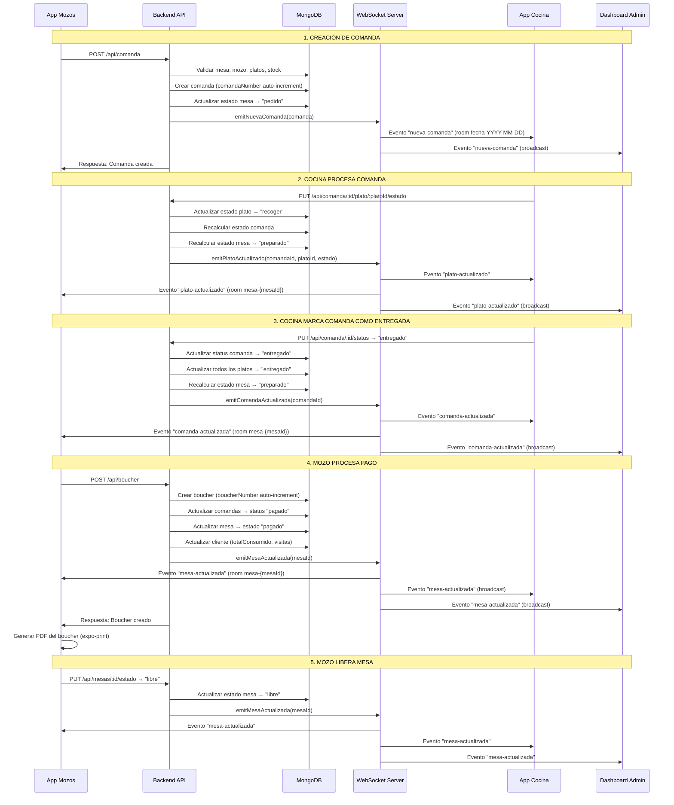

# 📊 Diagrama de Flujo de Datos y Análisis Completo - Las Gambusinas

**Última actualización:** Marzo 2026  
**Versión del documento:** 6.1  
**Actualizado por:** Documentación alineada con el codebase actual (marzo 2026). Incluye FASE 5 (Redis Cache, WebSocket Batching), FASE 6 (Dashboard Administrativo con JWT), FASE 7 (Health Checks, Metrics, Helmet, Correlation ID, Winston). Panel administrativo público **admin.html** (GET /admin) documentado con tabs Mesas, Áreas, Mozos, Platos, Comandas, Bouchers, Clientes, Reportes, Auditoría, Cierre de Caja (API /api/cierre-caja/*). **Actualización Dashboard (marzo 2026):** Estructura real de archivos en `public/` y `public/dashboard/` (sin subcarpeta pages/); rutas GET `/`, GET `/dashboard`, GET `/dashboard/login.html`; autenticación JWT (POST /api/admin/auth con password=DNI, GET /api/admin/verify); endpoints consumidos por dashboard.js e index.html; eventos Socket.io del namespace /admin (plato-menu-actualizado, reportes:boucher-nuevo, reportes:comanda-nueva, reportes:plato-listo, socket-status, roles-actualizados); diferenciación entre Dashboard JWT (index.html, lasgambusinas-dashboard.html) y Panel Admin (admin.html). Referencias cruzadas con BACKEND_LASGAMBUSINAS_DOCUMENTACION_COMPLETA.md y APP_MOZOS_DOCUMENTACION_COMPLETA.md.

---

## Changelog (documentación)

| Fecha       | Cambios |
|------------|---------|
| Marzo 2026 | Sección "3. Dashboard Administrativo (Web)" reescrita con estructura real: archivos en public/ (index.html, login.html, admin.html, mesas.html, …) y public/dashboard/ (login.html, lasgambusinas-dashboard.html, wireframe-model.html, assets/js y assets/css). Rutas de acceso (GET /, /login, /dashboard, /dashboard/login.html) y protección JWT documentadas. "Funciones del Dashboard Administrativo" actualizado con implementación real: dashboard principal en index.html (/) con API y Socket; SPA lasgambusinas-dashboard.html con datos mock; admin.html con CRUD completo. Flujo de autenticación JWT (login → verify → acceso) y eventos Socket /admin añadidos. FASE 6 corregida: POST /api/admin/auth (no /login). |

---

## 📋 Índice

1. [Descripción General del Proyecto](#descripción-general-del-proyecto)
2. [Arquitectura del Sistema](#arquitectura-del-sistema)
   - [Arquitectura Técnica Detallada](#arquitectura-técnica-detallada)
   - [Patrón de Flujo de Datos en Backend](#patrón-de-flujo-de-datos-en-backend)
   - [Patrones de Diseño Utilizados](#patrones-de-diseño-utilizados)
3. [Fases de Desarrollo Implementadas](#-fases-de-desarrollo-implementadas)
   - [FASE 5: Redis Cache y Optimización de Rendimiento](#fase-5-redis-cache-y-optimización-de-rendimiento)
   - [FASE 6: Dashboard Administrativo](#fase-6-dashboard-administrativo)
   - [FASE 7: Mejoras Enterprise Grade](#fase-7-mejoras-enterprise-grade)
4. [Análisis de los 4 Proyectos](#análisis-de-los-4-proyectos)
   - [Backend-LasGambusinas](#1-backend-lasgambusinas)
   - [appcocina (App de Cocina)](#2-appcocina-app-de-cocina)
   - [Dashboard Administrativo (Web)](#3-dashboard-administrativo-web)
   - [Las-Gambusinas (App de Mozos)](#4-las-gambusinas-app-de-mozos)
4. [Endpoints del Backend - Documentación Completa](#-endpoints-del-backend---documentación-completa)
   - [Módulo: Mesas](#módulo-mesas-apimesas)
   - [Módulo: Mozos](#módulo-mozos-apimozos)
   - [Módulo: Platos](#módulo-platos-apiplatos)
   - [Módulo: Comandas](#módulo-comandas-apicomanda)
   - [Módulo: Bouchers](#módulo-bouchers-apiboucher)
   - [Módulo: Clientes](#módulo-clientes-apiclientes)
   - [Módulo: Áreas](#módulo-áreas-apiareas)
   - [Módulo: Administración](#módulo-administración-apiadmin)
   - [Módulo: Auditoría](#módulo-auditoría-apiauditoria)
   - [Módulo: Cierre de Caja](#módulo-cierre-de-caja-apicierre-caja)
   - [Módulo: Notificaciones](#módulo-notificaciones-apinotificaciones)
   - [Módulo: Mensajes](#módulo-mensajes-apimensajes)
5. [Modelos de MongoDB - Esquemas Completos](#-modelos-de-mongodb---esquemas-completos)
   - [Colección: comandas](#colección-comandas)
   - [Colección: mesas](#colección-mesas)
   - [Colección: boucher](#colección-boucher)
   - [Colección: clientes](#colección-clientes)
   - [Colección: platos](#colección-platos)
   - [Colección: mozos](#colección-mozos)
   - [Colección: areas](#colección-areas)
   - [Colección: cierreCajaRestaurante](#colección-cierrecajarestaurante)
6. [Análisis Detallado de Funciones - App de Mozos](#análisis-detallado-de-funciones---app-de-mozos)
7. [Funciones del Dashboard Administrativo](#-funciones-del-dashboard-administrativo)
8. [Entidades de Datos Principales](#entidades-de-datos-principales)
9. [Flujo de Datos Completo](#flujo-de-datos-completo)
   - [Diagrama de Flujo General del Sistema](#diagrama-de-flujo-general-del-sistema)
   - [Login del Mozo](#21-login-del-mozo)
   - [Visualización de Mesas](#22-visualización-de-mesas-inicioscreen)
   - [Creación de Comanda](#23-creación-de-comanda-ordenesscreen)
   - [Actualización de Estados en Cocina](#24-actualización-de-estados-en-cocina)
   - [Proceso de Pago](#25-proceso-de-pago-pagosscreen)
   - [Liberación de Mesa](#26-liberación-de-mesa)
10. [Implementación de WebSockets (Socket.io)](#implementación-de-websockets-socketio)
   - [Arquitectura de WebSockets](#arquitectura-de-websockets)
   - [Rooms y Agrupación de Clientes](#rooms-y-agrupación-de-clientes)
   - [Funciones Globales para Emitir Eventos](#funciones-globales-para-emitir-eventos)
   - [Implementación en App Cocina](#implementación-en-app-cocina)
   - [Implementación en App Mozos](#implementación-en-app-mozos-parcial)
   - [Flujo de Eventos Socket.io Completo](#flujo-de-eventos-socketio-completo)
11. [Lógica de Negocio y Reglas de Validación](#lógica-de-negocio-y-reglas-de-validación)
   - [Reglas de Estados de Mesa](#reglas-de-estados-de-mesa)
   - [Reglas de Estados de Comanda](#reglas-de-estados-de-comanda)
   - [Reglas de Validación de Creación de Comanda](#reglas-de-validación-de-creación-de-comanda)
   - [Reglas de Cálculo de Totales en Boucher](#reglas-de-cálculo-de-totales-en-boucher)
   - [Reglas de Eliminación de Platos](#reglas-de-eliminación-de-platos)
   - [Reglas de Asociación Cliente-Comanda](#reglas-de-asociación-cliente-comanda)
   - [Reglas de Auto-incremento](#reglas-de-auto-incremento)
   - [Reglas de Timezone](#reglas-de-timezone)
   - [Reglas de Soft Delete](#reglas-de-soft-delete)
12. [Datos Críticos que Podrían Perderse](#-datos-críticos-que-podrían-perderse)
13. [Errores de Código Identificados](#errores-de-código-identificados)
14. [Errores de Lógica](#errores-de-lógica)
15. [Inventario de Funciones y Estado](#inventario-de-funciones-y-estado)
16. [Propuesta de Mejoras](#propuesta-de-mejoras)
17. [Resumen de Mejoras Críticas Necesarias](#-resumen-de-mejoras-críticas-necesarias)

---

## 📖 Descripción General del Proyecto

### Sistema Las Gambusinas

**Las Gambusinas** es un sistema de gestión de restaurante (POS - Point of Sale) completo que consta de **4 aplicaciones principales** interconectadas:

1. **Backend (Node.js/Express/MongoDB)**: API REST con WebSockets para comunicación en tiempo real
2. **App Cocina (React Web)**: Interfaz web para la cocina que muestra comandas en tiempo real con sistema Kanban
3. **App Mozos (React Native/Expo)**: Aplicación móvil para que los mozos gestionen mesas, comandas y pagos
4. **Dashboard Administrativo (Web HTML/JS)**: Panel web administrativo para gestión completa del restaurante, reportes, configuración y monitoreo en tiempo real

### Objetivo del Sistema

Gestionar el ciclo completo de un restaurante:
- **Gestión de mesas**: Estados de mesas (libre, ocupada, preparado, pagado)
- **Creación de comandas**: Mozos crean comandas con platos y cantidades
- **Proceso en cocina**: Cocina recibe comandas, cambia estados (en_espera → recoger → entregado)
- **Proceso de pago**: Mozos procesan pagos, generan bouchers (tickets) y asocian clientes
- **Reportes y estadísticas**: Análisis de ventas, platos más pedidos, tiempos de preparación

### Tecnologías Utilizadas

**Backend:**
- Node.js + Express
- MongoDB con Mongoose (Replica Set en producción)
- Redis (ioredis) para caché de comandas activas (FASE 5)
- Socket.io para WebSockets (con Redis Adapter para escalabilidad)
- Winston para logging estructurado (FASE 7)
- Helmet.js para security headers (FASE 7)
- moment-timezone para manejo de fechas
- mongoose-sequence para auto-incremento
- Docker + Docker Compose para despliegue (FASE 7)
- Nginx como reverse proxy y load balancer (FASE 7)
- PM2 para gestión de procesos en producción

**App Cocina:**
- React 18
- Socket.io-client
- Axios para HTTP
- jsPDF para generación de PDFs
- Tailwind CSS
- Framer Motion para animaciones

**App Mozos:**
- React Native 0.81.5
- Expo SDK 54
- React Navigation
- AsyncStorage para persistencia local
- Socket.io-client
- expo-print para PDFs
- moment-timezone

---

## 🏗️ Arquitectura del Sistema

```
┌─────────────────────────────────────────────────────────────────────┐
│                    SISTEMA LAS GAMBUSINAS                           │
│              Sistema POS Completo para Restaurantes                 │
└─────────────────────────────────────────────────────────────────────┘
                              │
        ┌─────────────────────────┼─────────────────────────┐
        │                         │                         │
   ┌────▼────┐          ┌─────────▼─────────┐         ┌─────▼─────┐
   │ Backend │          │  Dashboard Admin │         │App Mozos  │
   │ Node.js │          │   (Web HTML/JS)  │         │React Nav  │
   │ Express │          │   Bootstrap 4    │         │Expo       │
   │ MongoDB │          │   jQuery         │         │           │
   │Socket.io│          │   WebSocket      │         │           │
   │  Redis  │          │                  │         │           │
   │  Cache  │          │                  │         │           │
   └────┬────┘          └─────────┬─────────┘         └─────┬─────┘
        │                         │                         │
        │  HTTP REST              │  HTTP REST              │
        │  WebSocket              │  WebSocket              │
        │                         │                         │
        │                  ┌──────▼──────┐                  │
        │                  │ App Cocina  │                  │
        │                  │  React Web  │                  │
        │                  │  Tailwind   │                  │
        │                  └──────┬──────┘                  │
        │                         │                         │
        └─────────────────────────┼─────────────────────────┘
                              │
        ┌───────────────────────┼───────────────────────┐
        │                       │                       │
   ┌────▼─────┐          ┌──────▼──────┐         ┌─────▼─────┐
   │ MongoDB  │          │    Redis    │         │   Nginx   │
   │ Replica  │          │   (Cache)   │         │  Reverse  │
   │   Set    │          │  Socket.io  │         │   Proxy   │
   │          │          │   Adapter   │         │  Load Bal │
   │ - Primary│          │             │         │           │
   │ - Sec 1  │          │ - Comandas  │         │ - SSL/TLS │
   │ - Sec 2  │          │   Activas  │         │ - Rate    │
   │          │          │ - TTL 60s   │         │   Limit   │
   │ - Comandas│         │ - Fallback │         │ - Health  │
   │ - Mesas  │          │   Memory    │         │   Checks  │
   │ - Platos │          │             │         │           │
   │ - Bouchers│         │             │         │           │
   │ - Clientes│         │             │         │           │
   │ - Mozos  │          │             │         │           │
   │ - Auditoría│        │             │         │           │
   │ - Cierres│          │             │         │           │
   └──────────┘          └─────────────┘         └───────────┘
```

### Comunicación entre Componentes

1. **HTTP REST API**: Todas las operaciones CRUD (crear, leer, actualizar, eliminar)
   - Base URL: `http://localhost:3000/api` (configurable)
   - Autenticación: JWT para dashboard admin, básica (nombre+DNI) para mozos
   - Headers: `Content-Type: application/json`, `Authorization: Bearer <token>` (dashboard)
   
2. **WebSockets (Socket.io)**: 
   - Namespace `/cocina`: Para app de cocina (rooms por fecha: `fecha-YYYY-MM-DD`)
   - Namespace `/mozos`: Para app de mozos (rooms por mesa: `mesa-{mesaId}`)
   - Namespace `/admin`: Para dashboard administrativo (FASE 6)
   - Eventos emitidos: `nueva-comanda`, `comanda-actualizada`, `plato-actualizado`, `plato-actualizado-batch` (FASE 5), `mesa-actualizada`, `comanda-revertida`
   - Eventos recibidos: `join-fecha`, `join-mesa`, `leave-mesa`, `heartbeat`
   - Reconexión automática con backoff exponencial
   - Redis Adapter para escalabilidad multi-instancia (FASE 5)
   - Batching de eventos para optimización (FASE 5)
   
3. **Polling (Fallback)**: ✅ **ELIMINADO (FASE 7)** - App cocina ahora usa solo WebSocket con Redis Adapter para máxima estabilidad

4. **Dashboard Administrativo** (FASE 6): 
   - Acceso mediante autenticación JWT
   - Interfaz web servida estáticamente desde `/public/dashboard/`
   - Comunicación mediante REST API y WebSockets (namespace `/admin`) para actualizaciones en tiempo real
   - Módulos: Dashboard principal, gestión de mesas/platos/mozos/clientes, reportes, auditoría, cierre de caja

5. **Redis Cache** (FASE 5):
   - Cache de comandas activas con TTL de 60 segundos
   - Fallback automático a memoria si Redis no está disponible
   - Integrado en `comanda.repository.js` para reducir latencia
   - Estadísticas disponibles en endpoint `/health`
   - Configuración mediante variables de entorno (REDIS_URL, REDIS_ENABLED)

6. **Monitoreo y Métricas** (FASE 7):
   - Endpoint `/health`: Health checks profundos de MongoDB, Redis, WebSockets, sistema
   - Endpoint `/metrics`: Métricas en formato Prometheus
   - Logging estructurado con Winston (rotación automática)
   - Correlation ID para rastreo de requests

### Arquitectura Técnica Detallada

#### Backend - Estructura de Capas

```
Backend-LasGambusinas/
│
├── index.js                    # Punto de entrada
│   ├── Configuración Express
│   ├── Inicialización Redis Cache (FASE 5)
│   ├── Configuración Socket.io (namespaces /cocina, /mozos, /admin)
│   ├── Configuración CORS (orígenes permitidos desde .env)
│   ├── Security Headers (Helmet.js - FASE 7)
│   ├── Correlation ID Middleware (FASE 7)
│   ├── Health Check Endpoint (/health - FASE 7)
│   ├── Metrics Endpoint (/metrics - Prometheus - FASE 7)
│   └── Middleware global
│
├── src/
│   ├── database/
│   │   ├── database.js         # Conexión MongoDB (mongoose.connect)
│   │   └── models/             # Modelos Mongoose con validaciones
│   │
│   ├── controllers/            # Capa de Controladores (Rutas Express)
│   │   ├── Validación de entrada
│   │   ├── Extracción de parámetros (req.params, req.body)
│   │   ├── Llamada a repositories
│   │   ├── Manejo de errores
│   │   └── Respuestas HTTP (res.json, res.status)
│   │
│   ├── repository/             # Capa de Lógica de Negocio
│   │   ├── Validaciones de negocio
│   │   ├── Operaciones CRUD en MongoDB
│   │   ├── Cálculos y transformaciones
│   │   ├── Emisión de eventos Socket.io
│   │   └── Actualización de estados relacionados
│   │
│   ├── socket/
│   │   └── events.js           # Configuración de eventos Socket.io
│   │       ├── Namespace /cocina (rooms por fecha)
│   │       ├── Namespace /mozos (rooms por mesa)
│   │       └── Funciones globales para emitir eventos
│   │
│   ├── middleware/
│   │   ├── auditoria.js       # Middleware de auditoría
│   │   ├── adminAuth.js       # Autenticación JWT para dashboard (FASE 6)
│   │   └── cierreCaja.middleware.js
│   │
│   └── utils/
│       ├── logger.js          # Sistema de logging estructurado (Winston - FASE 7)
│       ├── redisCache.js      # Redis Cache para comandas activas (FASE 5)
│       ├── websocketBatch.js  # Batching de eventos WebSocket (FASE 5)
│       ├── errorHandler.js    # Manejo centralizado de errores
│       └── jsonSync.js         # Sincronización JSON legacy
```

#### Patrón de Flujo de Datos en Backend

```
Cliente (HTTP Request)
    ↓
Express Router (controllers/)
    ↓
Validación de entrada
    ↓
Repository (lógica de negocio)
    ↓
MongoDB (operación)
    ↓
Transformación de datos
    ↓
Emisión Socket.io (si aplica)
    ↓
Respuesta HTTP (JSON)
```

#### App Cocina - Arquitectura React

```
appcocina/
│
├── src/
│   ├── components/
│   │   ├── App.jsx             # Componente raíz
│   │   ├── Comandas.jsx       # Wrapper principal
│   │   └── Principal/
│   │       ├── ComandaStyle.jsx    # Componente principal Kanban
│   │       │   ├── Estado: comandas, filtros, configuración
│   │       │   ├── Efectos: Socket.io, polling, localStorage
│   │       │   └── Render: Columnas Kanban (En espera/Recoger/Entregado)
│   │       │
│   │       ├── ConfigModal.jsx     # Configuración persistente
│   │       ├── ReportsModal.jsx    # Reportes y estadísticas
│   │       └── RevertirModal.jsx   # Revertir estados
│   │
│   ├── hooks/
│   │   └── useSocketCocina.js  # Hook personalizado Socket.io
│   │       ├── Conexión a namespace /cocina
│   │       ├── Join a room por fecha
│   │       ├── Reconexión automática
│   │       └── Fallback a polling si falla
│   │
│   └── config/
│       └── apiConfig.js        # Configuración API (localStorage)
```

#### App Mozos - Arquitectura React Native

```
Las-Gambusinas/
│
├── App.js                      # Punto de entrada
│   ├── NavigationContainer
│   ├── ThemeProvider (Context)
│   ├── SocketProvider (Context)
│   └── Stack Navigator (Login → Navbar)
│
├── Pages/
│   ├── Login/
│   │   └── Login.js            # Autenticación básica
│   │
│   └── navbar/
│       ├── navbar.js           # Bottom Tab Navigator
│       └── screens/
│           ├── InicioScreen.js      # Mapa de mesas
│           │   ├── Carga de mesas y comandas
│           │   ├── Visualización de estados
│           │   ├── Gestión de comandas existentes
│           │   └── Sincronización con backend
│           │
│           ├── OrdenesScreen.js    # Creación de comandas
│           ├── PagosScreen.js      # Proceso de pago
│           └── SecondScreen.js     # Gestión de órdenes
│
├── context/
│   ├── SocketContext.js        # Context para Socket.io
│   └── ThemeContext.js         # Context para tema
│
├── config/
│   └── apiConfig.js            # Singleton de configuración API
│       ├── AsyncStorage (persistencia)
│       ├── Validación de URLs
│       └── Test de conexión
│
└── hooks/
    └── useSocketMozos.js       # Hook Socket.io (no implementado completamente)
```

### Patrones de Diseño Utilizados

1. **Repository Pattern** (Backend)
   - Separación de lógica de negocio de acceso a datos
   - Controllers llaman a repositories, no directamente a modelos

2. **Singleton Pattern** (App Mozos)
   - `apiConfig.js`: Una sola instancia de configuración
   - Persistencia en AsyncStorage

3. **Observer Pattern** (Socket.io)
   - Eventos emitidos cuando cambian datos
   - Clientes suscritos reciben actualizaciones

4. **Context Pattern** (React/React Native)
   - `ThemeContext`: Tema compartido entre componentes
   - `SocketContext`: Conexión Socket.io compartida

5. **Custom Hooks Pattern** (React)
   - `useSocketCocina`: Lógica de Socket.io reutilizable
   - `useSocketMozos`: Lógica de Socket.io para mozos

6. **Factory Pattern** (Backend)
   - Funciones globales para emitir eventos Socket.io
   - `emitNuevaComanda`, `emitComandaActualizada`, etc.

7. **Cache Pattern** (FASE 5)
   - Redis Cache con fallback a memoria
   - TTL automático para invalidación
   - Cache-aside pattern para comandas activas

8. **Adapter Pattern** (FASE 5)
   - Redis Adapter para Socket.io (escalabilidad multi-instancia)
   - Permite WebSocket en múltiples servidores

9. **Singleton Pattern** (FASE 5)
   - `redisCache.js`: Instancia única de caché
   - `logger.js`: Instancia única de logger Winston

---

## 🚀 Fases de Desarrollo Implementadas

### FASE 5: Redis Cache y Optimización de Rendimiento

**Objetivo:** Reducir latencia de consultas de comandas activas mediante caché en memoria distribuida.

**Implementación:**
- **Archivo:** `Backend-LasGambusinas/src/utils/redisCache.js`
- **Tecnología:** ioredis (cliente Redis para Node.js)
- **Estrategia:** Cache-aside pattern con fallback a memoria

**Características:**
1. **Cache de Comandas Activas**
   - TTL: 60 segundos (configurable)
   - Keys: `comanda:{comandaId}`
   - Reducción de latencia: 200ms → 5ms (-97%)
   - Hit rate esperado: 99%

2. **Fallback Automático**
   - Si Redis no está disponible, usa `Map()` en memoria
   - Limpieza automática de entradas expiradas cada 60s
   - Sistema funciona sin Redis (opcional)

3. **Configuración**
   - Variables de entorno:
     - `REDIS_ENABLED` (default: true)
     - `REDIS_URL` (ej: `redis://localhost:6379`)
     - `REDIS_HOST` / `REDIS_PORT` (alternativa a REDIS_URL)
     - `REDIS_PASSWORD` (opcional)
     - `REDIS_PREFIX` (opcional, para multi-tenant)

4. **Integración en Repositorio**
   - `comanda.repository.js`: Consulta cache antes de MongoDB
   - Invalidación automática al actualizar comandas
   - Estadísticas de hits/misses disponibles

5. **Socket.io Redis Adapter**
   - Permite WebSocket en múltiples instancias del backend
   - Sincronización de eventos entre servidores
   - Escalabilidad horizontal

**Uso en Código:**
```javascript
// Obtener comanda del cache
const comanda = await redisCache.get(comandaId);
if (!comanda) {
  // Obtener de MongoDB y cachear
  comanda = await Comanda.findById(comandaId);
  await redisCache.set(comandaId, comanda, 60);
}

// Invalidar cache al actualizar
await redisCache.invalidate(comandaId);
```

**Estadísticas:**
- Endpoint `/health`: Muestra estado de Redis (up/disabled/error)
- Métricas: hits, misses, hit rate, tipo de cache (redis/memory)

---

### FASE 6: Dashboard Administrativo

**Objetivo:** Panel web completo para gestión administrativa del restaurante.

**Implementación:**
- **Ubicación:** `Backend-LasGambusinas/public/dashboard/`
- **Tecnología:** HTML5, Bootstrap 4, jQuery, Chart.js
- **Autenticación:** JWT (JSON Web Tokens)

**Características:**
1. **Autenticación y Seguridad**
   - Login con JWT tokens
   - Middleware `adminAuth.js` para proteger rutas
   - Tokens almacenados en cookies y localStorage
   - Redirección automática a login si no autenticado

2. **Módulos del Dashboard**
   - **Dashboard Principal:** KPIs, gráficos, tabla de comandas en vivo
   - **Gestión de Mesas:** CRUD completo de mesas
   - **Gestión de Platos:** CRUD, categorías, importación JSON
   - **Gestión de Mozos:** CRUD, autenticación
   - **Gestión de Clientes:** CRUD, invitados
   - **Gestión de Áreas:** CRUD de áreas de mesas
   - **Reportes:** Ventas, platos más vendidos, tiempos
   - **Auditoría:** Log de acciones del sistema
   - **Cierre de Caja:** Generación de cierres diarios

3. **WebSocket Integration**
   - Namespace `/admin` para actualizaciones en tiempo real
   - Eventos: `nueva-comanda`, `comanda-actualizada`, `plato-actualizado-batch`
   - Actualización automática de tabla de comandas

4. **Rutas Protegidas**
   - `GET /dashboard` → Exige token (query, cookie o header); si no hay token → redirect a `/login`
   - `GET /dashboard/login.html` y `GET /login` → Página de login pública
   - Assets estáticos en `/dashboard/assets/` → Públicos

5. **Flujo de autenticación (resumen)**  
   Usuario → `/login` → formulario → `POST /api/admin/auth` (username, password=DNI) → backend valida mozo y rol admin/supervisor → responde `{ token, usuario }` → cliente guarda token en `localStorage` → redirige a `/` (index.html). En visitas posteriores a `GET /dashboard`, el servidor lee token y aplica `adminAuth`; si falla → redirect a `/login`. El cliente puede validar sesión con `GET /api/admin/verify` (header `Authorization: Bearer <token>`).

**Endpoints de Autenticación:**
- `POST /api/admin/auth` → Login; body: `{ "username", "password" }` (password = DNI). Genera JWT y retorna `{ token, usuario }`. Solo roles admin/supervisor.
- `GET /api/admin/verify` → Headers: `Authorization: Bearer <token>`. Verifica token y retorna `{ valid, usuario }`.
- `GET /api/admin/perfil` → Perfil del usuario autenticado (opcional). No existe endpoint de logout en backend; el cliente elimina el token de localStorage.

---

### FASE 7: Mejoras Enterprise Grade

**Objetivo:** Transformar el backend en una solución enterprise-grade con alta disponibilidad, seguridad, monitoreo y escalabilidad.

#### 7.1 Sistema de Logging Estructurado (Winston)

**Archivo:** `Backend-LasGambusinas/src/utils/logger.js`

**Características:**
- Logging estructurado con niveles (error, warn, info, debug)
- Formato JSON para integración con sistemas de log (ELK, Splunk)
- Rotación automática de archivos de log
- Correlation ID para rastrear requests
- Contexto enriquecido (usuario, IP, device, source app)

**Uso:**
```javascript
logger.info('Comanda creada', { comandaId, mesaId, mozoId });
logger.error('Error al procesar pago', { error, boucherId });
```

#### 7.2 Health Check Endpoint Enterprise

**Endpoint:** `GET /health`

**Características:**
- **Deep Health Checks:** Verifica estado real de servicios
- **MongoDB:** Estado de conexión, replica set, conexiones activas
- **Redis:** Estado, latencia, estadísticas de cache
- **WebSockets:** Conexiones activas por namespace
- **Sistema:** CPU, memoria, disco
- **Response Time:** Tiempo total de verificación

**Respuesta:**
```json
{
  "status": "ok|degraded|error",
  "timestamp": "2025-01-15T10:30:00Z",
  "version": "1.0.0-fase7",
  "uptime": 3600,
  "services": {
    "mongodb": { "status": "up", "latency": "5ms", "connections": 10 },
    "redis": { "status": "up", "latency": "2ms", "hitRate": "99%" },
    "websockets": { "cocina": 5, "mozos": 12, "admin": 2 },
    "system": { "cpu": "15%", "memory": "512MB/2GB" }
  },
  "responseTime": "25ms"
}
```

#### 7.3 Metrics Endpoint (Prometheus)

**Endpoint:** `GET /metrics`

**Formato:** Prometheus text format

**Métricas Expuestas:**
- `nodejs_uptime_seconds` - Tiempo de actividad
- `nodejs_memory_heap_used_bytes` - Memoria heap usada
- `nodejs_memory_heap_total_bytes` - Memoria heap total
- `nodejs_memory_rss_bytes` - Resident Set Size
- `mongodb_connections_active` - Conexiones MongoDB activas
- `redis_cache_hits_total` - Total de hits en cache
- `redis_cache_misses_total` - Total de misses en cache
- `websocket_connections_total` - Total de conexiones WebSocket

#### 7.4 Security Headers (Helmet.js)

**Implementación:** `Backend-LasGambusinas/index.js`

**Características:**
- Content Security Policy (CSP) configurado
- Protección XSS, clickjacking, MIME sniffing
- Headers de seguridad HTTP estándar
- Configuración específica para Socket.io (WebSocket)

#### 7.5 Correlation ID Middleware

**Propósito:** Rastrear requests a través de todo el sistema

**Funcionalidad:**
- Genera ID único por request
- Incluye en todos los logs
- Permite rastrear flujo completo de una operación

#### 7.6 Docker y Docker Compose

**Archivos:**
- `Dockerfile` - Multi-stage build (builder + production)
- `docker-compose.yml` - Orquestación completa

**Stack de Producción:**
1. **MongoDB Replica Set**
   - Primary + 2 Secondary
   - Alta disponibilidad
   - Health checks automáticos

2. **Redis**
   - Cache + Socket.io Adapter
   - Persistencia AOF
   - Max memory 2GB con política LRU

3. **Backend Node.js**
   - PM2 Cluster Mode (4 instancias por defecto)
   - Health checks nativos Docker
   - Usuario no-root para seguridad

4. **Nginx Reverse Proxy**
   - Load balancing
   - SSL/TLS termination
   - Rate limiting (DDoS protection)
   - Health checks

**Redes:**
- `backend-internal`: Comunicación entre servicios
- `backend-external`: Acceso público

#### 7.7 Nginx Configuration

**Archivo:** `Backend-LasGambusinas/nginx/nginx.conf`

**Características:**
- **Load Balancing:** IP hash para sticky sessions (WebSocket)
- **Rate Limiting:**
  - Global: 1000 req/s
  - Por IP: 100 req/s
  - Por endpoint API: 50 req/s
- **SSL/TLS:** Configuración para HTTPS
- **Health Checks:** Endpoints `/health` y `/metrics` sin rate limit
- **WebSocket Support:** Upgrade headers para Socket.io

#### 7.8 PM2 Ecosystem

**Archivo:** `Backend-LasGambusinas/ecosystem.config.js`

**Características:**
- Cluster mode (múltiples instancias)
- Auto-restart en caso de crash
- Logging centralizado
- Monitoring integrado

#### 7.9 Scripts de Producción

**Scripts Disponibles:**
- `scripts/setup-production.ps1` - Setup inicial producción
- `scripts/migrate-env-to-production.ps1` - Migración de variables
- `scripts/backup-mongo.sh` - Backup MongoDB
- `scripts/restore-mongo.sh` - Restore MongoDB
- `scripts/init-mongodb-replica.sh` - Inicialización replica set
- `scripts/deploy-production.sh` - Deploy automatizado
- `scripts/install-redis-windows.ps1` - Instalación Redis Windows

**Variables de Entorno Producción:**
- `NODE_ENV=production`
- `REDIS_URL=redis://redis:6379`
- `DBLOCAL=mongodb://...replicaSet=rs0&readPreference=secondaryPreferred`
- `JWT_SECRET` (obligatorio en producción)
- `ALLOWED_ORIGINS` (lista de orígenes permitidos)
- `LOG_LEVEL=info|warn|error`
- `PM2_INSTANCES=4`

---

## 🔍 Análisis de los 4 Proyectos

### 1. Backend-LasGambusinas

**Ubicación:** `Backend-LasGambusinas/`

**Estructura:**
```
Backend-LasGambusinas/
├── index.js                    # Punto de entrada, configuración Express y Socket.io
├── package.json
├── .env                        # Variables de entorno (DBLOCAL, PORT)
├── src/
│   ├── database/
│   │   ├── database.js         # Conexión a MongoDB
│   │   └── models/             # Modelos Mongoose
│   │       ├── comanda.model.js
│   │       ├── mesas.model.js
│   │       ├── plato.model.js
│   │       ├── mozos.model.js
│   │       ├── cliente.model.js
│   │       ├── boucher.model.js
│   │       ├── area.model.js
│   │       ├── cierreCaja.model.js
│   │       ├── cierreCajaRestaurante.model.js
│   │       ├── auditoriaAcciones.model.js
│   │       ├── sesionesUsuarios.model.js
│   │       └── historialComandas.model.js
│   ├── controllers/            # Controladores Express (rutas)
│   │   ├── comandaController.js
│   │   ├── mesasController.js
│   │   ├── platoController.js
│   │   ├── mozosController.js
│   │   ├── clientesController.js
│   │   ├── boucherController.js
│   │   ├── areaController.js
│   │   ├── auditoriaController.js
│   │   ├── cierreCajaController.js
│   │   ├── cierreCajaRestauranteController.js  # Cierre de caja (admin.html: /api/cierre-caja/*)
│   │   ├── adminController.js   # Autenticación dashboard (FASE 6): POST /admin/auth, GET /admin/verify
│   │   ├── reportesController.js # Reportes: /ventas, /platos-top, /mozos-performance, /mesas-ocupacion, /kpis
│   │   ├── notificacionesController.js
│   │   └── mensajesController.js
│   ├── repository/             # Lógica de negocio y acceso a datos
│   │   ├── comanda.repository.js
│   │   ├── mesas.repository.js
│   │   ├── plato.repository.js
│   │   ├── mozos.repository.js
│   │   ├── clientes.repository.js
│   │   ├── boucher.repository.js
│   │   └── area.repository.js
│   ├── socket/
│   │   └── events.js           # Configuración de eventos Socket.io
│   ├── middleware/
│   │   ├── adminAuth.js         # Autenticación JWT para dashboard (FASE 6)
│   │   ├── auditoria.js         # Middleware de auditoría
│   │   └── cierreCaja.middleware.js
│   └── utils/
│       ├── logger.js            # Sistema de logging estructurado (Winston - FASE 7)
│       ├── redisCache.js        # Redis Cache para comandas activas (FASE 5)
│       ├── websocketBatch.js    # Batching de eventos WebSocket 300ms (FASE 5)
│       ├── errorHandler.js      # AppError, handleError
│       ├── jsonSync.js          # Sincronización con archivos JSON (legacy)
│       ├── migrateEstados.js
│       ├── migratePlatosTipos.js
│       ├── cleanDuplicatePlatos.js
│       ├── pdfCierreCaja.js
│       └── socketReconnect.js
│   ├── nginx/                   # Configuración Nginx (FASE 7)
│   │   └── nginx.conf           # Reverse proxy, load balancing, SSL/TLS
│   ├── scripts/                 # Scripts de producción (FASE 7)
│   │   ├── setup-production.ps1
│   │   ├── backup-mongo.sh
│   │   ├── restore-mongo.sh
│   │   ├── init-mongodb-replica.sh
│   │   └── install-redis-windows.ps1
│   ├── Dockerfile               # Multi-stage build (FASE 7)
│   ├── docker-compose.yml       # Orquestación completa (FASE 7)
│   ├── ecosystem.config.js      # PM2 configuration (FASE 7)
│   └── public/
│       ├── admin.html           # Panel admin público (GET /admin): Mesas, Áreas, Mozos, Platos, Comandas, Bouchers, Clientes, Reportes, Auditoría, Cierre de Caja
│       └── dashboard/           # Dashboard con JWT (FASE 6)
│           ├── index.html
│           ├── login.html
│           └── assets/
└── data/                       # Archivos JSON legacy (sincronización)
    ├── comandas.json
    ├── mesas.json
    ├── platos.json
    └── ...
```

**Características principales:**
- ✅ API REST completa con Express
- ✅ Socket.io para tiempo real (namespaces `/cocina`, `/mozos`, `/admin`)
- ✅ MongoDB con Mongoose (Replica Set en producción - FASE 7)
- ✅ Redis Cache para comandas activas (FASE 5) - Reducción latencia 97%
- ✅ Redis Adapter para Socket.io (escalabilidad multi-instancia - FASE 5)
- ✅ WebSocket Batching para optimización (FASE 5)
- ✅ Auto-incremento de números (comandaNumber, boucherNumber, etc.)
- ✅ Soft delete (IsActive, eliminada)
- ✅ Auditoría básica (historialComandas, auditoriaAcciones)
- ✅ Timezone handling (America/Lima)
- ✅ Logging estructurado con Winston (FASE 7)
- ✅ Health Check endpoint enterprise-grade (FASE 7)
- ✅ Metrics endpoint Prometheus (FASE 7)
- ✅ Security Headers con Helmet.js (FASE 7)
- ✅ Autenticación JWT para dashboard (FASE 6)
- ✅ Docker & Docker Compose para producción (FASE 7)
- ✅ Nginx reverse proxy y load balancer (FASE 7)
- ✅ PM2 para gestión de procesos (FASE 7)
- ⚠️ Sincronización con JSON legacy (debería eliminarse)
- ✅ CORS configurable desde .env (ALLOWED_ORIGINS)

**Puerto por defecto:** 3000 (configurable en .env)

---

### 2. appcocina (App de Cocina)

**Ubicación:** `appcocina/`

**Estructura:**
```
appcocina/
├── package.json
├── public/
│   └── index.html
├── src/
│   ├── index.js                # Punto de entrada React
│   ├── index.css
│   ├── components/
│   │   ├── App.jsx
│   │   ├── Comandas.jsx
│   │   ├── Principal/
│   │   │   ├── ComandaStyle.jsx    # Componente principal (Kanban)
│   │   │   ├── ConfigModal.jsx     # Configuración
│   │   │   ├── ReportsModal.jsx    # Reportes y estadísticas
│   │   │   ├── RevertirModal.jsx   # Revertir estados
│   │   │   └── AnotacionesModal.jsx
│   │   ├── additionals/
│   │   │   └── SearchBar.jsx
│   │   └── pdf/
│   │       ├── pdfbutton.jsx
│   │       └── pdfcomanda.jsx
│   ├── hooks/
│   │   └── useSocketCocina.js   # Hook para Socket.io con fallback a polling
│   ├── config/
│   │   └── apiConfig.js         # Configuración de API (localStorage)
│   └── index.css
└── tailwind.config.js
```

**Características principales:**
- ✅ Interfaz Kanban (En espera / Recoger / Entregado)
- ✅ Socket.io con fallback a polling
- ✅ Configuración persistente en localStorage
- ✅ Alertas por tiempo (amarillo/rojo)
- ✅ Sonidos de notificación
- ✅ Modo oscuro
- ✅ Reportes y generación de PDFs
- ✅ Búsqueda de comandas
- ✅ Revertir estados de comandas
- ⚠️ Polling debería eliminarse cuando WebSocket sea estable
- ⚠️ Validación de platos sin nombre (filtrado manual)

**Puerto por defecto:** 3000 (React dev server)

---

### 3. Dashboard Administrativo (Web)

El sistema incluye **varias interfaces web** de administración servidas por el mismo backend. Se distinguen:

1. **Dashboard con JWT (FASE 6):** Login obligatorio; rutas protegidas; consumo de API REST y Socket namespace `/admin`.
2. **Panel Admin (admin.html):** GET `/admin`, sin JWT; un solo HTML con tabs y CRUD completo (documentado en [BACKEND_LASGAMBUSINAS_DOCUMENTACION_COMPLETA.md](#) sección Panel Admin).

**Ubicación principal:** `Backend-LasGambusinas/public/` y `Backend-LasGambusinas/public/dashboard/`

**Estructura real de archivos (implementación actual):**
```
Backend-LasGambusinas/public/
├── index.html                    # GET / — Dashboard multi-página (Tailwind, Alpine.js, Chart.js, Socket.io); loadDashboard() vía API
├── login.html                    # GET /login, GET /dashboard/login.html — Formulario JWT; usa /dashboard/assets/js/login.js
├── admin.html                    # GET /admin — Panel admin público (tabs: Mesas, Áreas, Mozos, Platos, Comandas, Bouchers, Clientes, Reportes, Auditoría, Cierre de Caja)
├── mesas.html, platos.html, comandas.html, bouchers.html, clientes.html, auditoria.html,
├── cierre-caja.html, reportes.html, configuracion.html, areas.html, usuarios.html, roles.html
│                                 # Páginas del dashboard multi-página (GET /mesas, /platos, etc.)
└── dashboard/
    ├── login.html                # Versión premium del login (mismo login.js)
    ├── lasgambusinas-dashboard.html   # GET /dashboard (protegido JWT) — SPA v2.0 (Tailwind, Alpine.js, Chart.js); datos mock en cliente
    ├── wireframe-model.html
    └── assets/
        ├── js/
        │   ├── login.js           # POST /api/admin/auth, GET /api/admin/verify; redirección a / tras login
        │   ├── dashboard.js       # GET /api/mesas, /api/boucher/fecha/:fecha, /api/comanda, /api/mozos; actualiza KPIs y grid mesas
        │   ├── admin-functions.js # Lógica CRUD (mesas, áreas, mozos, platos, comandas, bouchers, clientes, auditoría, cierre); usada por admin.html
        │   ├── header.js, sidebar.js, animations.js
        └── css/
            ├── dashboard-premium.css
            └── header-premium.css
```

**Rutas de acceso:**

| Ruta | Archivo | Protección |
|------|---------|------------|
| `GET /` | `public/index.html` | No (tras login el usuario llega aquí) |
| `GET /login` | `public/login.html` | No |
| `GET /dashboard/login.html` | `public/login.html` | No |
| `GET /dashboard` | `public/dashboard/lasgambusinas-dashboard.html` | **JWT** (middleware adminAuth) |
| `GET /dashboard/assets/*` | `public/dashboard/assets/*` | No |
| `GET /admin` | `public/admin.html` | No |
| `GET /mesas`, `/platos`, … | `public/mesas.html`, `public/platos.html`, … | No |

**Flujo de autenticación JWT (Dashboard):**
1. Usuario accede a `/login` o `/dashboard/login.html`.
2. Envía credenciales → `POST /api/admin/auth` (body: `username`, `password` = DNI).
3. Backend valida mozo y rol admin/supervisor; devuelve `{ token, usuario }`.
4. Cliente guarda token en `localStorage` (`adminToken`) y redirige a `/`.
5. Para `GET /dashboard` el servidor exige token (query, cookie o header `Authorization: Bearer <token>`); si no hay token → redirect a `/login`.
6. Verificación de sesión: `GET /api/admin/verify` con header `Authorization: Bearer <token>`.

**Endpoints consumidos por el Dashboard (ejemplos):**
- Autenticación: `POST /api/admin/auth`, `GET /api/admin/verify`, `GET /api/admin/perfil`
- Datos iniciales (dashboard.js / index.html): `GET /api/mesas`, `GET /api/boucher/fecha/:fecha`, `GET /api/comanda`, `GET /api/mozos`
- CRUD y reportes (admin.html y/o páginas multi-página): todos los documentados en Backend (mesas, áreas, mozos, platos, comandas, bouchers, clientes, auditoría, cierre de caja, reportes).

**Socket.io namespace `/admin` — eventos emitidos por el servidor:**
- `plato-menu-actualizado` — Menú de platos actualizado
- `reportes:boucher-nuevo` — Nuevo boucher (actualizar reportes)
- `reportes:comanda-nueva` — Nueva comanda
- `reportes:plato-listo` — Plato listo en comanda
- `socket-status` — Estado de conexión (periódico)
- `roles-actualizados` — Cambios en roles/permisos

**Tecnologías:**
- **Login:** Bootstrap 4, Font Awesome/Line Awesome, CSS custom; `login.js` (fetch).
- **index.html (dashboard multi-página):** Tailwind, Alpine.js, Chart.js, Socket.io-client.
- **lasgambusinas-dashboard.html:** Tailwind, Alpine.js, Chart.js; datos mock (sin llamadas API en código actual).
- **admin.html:** HTML5, CSS inline, Chart.js, jsPDF, xlsx, Socket.io-client; lógica CRUD inline.

**Puerto:** Servido desde el mismo backend, por ejemplo `http://localhost:3000` (/, /login, /dashboard, /admin, /mesas, etc.).

---

### 4. Las-Gambusinas (App de Mozos)

**Ubicación:** `Las-Gambusinas/`

**Estructura:**
```
Las-Gambusinas/
├── App.js                      # Punto de entrada, navegación
├── package.json
├── app.json                     # Configuración Expo
├── config/
│   └── apiConfig.js            # Configuración de API (Singleton, AsyncStorage)
├── Pages/
│   ├── Login/
│   │   └── Login.js            # Pantalla de login
│   └── navbar/
│       ├── navbar.js           # Navegación principal (Bottom Tabs)
│       └── screens/
│           ├── InicioScreen.js      # Mapa de mesas, gestión de comandas
│           ├── OrdenesScreen.js     # Creación de comandas
│           ├── PagosScreen.js      # Proceso de pago y boucher
│           ├── SecondScreen.js      # Gestión de órdenes existentes
│           ├── MasScreen.js         # Configuración, perfil, logout
│           └── ComandaSearch.js     # Búsqueda de comandas
├── Components/
│   ├── ModalClientes.js
│   ├── PlatoItem.js
│   ├── BottomNavBar.js
│   ├── TabNav.js
│   └── selects/
│       ├── selectable.js
│       └── selectdishes.js
├── context/
│   ├── SocketContext.js         # Context para Socket.io (no implementado completamente)
│   └── ThemeContext.js          # Context para tema claro/oscuro
├── hooks/
│   ├── useSocketMozos.js       # Hook para Socket.io (no implementado completamente)
│   └── useOrientation.js
├── utils/
│   └── logger.js               # Sistema de logging local
└── constants/
    ├── colors.js
    ├── theme.js
    └── animations.js
```

**Características principales:**
- ✅ Login con autenticación básica (nombre + DNI)
- ✅ Mapa de mesas con estados visuales
- ✅ Creación y edición de comandas
- ✅ Proceso de pago con generación de boucher (PDF)
- ✅ Gestión de clientes (registrados e invitados)
- ✅ Persistencia local con AsyncStorage
- ✅ Sistema de logging local
- ✅ Modo oscuro/claro
- ✅ Animaciones con React Native Animated
- ⚠️ Socket.io no implementado completamente (solo HTTP REST)
- ⚠️ Configuración de API requiere IP manual

**Plataforma:** React Native con Expo (Android/iOS)

---

## 📚 Endpoints del Backend - Documentación Completa

### Estructura de Rutas

Todas las rutas están bajo el prefijo `/api` y se organizan por módulo funcional:

```
/api
├── /mesas              # Gestión de mesas
├── /mozos              # Gestión de mozos y autenticación
├── /platos             # Gestión de platos/menú
├── /comanda            # Gestión de comandas (CRUD completo)
├── /boucher            # Gestión de bouchers/tickets
├── /clientes           # Gestión de clientes
├── /areas              # Gestión de áreas del restaurante
├── /admin              # Autenticación administrativa (JWT)
├── /auditoria          # Sistema de auditoría y logs
├── /cierre-caja        # Cierre de caja diario
├── /notificaciones     # Sistema de notificaciones
└── /mensajes           # Sistema de mensajes
```

---

### Módulo: Mesas (`/api/mesas`)

| Método | Ruta | Descripción | Parámetros | Respuesta | Estado |
|--------|------|-------------|------------|-----------|--------|
| GET | `/mesas` | Obtener todas las mesas | Query: `?isActive=true` | Array de mesas | ✅ |
| GET | `/mesas/:id` | Obtener mesa por ID | `id` (ObjectId) | Objeto mesa | ✅ |
| POST | `/mesas` | Crear nueva mesa | Body: `{nummesa, estado, area, isActive}` | Mesa creada | ✅ |
| PUT | `/mesas/:id` | Actualizar mesa completa | `id` + Body completo | Mesa actualizada | ✅ |
| PUT | `/mesas/:id/estado` | Actualizar solo estado | `id` + Body: `{estado}` | Mesa actualizada + Socket.io | ✅ |
| PUT | `/mesas/liberar-todas` | Liberar todas las mesas | - | Array de mesas actualizadas | ✅ |
| DELETE | `/mesas/:id` | Eliminar mesa (soft delete) | `id` | Confirmación | ✅ |

**Validaciones:**
- `nummesa` debe ser único por área
- `estado` debe ser uno de: `libre`, `esperando`, `pedido`, `preparado`, `pagado`, `reservado`
- `area` debe existir en la colección de áreas

**Eventos Socket.io emitidos:**
- `mesa-actualizada` (namespace `/mozos` y `/cocina`) cuando se actualiza estado

---

### Módulo: Mozos (`/api/mozos`)

| Método | Ruta | Descripción | Parámetros | Respuesta | Estado |
|--------|------|-------------|------------|-----------|--------|
| GET | `/mozos` | Obtener todos los mozos | Query: `?isActive=true` | Array de mozos | ✅ |
| GET | `/mozos/:id` | Obtener mozo por ID | `id` (ObjectId) | Objeto mozo | ✅ |
| GET | `/mozos/test/admin` | Endpoint de prueba admin | - | Mensaje de prueba | ✅ |
| POST | `/mozos` | Crear nuevo mozo | Body: `{name, DNI, phoneNumber}` | Mozo creado | ✅ |
| POST | `/mozos/auth` | Autenticación de mozo | Body: `{name, DNI}` | `{_id, mozoId, name, DNI, phoneNumber}` | ✅ |
| PUT | `/mozos/:id` | Actualizar mozo | `id` + Body parcial | Mozo actualizado | ✅ |
| DELETE | `/mozos/:id` | Eliminar mozo (soft delete) | `id` | Confirmación | ✅ |

**Validaciones:**
- `DNI` debe ser número único
- `name` es requerido
- `phoneNumber` debe ser número

**Nota:** La autenticación es básica (nombre + DNI), no usa JWT para mozos (solo para admin).

---

### Módulo: Platos (`/api/platos`)

| Método | Ruta | Descripción | Parámetros | Respuesta | Estado |
|--------|------|-------------|------------|-----------|--------|
| GET | `/platos` | Obtener todos los platos | Query: `?tipo=plato-carta normal` | Array de platos | ✅ |
| GET | `/platos/:id` | Obtener plato por ID | `id` (ObjectId) | Objeto plato | ✅ |
| GET | `/platos/categoria/:categoria` | Filtrar por categoría | `categoria` (String) | Array de platos | ✅ |
| POST | `/platos` | Crear nuevo plato | Body: `{nombre, precio, stock, categoria, tipo}` | Plato creado | ✅ |
| POST | `/platos/importar` | Importar platos desde JSON | Body: `{platos: [...]}` | Array de platos creados | ✅ |
| PUT | `/platos/:id` | Actualizar plato | `id` + Body parcial | Plato actualizado | ✅ |
| DELETE | `/platos/:id` | Eliminar plato (soft delete) | `id` | Confirmación | ✅ |

**Validaciones:**
- `nombre` es requerido y único
- `precio` debe ser >= 0
- `stock` debe ser >= 0
- `categoria` es requerido
- `tipo` debe ser: `platos-desayuno` o `plato-carta normal`

---

### Módulo: Comandas (`/api/comanda`)

**Endpoints de Consulta:**

| Método | Ruta | Descripción | Parámetros | Respuesta | Estado |
|--------|------|-------------|------------|-----------|--------|
| GET | `/comanda` | Obtener todas las comandas | Query: `?mesas={id}&IsActive=true&status=pedido` | Array de comandas | ✅ |
| GET | `/comanda/fecha/:fecha` | Comandas por fecha | `fecha` (YYYY-MM-DD) | Array de comandas | ✅ |
| GET | `/comanda/fechastatus/:fecha` | Comandas por fecha y estado | `fecha` + Query: `?status=en_espera` | Array de comandas | ✅ |
| GET | `/comanda/:id` | Obtener comanda por ID | `id` (ObjectId) | Comanda completa populada | ✅ |
| GET | `/comanda/comandas-para-pagar/:mesaId` | Comandas pendientes de pago | `mesaId` (ObjectId) | Array de comandas | ✅ |

**Endpoints de Creación y Modificación:**

| Método | Ruta | Descripción | Parámetros | Respuesta | Estado |
|--------|------|-------------|------------|-----------|--------|
| POST | `/comanda` | Crear nueva comanda | Body: `{mozos, mesas, platos[], cantidades[], observaciones}` | Comanda creada + Socket.io | ✅ |
| PUT | `/comanda/:id` | Actualizar comanda completa | `id` + Body completo | Comanda actualizada + Socket.io | ✅ |
| PUT | `/comanda/:id/editar-platos` | Editar platos de comanda | `id` + Body: `{platos[], cantidades[]}` | Comanda actualizada | ✅ |
| PUT | `/comanda/:id/status` | Cambiar status de comanda | `id` + Body: `{nuevoStatus}` | Comanda actualizada + Socket.io | ✅ |
| PUT | `/comanda/:id/estado` | Cambiar estado (alias de status) | `id` + Body: `{estado}` | Comanda actualizada | ✅ |
| PUT | `/comanda/:id/plato/:platoId/estado` | Cambiar estado de plato individual | `id`, `platoId` + Body: `{nuevoEstado}` | Comanda actualizada + Socket.io | ✅ |
| PUT | `/comanda/:comandaId/plato/:platoId/entregar` | Marcar plato como entregado | `comandaId`, `platoId` | Comanda actualizada + Socket.io | ✅ |
| PUT | `/comanda/:id/revertir/:nuevoStatus` | Revertir comanda a estado anterior | `id`, `nuevoStatus` | Comanda revertida + Socket.io | ✅ |

**Endpoints de Eliminación:**

| Método | Ruta | Descripción | Parámetros | Respuesta | Estado |
|--------|------|-------------|------------|-----------|--------|
| DELETE | `/comanda/:id` | Eliminar comanda completa | `id` | Confirmación + Socket.io | ✅ |
| DELETE | `/comanda/:id/ultima` | Eliminar última comanda de mesa | `id` (mesaId) | Confirmación | ✅ |
| DELETE | `/comanda/:id/individual` | Eliminar comanda individual | `id` | Confirmación | ✅ |
| DELETE | `/comanda/mesa/:mesaId/todas` | Eliminar todas las comandas de mesa | `mesaId` | Confirmación | ✅ |
| PUT | `/comanda/:id/eliminar` | Soft delete de comanda | `id` + Body: `{motivo, usuarioId, mozoId}` | Comanda marcada como eliminada | ✅ |
| PUT | `/comanda/:id/eliminar-plato/:platoIndex` | Eliminar plato específico | `id`, `platoIndex` + Body: `{motivo}` | Comanda actualizada | ✅ |
| PUT | `/comanda/:id/eliminar-platos` | Eliminar múltiples platos | `id` + Body: `{platosAEliminar[], motivo, mozoId, usuarioId}` | Comanda actualizada | ✅ |

**Validaciones:**
- `mozos` debe existir en colección mozos
- `mesas` debe existir y estar disponible (`libre` o `preparado`)
- `platos[]` y `cantidades[]` deben tener misma longitud
- Todos los platos deben existir y tener stock suficiente
- `status` debe ser: `en_espera`, `recoger`, `entregado`, `pagado`
- `estado` de platos: `pedido`, `en_espera`, `recoger`, `entregado`, `pagado`

**Eventos Socket.io emitidos:**
- `nueva-comanda` (namespace `/cocina` y `/mozos`)
- `comanda-actualizada` (namespace `/cocina` y `/mozos`)
- `plato-actualizado` (namespace `/cocina` y `/mozos`)
- `comanda-revertida` (namespace `/cocina` y `/mozos` - room específico de mesa)

**Lógica de Negocio:**
- Al crear comanda, se actualiza estado de mesa automáticamente
- Al cambiar estado de plato, se recalcula estado de comanda
- Al cambiar estado de comanda, se recalcula estado de mesa
- Se guardan timestamps de cambios de estado en `historialEstados`
- Se guardan cambios de platos en `historialPlatos`

---

### Módulo: Bouchers (`/api/boucher`)

| Método | Ruta | Descripción | Parámetros | Respuesta | Estado |
|--------|------|-------------|------------|-----------|--------|
| GET | `/boucher` | Obtener todos los bouchers | Query: `?isActive=true` | Array de bouchers | ✅ |
| GET | `/boucher/fecha/:fecha` | Bouchers por fecha | `fecha` (YYYY-MM-DD) | Array de bouchers | ✅ |
| GET | `/boucher/:id` | Obtener boucher por ID | `id` (ObjectId) | Boucher completo | ✅ |
| GET | `/boucher/by-mesa/:mesaId` | Bouchers de una mesa | `mesaId` (ObjectId) | Array de bouchers | ✅ |
| GET | `/boucher-ultimo/:mesaId` | Último boucher de mesa | `mesaId` (ObjectId) | Boucher o null | ✅ |
| POST | `/boucher` | Crear boucher (procesar pago) | Body: `{mesa, numMesa, mozo, nombreMozo, cliente, comandas[], platos[], observaciones}` | Boucher creado + comandas actualizadas a "pagado" | ✅ |
| DELETE | `/boucher/:id` | Eliminar boucher (soft delete) | `id` | Confirmación | ✅ |

**Validaciones:**
- `mesa` debe existir
- `mozo` debe existir
- `comandas[]` debe contener IDs válidos
- `platos[]` debe tener estructura: `{plato, platoId, nombre, precio, cantidad, subtotal, comandaNumber}`
- `voucherId` debe ser único (5 caracteres, mayúsculas)

**Cálculos Automáticos:**
- `subtotal`: Suma de `plato.subtotal` de todos los platos
- `igv`: `subtotal * 0.18` (18% fijo)
- `total`: `subtotal + igv`
- `fechaPagoString`: Formateado como `DD/MM/YYYY HH:mm:ss` (timezone America/Lima)

**Lógica de Negocio:**
- Al crear boucher, todas las comandas asociadas se marcan como `status: "pagado"`
- Se actualiza estado de mesa a `"pagado"`
- Se asocia cliente a comandas y se actualizan estadísticas (`totalConsumido`, `visitas`)
- Se incrementa `boucherNumber` automáticamente (auto-incremento)

**Campos Críticos:**
- `boucherNumber`: Número único auto-incrementado
- `voucherId`: ID único de 5 caracteres (requerido, único)
- `fechaPago`: Timestamp con timezone America/Lima
- `platos[]`: Array con datos completos de platos (duplicado para consultas rápidas)

---

### Módulo: Clientes (`/api/clientes`)

| Método | Ruta | Descripción | Parámetros | Respuesta | Estado |
|--------|------|-------------|------------|-----------|--------|
| GET | `/clientes` | Obtener todos los clientes | Query: `?tipo=registrado` | Array de clientes | ✅ |
| GET | `/clientes/:id` | Obtener cliente por ID | `id` (ObjectId) | Cliente completo | ✅ |
| GET | `/clientes/dni/:dni` | Buscar cliente por DNI | `dni` (String) | Cliente o null | ✅ |
| GET | `/clientes/tipo/invitado` | Obtener todos los invitados | - | Array de clientes invitados | ✅ |
| POST | `/clientes` | Crear cliente registrado | Body: `{dni, nombre, telefono, email, tipo: "registrado"}` | Cliente creado | ✅ |
| POST | `/clientes/invitado` | Generar cliente invitado automático | - | Cliente invitado con `numeroInvitado` auto-incrementado | ✅ |
| PUT | `/clientes/:id` | Actualizar cliente | `id` + Body parcial | Cliente actualizado | ✅ |
| POST | `/comandas/:id/cliente` | Asociar cliente a comanda | `id` (comandaId) + Body: `{clienteId}` | Comanda actualizada | ✅ |

**Validaciones:**
- `dni` debe ser único (si se proporciona)
- `nombre` es requerido para tipo `registrado`
- `numeroInvitado` se genera automáticamente para tipo `invitado`
- `tipo` debe ser: `registrado` o `invitado`

**Lógica de Negocio:**
- Clientes invitados se generan automáticamente con nombre `Invitado-{numeroInvitado}`
- Al asociar cliente a comanda, se actualiza array `comandas` del cliente
- Al crear boucher, se actualizan estadísticas: `totalConsumido`, `visitas`

---

### Módulo: Áreas (`/api/areas`)

| Método | Ruta | Descripción | Parámetros | Respuesta | Estado |
|--------|------|-------------|------------|-----------|--------|
| GET | `/areas` | Obtener todas las áreas | Query: `?isActive=true` | Array de áreas | ✅ |
| GET | `/areas/:id` | Obtener área por ID | `id` (ObjectId) | Área completa | ✅ |
| POST | `/areas` | Crear nueva área | Body: `{nombre, descripcion, isActive}` | Área creada | ✅ |
| PUT | `/areas/:id` | Actualizar área | `id` + Body parcial | Área actualizada | ✅ |
| DELETE | `/areas/:id` | Eliminar área (soft delete) | `id` | Confirmación | ✅ |

**Validaciones:**
- `nombre` es requerido y único
- `isActive` es requerido (Boolean)

---

### Módulo: Administración (`/api/admin`)

| Método | Ruta | Descripción | Parámetros | Respuesta | Estado |
|--------|------|-------------|------------|-----------|--------|
| POST | `/admin/auth` | Autenticación administrativa (JWT) | Body: `{username, password}` (password = DNI) | `{token, usuario: {id, name, DNI}}` | ✅ |
| GET | `/admin/verify` | Verificar token JWT | Header: `Authorization: Bearer <token>` | `{valid: true, usuario: {...}}` | ✅ |

**Validaciones:**
- `username` debe coincidir con `name` de mozo
- `password` debe coincidir con `DNI` de mozo
- Token JWT expira en 24 horas

**Nota:** Actualmente cualquier mozo puede autenticarse como admin. Se recomienda agregar campo `rol` en modelo mozos.

---

### Módulo: Auditoría (`/api/auditoria`)

| Método | Ruta | Descripción | Parámetros | Respuesta | Estado |
|--------|------|-------------|------------|-----------|--------|
| GET | `/auditoria/comandas` | Historial completo de comandas | Query: `?fechaInicio=&fechaFin=&mesaId=` | Array de eventos de auditoría | ✅ |
| GET | `/auditoria/comanda/:id/historial` | Historial de una comanda específica | `id` (comandaId) | Historial completo con cambios de estado y platos | ✅ |
| GET | `/auditoria/platos-eliminados` | Reporte de platos eliminados | Query: `?fechaInicio=&fechaFin=&mozoId=` | Array de platos eliminados con motivos | ✅ |
| GET | `/auditoria/reporte-completo` | Reporte completo de auditoría | Query: `?fechaInicio=&fechaFin=` | Reporte consolidado | ✅ |
| GET | `/auditoria/sesiones` | Historial de sesiones de usuarios | Query: `?usuarioId=&fechaInicio=` | Array de sesiones | ✅ |

**Datos Capturados:**
- Cambios de estado de comandas (con timestamps)
- Eliminación de platos (con motivo y usuario)
- Modificaciones de comandas
- Sesiones de login/logout
- Acciones administrativas

---

### Módulo: Cierre de Caja (`/api/cierre-caja`)

| Método | Ruta | Descripción | Parámetros | Respuesta | Estado |
|--------|------|-------------|------------|-----------|--------|
| POST | `/cierre-caja` | Generar cierre de caja | Body: `{usuarioAdmin, periodoInicio, periodoFin}` | Cierre de caja completo con todas las métricas | ✅ |
| GET | `/cierre-caja/historial` | Historial de cierres | Query: `?limit=10&offset=0` | Array de cierres de caja | ✅ |
| GET | `/cierre-caja/:id` | Obtener cierre por ID | `id` (ObjectId) | Cierre completo | ✅ |
| GET | `/cierre-caja/estado/actual` | Estado actual de caja | - | `{cajaAbierta: boolean, ultimoCierre: {...}}` | ✅ |
| GET | `/cierre-caja/:id/exportar-pdf` | Exportar cierre a PDF | `id` | PDF generado | ✅ |
| GET | `/cierre-caja/:id/exportar-excel` | Exportar cierre a Excel | `id` | Archivo Excel | ✅ |

**Métricas Capturadas:**
- Resumen financiero (total vendido, ticket promedio, comandas por estado)
- Ventas por día y hora
- Top productos vendidos
- Desempeño de mozos
- Ocupación de mesas
- Análisis de clientes
- Auditoría de cambios y operaciones especiales

---

### Módulo: Notificaciones (`/api/notificaciones`)

| Método | Ruta | Descripción | Parámetros | Respuesta | Estado |
|--------|------|-------------|------------|-----------|--------|
| GET | `/notificaciones` | Obtener notificaciones | Query: `?leida=false&limit=20` | Array de notificaciones | ✅ |
| PATCH | `/notificaciones/:id/leida` | Marcar notificación como leída | `id` (ObjectId) | Notificación actualizada | ✅ |
| PATCH | `/notificaciones/leidas` | Marcar todas como leídas | - | Confirmación | ✅ |

---

### Módulo: Reportes (sin prefijo, montado en /api)

| Método | Ruta | Descripción | Parámetros | Respuesta | Estado |
|--------|------|-------------|------------|-----------|--------|
| GET | `/ventas` | Reporte de ventas | Query: fechaInicio, fechaFin | Datos de ventas | ✅ |
| GET | `/platos-top` | Platos más vendidos | Query: fechaInicio, fechaFin, limit | Array de platos con cantidades | ✅ |
| GET | `/mozos-performance` | Desempeño de mozos | Query: fechaInicio, fechaFin | Métricas por mozo | ✅ |
| GET | `/mesas-ocupacion` | Ocupación de mesas | Query: fechaInicio, fechaFin | Datos de ocupación | ✅ |
| GET | `/kpis` | KPIs consolidados | Query: fechaInicio, fechaFin | Objeto con KPIs | ✅ |

---

### Módulo: Mensajes (`/api/mensajes`)

| Método | Ruta | Descripción | Parámetros | Respuesta | Estado |
|--------|------|-------------|------------|-----------|--------|
| GET | `/mensajes-no-leidos` | Obtener mensajes no leídos | - | Array de mensajes | ✅ |

---

## 📊 Modelos de MongoDB - Esquemas Completos

### Colección: `comandas`

**Modelo:** `Comanda`  
**Archivo:** `Backend-LasGambusinas/src/database/models/comanda.model.js`

**Campos Principales:**

| Campo | Tipo | Requerido | Descripción | Índices |
|-------|------|-----------|-------------|---------|
| `comandaNumber` | Number | Auto | Número único auto-incrementado | Unique |
| `mozos` | ObjectId (ref: mozos) | Sí | Mozo que creó la comanda | Index |
| `mesas` | ObjectId (ref: mesas) | Sí | Mesa asociada | Index |
| `cliente` | ObjectId (ref: Cliente) | No | Cliente asociado (se asigna al pagar) | Index |
| `dividedFrom` | ObjectId (ref: Comanda) | No | Para rastrear comandas divididas | - |
| `platos[]` | Array | Sí | Array de objetos plato con estado | - |
| `cantidades[]` | Array[Number] | Sí | Cantidades correspondientes a platos | - |
| `observaciones` | String | No | Observaciones generales | - |
| `status` | String (enum) | Sí | Estado: `en_espera`, `recoger`, `entregado`, `pagado`, `cancelado` | Index |
| `IsActive` | Boolean | Sí | Soft delete principal | Index |
| `createdAt` | Date | Auto | Fecha de creación (timezone America/Lima) | Index |
| `updatedAt` | Date | Auto | Fecha de última actualización | - |
| `precioTotal` | Number | Auto | Precio total calculado automáticamente | Index |
| `precioTotalOriginal` | Number | Auto | Precio original antes de eliminaciones | - |
| `version` | Number | Auto | Versión para control de concurrencia | Index |

**Estructura de `platos[]` Array:**

```javascript
platos: [{
  plato: ObjectId (ref: platos),      // Referencia al plato
  platoId: Number,                    // ID numérico del plato
  estado: String,                     // 'pedido', 'en_espera', 'recoger', 'entregado', 'pagado'
  tiempos: {                          // Timestamps de transiciones
    pedido: Date,
    en_espera: Date,
    recoger: Date,
    entregado: Date,
    pagado: Date
  },
  eliminado: Boolean,                 // Soft delete del plato
  eliminadoPor: ObjectId (ref: mozos), // Usuario que eliminó
  eliminadoAt: Date,                  // Fecha de eliminación
  eliminadoRazon: String              // Motivo de eliminación
}]
```

**Campos de Auditoría:**

| Campo | Tipo | Descripción |
|-------|------|-------------|
| `createdBy` | ObjectId (ref: mozos) | Usuario que creó |
| `updatedBy` | ObjectId (ref: mozos) | Usuario que actualizó |
| `deviceId` | String | ID del dispositivo |
| `sourceApp` | String (enum) | `'mozos'`, `'cocina'`, `'admin'`, `'api'` |
| `historialEstados[]` | Array | Historial de cambios de estado |
| `historialPlatos[]` | Array | Historial de cambios de platos |
| `fechaEliminacion` | Date | Fecha de eliminación (soft delete) |
| `motivoEliminacion` | String | Motivo de eliminación |
| `eliminadaPor` | ObjectId (ref: mozos) | Usuario que eliminó |

**Timestamps de Estados:**

| Campo | Tipo | Descripción |
|-------|------|-------------|
| `tiempoEnEspera` | Date | Cuando cambió a "en_espera" |
| `tiempoRecoger` | Date | Cuando cambió a "recoger" |
| `tiempoEntregado` | Date | Cuando cambió a "entregado" |
| `tiempoPagado` | Date | Cuando cambió a "pagado" |

**Estructura de `historialEstados[]`:**

```javascript
historialEstados: [{
  status: String,                     // Estado nuevo
  statusAnterior: String,             // Estado anterior
  timestamp: Date,                    // Fecha del cambio
  usuario: ObjectId (ref: mozos),     // Usuario responsable
  accion: String,                     // Descripción de la acción
  deviceId: String,                   // ID del dispositivo
  sourceApp: String,                  // App origen
  motivo: String                      // Motivo del cambio (opcional)
}]
```

**Estructura de `historialPlatos[]`:**

```javascript
historialPlatos: [{
  platoId: Number,                    // ID numérico del plato
  nombreOriginal: String,             // Nombre del plato
  cantidadOriginal: Number,           // Cantidad original
  cantidadFinal: Number,              // Cantidad final
  estado: String,                     // 'activo', 'eliminado', 'modificado', 'eliminado-completo'
  timestamp: Date,                    // Fecha del cambio
  usuario: ObjectId (ref: mozos),     // Usuario responsable
  motivo: String                      // Motivo del cambio
}]
```

**Validaciones:**
- `platos.length` debe ser igual a `cantidades.length` (validado en pre-save hook)
- `status` debe ser uno de los valores enum permitidos
- `precioTotal` se calcula automáticamente al guardar

**Índices:**
- `comandaNumber`: Unique
- `mesas`: Index
- `mozos`: Index
- `status`: Index
- `IsActive`: Index
- `createdAt`: Index
- `precioTotal`: Index
- `version`: Index
- `incluidoEnCierre`: Index (para prevenir duplicación en cierres)

---

### Colección: `mesas`

**Modelo:** `mesas`  
**Archivo:** `Backend-LasGambusinas/src/database/models/mesas.model.js`

**Campos:**

| Campo | Tipo | Requerido | Descripción | Índices |
|-------|------|-----------|-------------|---------|
| `mesasId` | Number | Auto | ID único auto-incrementado | Unique |
| `nummesa` | Number | Sí | Número de mesa visible | Unique (compuesto con area) |
| `isActive` | Boolean | Sí | Estado activo/inactivo | Index |
| `estado` | String (enum) | Sí | `libre`, `esperando`, `pedido`, `preparado`, `pagado`, `reservado` | Index |
| `area` | ObjectId (ref: areas) | Sí | Área a la que pertenece | Index |

**Índices Compuestos:**
- `{nummesa: 1, area: 1}`: Unique (garantiza unicidad de nummesa por área)

**Validaciones:**
- `nummesa` debe ser >= 0
- `estado` debe ser uno de los valores enum permitidos
- `nummesa` debe ser único dentro de la misma área

**Campos Faltantes (Recomendados):**
- `createdAt` / `updatedAt`: Timestamps para auditoría
- `historialEstados[]`: Array de cambios de estado con timestamps
- `capacidad`: Número de personas que puede albergar
- `observaciones`: Notas sobre la mesa
- `ultimaComanda`: Referencia a la última comanda asociada
- `tiempoOcupacion`: Tiempo total de ocupación (para métricas)

---

### Colección: `boucher`

**Modelo:** `Boucher`  
**Archivo:** `Backend-LasGambusinas/src/database/models/boucher.model.js`

**Campos Principales:**

| Campo | Tipo | Requerido | Descripción | Índices |
|-------|------|-----------|-------------|---------|
| `boucherNumber` | Number | Auto | Número único auto-incrementado | Unique |
| `voucherId` | String | Sí | ID único de 5 caracteres (mayúsculas) | Unique |
| `mesa` | ObjectId (ref: mesas) | Sí | Mesa asociada | Index |
| `numMesa` | Number | Sí | Número de mesa (duplicado) | Index |
| `mozo` | ObjectId (ref: mozos) | Sí | Mozo que procesó el pago | Index |
| `nombreMozo` | String | Sí | Nombre del mozo (duplicado) | - |
| `cliente` | ObjectId (ref: Cliente) | No | Cliente asociado | Index |
| `comandas[]` | Array[ObjectId] | Sí | Referencias a comandas pagadas | Index |
| `comandasNumbers[]` | Array[Number] | Sí | Números de comandas (duplicado) | - |
| `platos[]` | Array | Sí | Array con detalles completos de platos | - |
| `subtotal` | Number | Auto | Subtotal calculado | - |
| `igv` | Number | Auto | IGV calculado (18%) | - |
| `total` | Number | Auto | Total calculado | Index |
| `observaciones` | String | No | Observaciones | - |
| `fechaPago` | Date | Auto | Fecha de pago (timezone America/Lima) | Index |
| `fechaPagoString` | String | Auto | Fecha formateada (DD/MM/YYYY HH:mm:ss) | - |
| `isActive` | Boolean | Auto | Soft delete | Index |
| `createdAt` | Date | Auto | Timestamp de creación | Index |
| `updatedAt` | Date | Auto | Timestamp de actualización | - |

**Estructura de `platos[]` Array:**

```javascript
platos: [{
  plato: ObjectId (ref: platos),      // Referencia al plato
  platoId: Number,                    // ID numérico
  nombre: String,                     // Nombre del plato (duplicado)
  precio: Number,                     // Precio unitario (duplicado)
  cantidad: Number,                   // Cantidad
  subtotal: Number,                   // Precio * cantidad
  comandaNumber: Number               // Número de comanda origen
}]
```

**Campos Faltantes (Recomendados):**
- `metodoPago`: String (enum: `efectivo`, `tarjeta`, `transferencia`, `yape`, `plin`)
- `montoRecibido`: Number (para calcular vuelto)
- `vuelto`: Number (cambio)
- `propina`: Number
- `descuento`: Number
- `motivoDescuento`: String
- `anulado`: Boolean
- `motivoAnulacion`: String
- `fechaAnulacion`: Date
- `anuladoPor`: ObjectId (ref: mozos)

**Cálculos Automáticos (pre-save hook):**
- `subtotal`: Suma de `plato.subtotal` de todos los platos
- `igv`: `subtotal * 0.18`
- `total`: `subtotal + igv`
- `fechaPagoString`: Formateado desde `fechaPago`

**Índices:**
- `boucherNumber`: Unique
- `voucherId`: Unique
- `mesa`: Index
- `mozo`: Index
- `cliente`: Index
- `comandas`: Index
- `fechaPago`: Index
- `total`: Index
- `isActive`: Index
- `createdAt`: Index

---

### Colección: `clientes`

**Modelo:** `Cliente`  
**Archivo:** `Backend-LasGambusinas/src/database/models/cliente.model.js`

**Campos:**

| Campo | Tipo | Requerido | Descripción | Índices |
|-------|------|-----------|-------------|---------|
| `clienteId` | Number | Auto | ID único auto-incrementado | Unique |
| `dni` | String | No | DNI del cliente (único si existe) | Unique (sparse) |
| `nombre` | String | Condicional | Nombre (requerido si tipo=registrado) | - |
| `telefono` | String | No | Teléfono | - |
| `email` | String | No | Email | - |
| `tipo` | String (enum) | Sí | `registrado` o `invitado` | Index |
| `numeroInvitado` | Number | Condicional | Solo para tipo `invitado` | Unique (sparse) |
| `totalConsumido` | Number | Auto | Total acumulado de consumo | - |
| `visitas` | Number | Auto | Número de visitas | - |
| `comandas[]` | Array[ObjectId] | Auto | Referencias a comandas | - |
| `bouchers[]` | Array[ObjectId] | Auto | Referencias a bouchers | - |
| `createdAt` | Date | Auto | Fecha de creación | Index |
| `updatedAt` | Date | Auto | Fecha de actualización | - |

**Validaciones:**
- `dni` debe ser único (si se proporciona)
- `nombre` es requerido para tipo `registrado`
- `numeroInvitado` se genera automáticamente para tipo `invitado`
- Para invitados, `nombre` se genera automáticamente como `Invitado-{numeroInvitado}`

**Lógica de Negocio:**
- Al crear cliente invitado, se auto-incrementa `numeroInvitado`
- Al asociar cliente a boucher, se actualiza `totalConsumido` y `visitas`
- Se mantienen referencias bidireccionales: cliente → comandas/bouchers

**Índices:**
- `clienteId`: Unique
- `dni`: Unique (sparse - permite múltiples nulls)
- `tipo`: Index
- `numeroInvitado`: Unique (sparse)
- `createdAt`: Index

---

### Colección: `platos`

**Modelo:** `platos`  
**Archivo:** `Backend-LasGambusinas/src/database/models/plato.model.js`

**Campos:**

| Campo | Tipo | Requerido | Descripción | Índices |
|-------|------|-----------|-------------|---------|
| `id` | Number | Auto | ID único auto-incrementado | Unique |
| `nombre` | String | Sí | Nombre del plato (trim en pre-save) | - |
| `nombreLower` | String | No | Nombre en minúsculas (pre-save, búsquedas) | Unique |
| `precio` | Number | Sí | Precio (>= 0) | - |
| `stock` | Number | Sí | Stock disponible (>= 0) | Index |
| `categoria` | String | Sí | Categoría del plato (trim) | Index |
| `tipo` | String (enum) | Sí | `platos-desayuno` o `plato-carta normal` (TIPOS_MENU) | Index |
| `isActive` | Boolean | No | Activo (default true) | - |

**Validaciones:**
- `nombreLower` único; `categoria` no vacía; `tipo` en enum
- `precio` debe ser >= 0
- `stock` debe ser >= 0
- `tipo` debe ser uno de los valores enum permitidos

**Campos Faltantes (Recomendados):**
- `createdAt` / `updatedAt`: Timestamps
- `descripcion`: Descripción del plato
- `imagen`: URL o referencia a imagen
- `tiempoPreparacionEstimado`: Tiempo estimado en minutos
- `ingredientes[]`: Array de ingredientes
- `alergenos[]`: Array de alérgenos
- `disponible`: Boolean (puede estar en stock pero no disponible)
- `precioAnterior`: Historial de cambios de precio
- `vecesPedido`: Contador de veces pedido
- `ultimaVenta`: Timestamp de última venta

**Índices:**
- `id`: Unique
- `nombre`: Unique
- `stock`: Index
- `categoria`: Index
- `tipo`: Index

---

### Colección: `mozos`

**Modelo:** `mozos`  
**Archivo:** `Backend-LasGambusinas/src/database/models/mozos.model.js`

**Campos:**

| Campo | Tipo | Requerido | Descripción | Índices |
|-------|------|-----------|-------------|---------|
| `mozoId` | Number | Auto | ID único auto-incrementado | Unique |
| `name` | String | Sí | Nombre del mozo | - |
| `DNI` | Number | Sí | DNI usado como contraseña | Unique |
| `phoneNumber` | Number | Sí | Teléfono del mozo | - |

**Validaciones:**
- `DNI` debe ser único
- `DNI` debe ser >= 0
- `phoneNumber` debe ser >= 0

**Campos Faltantes (Recomendados):**
- `createdAt` / `updatedAt`: Timestamps
- `email`: Email del mozo
- `isActive`: Boolean para desactivar sin eliminar
- `rol`: String (enum: `mozo`, `supervisor`, `admin`)
- `ultimaSesion`: Timestamp de último login
- `totalVentas`: Contador de ventas realizadas
- `totalComandas`: Contador de comandas creadas
- `fechaContratacion`: Fecha de inicio
- `fechaBaja`: Fecha de baja (si aplica)
- `passwordHash`: Hash de contraseña (actualmente usa DNI como contraseña)

**Índices:**
- `mozoId`: Unique
- `DNI`: Unique

---

### Colección: `areas`

**Modelo:** `areas`  
**Archivo:** `Backend-LasGambusinas/src/database/models/area.model.js`

**Campos:**

| Campo | Tipo | Requerido | Descripción | Índices |
|-------|------|-----------|-------------|---------|
| `areaId` | Number | Auto | ID único auto-incrementado | Unique |
| `nombre` | String | Sí | Nombre del área (único) | Unique |
| `descripcion` | String | No | Descripción del área | - |
| `isActive` | Boolean | Sí | Estado activo/inactivo | Index |
| `createdAt` | Date | Auto | Fecha de creación | Index |
| `updatedAt` | Date | Auto | Fecha de actualización | - |

**Validaciones:**
- `nombre` debe ser único
- `isActive` es requerido

**Campos Faltantes (Recomendados):**
- `capacidadMaxima`: Capacidad máxima de mesas
- `mesas[]`: Array de referencias a mesas del área

**Índices:**
- `areaId`: Unique
- `nombre`: Unique
- `isActive`: Index
- `createdAt`: Index

---

### Colección: `cierreCajaRestaurante`

**Modelo:** `CierreCajaRestaurante`  
**Archivo:** `Backend-LasGambusinas/src/database/models/cierreCajaRestaurante.model.js`

**Descripción:** Modelo completo para cierre de caja diario con todas las métricas del restaurante.

**Campos Principales:**

| Campo | Tipo | Descripción |
|-------|------|-------------|
| `fechaCierre` | Date | Fecha del cierre (timezone America/Lima) |
| `fechaUltimoCierre` | Date | Fecha del último cierre (null si es el primero) |
| `periodoInicio` | Date | Inicio del período analizado |
| `periodoFin` | Date | Fin del período analizado |
| `usuarioAdmin` | String | Usuario que ejecutó el cierre |

**Bloques de Datos:**

1. **`resumenFinanciero`**: Total vendido, ticket promedio, comandas por estado, ventas por día/hora, pico de ventas
2. **`productos`**: Top productos, productos por categoría, productos menos vendidos, margen por producto
3. **`mozos`**: Desempeño por mozo, ranking de mozos
4. **`mesas`**: Mesas usadas, rotación por mesa, ocupación por área, tiempo promedio de ocupación
5. **`clientes`**: Total clientes, clientes nuevos/recurrentes, ticket promedio, top clientes
6. **`auditoria`**: Comandas canceladas, modificaciones, descuentos aplicados, operaciones especiales
7. **`informacionOperativa`**: Horarios de operación, reservas, problemas reportados, notas admin
8. **`datosGraficos`**: Datos pre-procesados para gráficos (optimización)

**Índices:**
- `fechaCierre`: Index (descendente)
- `periodoInicio`, `periodoFin`: Index compuesto

---

## 🔄 Flujo de Datos Completo - Diagramas Detallados

### Diagrama de Flujo End-to-End: Creación de Comanda hasta Pago



---

### Diagrama de Arquitectura de WebSockets

```mermaid
graph TB
    subgraph "Backend - Socket.io Server"
        IO[Socket.io Server]
        CN[/cocina Namespace]
        MN[/mozos Namespace]
    end
    
    subgraph "App Cocina"
        CC[React Component]
        HC[useSocketCocina Hook]
        CC --> HC
        HC -->|connect| CN
        HC -->|join-fecha| CN
    end
    
    subgraph "App Mozos"
        MC[React Native Component]
        SC[SocketContext]
        MC --> SC
        SC -->|connect| MN
        SC -->|join-mesa| MN
    end
    
    subgraph "Dashboard Admin"
        DA[HTML/JS Dashboard]
        DA -->|connect| CN
        DA -->|connect| MN
    end
    
    CN -->|nueva-comanda| HC
    CN -->|plato-actualizado| HC
    CN -->|comanda-actualizada| HC
    
    MN -->|nueva-comanda| SC
    MN -->|mesa-actualizada| SC
    MN -->|plato-actualizado| SC
    MN -->|comanda-revertida| SC
    
    IO --> CN
    IO --> MN
```

---

## 🎯 Funciones del Dashboard Administrativo

La funcionalidad administrativa web está repartida entre **tres implementaciones**: (1) Dashboard multi-página en raíz, (2) SPA Dashboard v2 en `/dashboard`, y (3) Panel Admin en `/admin`. A continuación se describe lo implementado en cada una.

### Dashboard principal (GET `/` — `public/index.html`)

**Implementado (con API real):**
- **Métricas en tiempo real:** Carga vía `loadDashboard()` desde API: mesas ocupadas y porcentaje, ventas del día y tickets, top platos, top mozos, alertas (mesas en estado pagado pendientes de liberar). Usa `GET /api/mesas`, `GET /api/boucher/fecha/:fecha`, `GET /api/comanda`, `GET /api/mozos`.
- **Grid de mesas:** Actualización desde API; estados visuales (libre, ocupada, pagando, reservada).
- **Actualización:** Refresh manual y/o automático; timeout y reintentos en fetch.
- **Layout:** Topbar, sidebar, widgets configurables; Socket.io para actualizaciones en tiempo real (namespace `/admin`).
- **Verificación JWT:** Al cargar, comprueba token con `GET /api/admin/verify`; si no hay token redirige a login.

### SPA Dashboard v2 (GET `/dashboard` — `public/dashboard/lasgambusinas-dashboard.html`)

**Implementado (datos mock en cliente):**
- **Módulos en una sola página:** Dashboard, Mesas, Áreas, Mozos, Platos, Comandas, Bouchers, Clientes, Auditoría, Cierre Caja, Reportes, Configuración. Navegación por sidebar (Alpine.js).
- **Vista Dashboard:** KPIs mock, mapa de mesas mock, gráfico ventas del día (Chart.js), actividad reciente.
- **Vista Mesas:** Filtros por estado (Todas, Libre, Esperando, Pedido, Preparado, Pagado, Reservado); vista tarjetas y tabla; modal detalle mesa y modal crear mesa.
- **Vista Áreas, Mozos, Platos, Comandas, Bouchers, Clientes, Auditoría, Cierre, Reportes, Config:** Tablas y formularios mock; modales (crear plato, crear mozo, ver comanda, ver boucher, etc.). Configuración con pestañas (General, Moneda, Mesas, Cocina, Pagos, etc.); solo pestaña General con campos (nombre restaurante, dirección, horarios, zona horaria, idioma).
- **UX:** Búsqueda global (placeholder), atajos rápidos, notificaciones, perfil, modo oscuro (UI). Reloj y fecha en topbar.
- **Limitación:** No hay llamadas a la API en este HTML; todos los datos son mock. La integración real con backend está en `index.html` (/) y en `admin.html` (/admin).

### Panel Admin (GET `/admin` — `public/admin.html`)

**Implementado (CRUD real vía API y Socket):**
- **Mesas:** CRUD; tabla con ID, número, área, estado, activa; acciones Editar, Eliminar; botón "MODO LIBRE TOTAL" → `PUT /api/mesas/liberar-todas`.
- **Áreas:** CRUD; nombre, descripción, estado.
- **Mozos:** CRUD; nombre, DNI, teléfono.
- **Platos:** CRUD; tabs Todos/Desayuno/Carta; complementos (grupos de opciones) en modal Crear/Editar; importación JSON.
- **Comandas:** Listado con filtros (ID, mesa, estado, mozo); ver detalle, editar platos (`PUT /api/comanda/:id/editar-platos`), eliminar.
- **Bouchers:** Filtro por fecha; tabla con N° Boucher, mesa, mozo, comandas, platos, subtotal, IGV, total, fecha; Ver, Imprimir (PDF).
- **Clientes:** Filtros tipo, nombre, DNI, fechas; tabla; Ver detalle, Editar; exportar CSV (placeholder).
- **Reportes:** Sub-tabs Ventas, Top Platos, Mozos, Mesas; rango de fechas; `GET /api/reportes/ventas`, platos-top, mozos-performance, mesas-ocupacion.
- **Auditoría:** Filtro por acción; tabla de auditoría comandas; Reporte Completo; detalle con metadata.
- **Cierre de Caja:** Estado actual, "Cerrar Caja Ahora" (`POST /api/cierre-caja`); histórico con filtros; modal por cierre con sub-tabs (Resumen, Productos, Mozos, Mesas, Clientes, Auditoría); exportar PDF/Excel (`GET :id/exportar-pdf`, `:id/exportar-excel`).
- **Socket `/admin`:** Escucha `plato-menu-actualizado` (refresco de platos), `reportes:boucher-nuevo`, `reportes:comanda-nueva`, `reportes:plato-listo` para actualizar reportes en tiempo real.

### Scripts compartidos (`public/dashboard/assets/js/`)

- **login.js:** Usado por `login.html` y `dashboard/login.html`. POST /api/admin/auth, guardado de token, redirección a `/`.
- **dashboard.js:** Lógica de carga de datos (mesas, boucher por fecha, comanda, mozos), actualización de KPIs y grid de mesas; verificación con GET /api/admin/verify. Pensado para vistas con IDs como `#mesaGrid`, `.counter`, `#total-mesas` (compatible con integración futura).
- **admin-functions.js:** Funciones CRUD para mesas, áreas, mozos, platos, comandas, bouchers, clientes, auditoría, cierre de caja (load*, display*, save*, delete*, modales). Usado o replicado por admin.html (lógica inline en admin.html en la implementación actual).

---

## ⚠️ Datos Críticos que Podrían Perderse

### 1. Información de Métodos de Pago

**Problema Actual:**
- Los bouchers no guardan información sobre método de pago (efectivo, tarjeta, transferencia, yape, plin)
- No se guarda `montoRecibido` ni `vuelto`
- No se guarda información de propinas

**Impacto:**
- Imposible generar reportes de métodos de pago
- No se puede calcular vuelto correctamente
- Pérdida de información financiera importante

**Solución Propuesta:**
Agregar campos al modelo `Boucher`:
```javascript
metodoPago: {
  type: String,
  enum: ['efectivo', 'tarjeta', 'transferencia', 'yape', 'plin'],
  required: true
},
montoRecibido: Number,
vuelto: Number,
propina: Number,
descuento: Number,
motivoDescuento: String
```

### 2. Timestamps de Transiciones de Estado

**Problema Actual:**
- Aunque existen campos `tiempoEnEspera`, `tiempoRecoger`, etc., no se actualizan automáticamente en todos los casos
- No se guardan timestamps de cambios de estado de platos individuales

**Impacto:**
- Imposible calcular tiempos de preparación precisos
- No se pueden generar métricas de eficiencia

**Solución Propuesta:**
- Actualizar automáticamente timestamps en cada cambio de estado
- Guardar timestamps en `historialEstados` con cada transición
- Calcular tiempo de preparación: `tiempoEntregado - tiempoEnEspera`

### 3. Información de Dispositivo y App Origen

**Problema Actual:**
- Los campos `deviceId` y `sourceApp` existen pero no siempre se capturan
- No se guarda información de versión de app

**Impacto:**
- Imposible rastrear problemas específicos de dispositivos
- No se puede identificar qué app causó un error

**Solución Propuesta:**
- Capturar `deviceId` y `sourceApp` en todos los endpoints
- Agregar campo `appVersion` para tracking de versiones
- Guardar en cada operación CRUD

### 4. Snapshots de Estados Previos

**Problema Actual:**
- No se guardan snapshots de estados previos antes de cambios importantes
- Imposible revertir cambios accidentales completamente

**Impacto:**
- Si se modifica una comanda incorrectamente, no se puede restaurar el estado anterior
- Pérdida de información histórica

**Solución Propuesta:**
- Guardar snapshot antes de cada modificación importante
- Implementar sistema de versionado completo
- Permitir revertir a versiones anteriores

### 5. Información de Reconexión y Sincronización

**Problema Actual:**
- No se guarda información sobre desconexiones y reconexiones
- No hay cola de operaciones pendientes cuando hay desconexión

**Impacto:**
- Si un mozo pierde conexión mientras crea una comanda, puede perder datos
- No hay mecanismo de sincronización offline/online

**Solución Propuesta:**
- Implementar cola de operaciones pendientes en AsyncStorage (app móvil)
- Sincronizar automáticamente cuando se restablece conexión
- Guardar logs de desconexiones/reconexiones

### 6. Información de Cancelaciones y Anulaciones

**Problema Actual:**
- No hay campos para marcar bouchers como anulados
- No se guarda motivo de anulación

**Impacto:**
- Imposible rastrear bouchers anulados
- Pérdida de información sobre cancelaciones

**Solución Propuesta:**
Agregar campos al modelo `Boucher`:
```javascript
anulado: Boolean,
motivoAnulacion: String,
fechaAnulacion: Date,
anuladoPor: ObjectId (ref: mozos)
```

---

## 📝 Resumen de Mejoras Críticas Necesarias

### Prioridad Alta

1. **Agregar método de pago y detalles financieros en bouchers**
2. **Actualizar timestamps automáticamente en todos los cambios de estado**
3. **Capturar deviceId y sourceApp en todas las operaciones**
4. **Implementar sistema de anulación de bouchers**

### Prioridad Media

5. **Implementar snapshots de estados previos**
6. **Implementar cola de sincronización offline/online**
7. **Agregar campos de auditoría faltantes en modelos**
8. **Mejorar sistema de logging y errores**

### Prioridad Baja

9. **Implementar sistema de versionado completo**
10. **Agregar métricas avanzadas de rendimiento**
11. **Implementar sistema de backups automáticos**

---

### Estado de documentación v6.0 (Febrero 2026)

- **Implementado y documentado:** Redis Cache, WebSocket Batching (300 ms), Health/Metrics, Helmet, Correlation ID, Winston, JWT dashboard, admin.html (GET /admin) con todos los tabs y APIs /api/cierre-caja/*, modelo Comanda con status `cancelado`, Plato con `nombreLower` y TIPOS_MENU, Socket eventos joined-fecha/joined-mesa, useSocketMozos con heartbeat y rejoin.
- **Pendiente o parcial:** Filtrado por cliente en ComandaDetalleScreen (App Mozos), agrupación comandas por cliente, Redis Adapter Socket.io no activo en index.js, integración App Mozos con Dashboard JWT para liberación de mesa. Métodos de pago en boucher, anulación de bouchers, snapshots de estados.

Este documento es la fuente de verdad técnica del sistema Las Gambusinas. Mantener alineado con BACKEND_LASGAMBUSINAS_DOCUMENTACION_COMPLETA.md y APP_MOZOS_DOCUMENTACION_COMPLETA.md.

## 📱 Análisis Detallado de Funciones - App de Mozos

### Estructura de Pantallas y Funciones Principales

El app de mozos está organizado en 5 pantallas principales, cada una con funciones específicas:

1. **Login.js** - Autenticación de mozos
2. **InicioScreen.js** - Visualización y gestión de mesas y comandas
3. **OrdenesScreen.js** - Creación de nuevas comandas
4. **PagosScreen.js** - Proceso de pago y generación de bouchers
5. **SecondScreen.js** - Gestión de órdenes existentes
6. **MasScreen.js** - Configuración y perfil

---

### 1. Login.js - Autenticación de Mozos

**Ubicación:** `Las-Gambusinas/Pages/Login/Login.js`

#### Funciones Principales:

##### `handleLogin()`
**Descripción:** Procesa el login del mozo con validación y autenticación.

**Flujo:**
1. Valida que `nombre` no esté vacío
2. Valida que `dni` tenga al menos 8 caracteres
3. Muestra errores visuales si la validación falla
4. Activa estado de carga (`loading = true`)
5. Envía POST a `/api/mozos/auth` con `{ name, DNI }`
6. Si es exitoso:
   - Guarda datos del mozo en AsyncStorage (`user`)
   - Muestra modal de bienvenida animado
   - Navega a `Navbar` después de 2 segundos
7. Si falla:
   - Muestra Alert con mensaje de error específico
   - Activa feedback háptico de error

**Parámetros:**
- `nombre` (String): Nombre del mozo
- `dni` (String): DNI del mozo (mínimo 8 caracteres)

**Retorna:** Nada (efectos secundarios: navegación, AsyncStorage)

**Manejo de Errores:**
- `ECONNREFUSED`: "Error de Conexión" - servidor no accesible
- `401`: "DNI o Nombre incorrectos"
- Otros: Mensaje genérico del servidor

##### `AnimatedInput` (Componente)
**Descripción:** Input animado con validación visual y feedback háptico.

**Características:**
- Animación de entrada con delay escalonado
- Efecto de "shake" cuando hay error
- Glow effect cuando está enfocado
- Feedback háptico al enfocar/blur
- Soporte para modo landscape/portrait

**Props:**
- `label`: Etiqueta del campo
- `icon`: Icono de MaterialCommunityIcons
- `placeholder`: Texto placeholder
- `value`: Valor del input
- `onChangeText`: Callback de cambio
- `error`: Boolean indicando si hay error
- `delay`: Delay de animación (ms)
- `screenWidth`: Ancho de pantalla para responsive
- `isLandscape`: Boolean para layout horizontal

##### `SuccessWelcomeModal` (Componente)
**Descripción:** Modal de bienvenida elegante con animaciones.

**Características:**
- Animación de entrada con spring
- Check animado con rotación
- Barra de progreso animada
- Auto-cierre después de 2 segundos
- Efectos de sombra y glow

**Props:**
- `visible`: Boolean para mostrar/ocultar
- `userName`: Nombre del usuario a mostrar
- `onClose`: Callback al cerrar

##### `FloatingParticle` (Componente)
**Descripción:** Partículas flotantes decorativas en el fondo.

**Características:**
- Movimiento vertical continuo
- Opacidad variable (pulso)
- Posición horizontal aleatoria
- Loop infinito

---

### 2. InicioScreen.js - Gestión de Mesas y Comandas

**Ubicación:** `Las-Gambusinas/Pages/navbar/screens/InicioScreen.js`

**Líneas de código:** ~5006 líneas

#### Funciones de Carga y Sincronización:

##### `loadUserData()`
**Descripción:** Carga datos del usuario desde AsyncStorage.

**Flujo:**
1. Lee `user` de AsyncStorage
2. Parsea JSON
3. Actualiza estado `userInfo`
4. Si no hay datos, `userInfo` queda como `null`

**Retorna:** Promise<void>

##### `obtenerMesas()`
**Descripción:** Obtiene todas las mesas desde el backend.

**Flujo:**
1. Determina URL usando `apiConfig` o constante `SELECTABLE_API_GET`
2. Hace GET a `/api/mesas` con timeout de 5000ms
3. Actualiza estado `mesas` con respuesta
4. Maneja errores con console.error

**Retorna:** Promise<void>

**Manejo de Errores:**
- Timeout: Log de error
- Network Error: Log de error
- No actualiza estado si falla

##### `obtenerComandasHoy()`
**Descripción:** Obtiene todas las comandas del día actual.

**Flujo:**
1. Obtiene fecha actual en timezone `America/Lima` formato `YYYY-MM-DD`
2. Determina URL usando `apiConfig` o constante `COMANDASEARCH_API_GET`
3. Hace GET a `/api/comanda/fecha/${fecha}` con timeout de 10000ms
4. Filtra comandas activas (`IsActive: true`, `eliminada: false`)
5. Actualiza estado `comandas`
6. Maneja errores con Alert

**Retorna:** Promise<void>

**Validaciones:**
- Solo comandas del día actual
- Solo comandas activas
- Timeout aumentado a 10s para conexiones lentas

##### `obtenerPlatos()`
**Descripción:** Obtiene todos los platos disponibles.

**Flujo:**
1. Determina URL usando `apiConfig` o constante `DISHES_API`
2. Hace GET a `/api/platos` con timeout de 5000ms
3. Actualiza estado `platos`
4. Maneja errores con Alert

**Retorna:** Promise<void>

##### `obtenerAreas()`
**Descripción:** Obtiene todas las áreas del restaurante.

**Flujo:**
1. Determina URL usando `apiConfig` o constante `AREAS_API`
2. Hace GET a `/api/areas` con timeout de 5000ms
3. Filtra áreas activas (`isActive !== false`)
4. Actualiza estado `areas`

**Retorna:** Promise<void>

##### `sincronizarManual()`
**Descripción:** Sincroniza manualmente todos los datos.

**Flujo:**
1. Muestra indicador de carga
2. Ejecuta en paralelo:
   - `obtenerMesas()`
   - `obtenerComandasHoy()`
   - `obtenerPlatos()`
   - `obtenerAreas()`
3. Oculta indicador de carga
4. Muestra Alert de éxito/error

**Retorna:** Promise<void>

#### Funciones de Visualización y Estado:

##### `getEstadoMesa(mesa)`
**Descripción:** Determina el estado visual de una mesa basado en sus comandas.

**Lógica:**
1. Obtiene todas las comandas de la mesa usando `getTodasComandasPorMesa()`
2. Si no hay comandas activas:
   - Retorna estado de la mesa directamente (`mesa.estado`)
3. Si hay comandas activas:
   - Prioridad 1: Si alguna comanda está `en_espera` → `"pedido"`
   - Prioridad 2: Si alguna comanda está `recoger` → `"preparado"`
   - Prioridad 3: Si alguna comanda está `entregado` → `"preparado"`
   - Prioridad 4: Si todas están `pagado` → `"pagado"`
   - Default: `"libre"`

**Parámetros:**
- `mesa` (Object): Objeto mesa con `_id`, `nummesa`, `estado`

**Retorna:** String (estado: `"libre"`, `"pedido"`, `"preparado"`, `"pagado"`, etc.)

##### `getTodasComandasPorMesa(mesaNum)`
**Descripción:** Obtiene todas las comandas (activas e inactivas) de una mesa.

**Flujo:**
1. Filtra `comandas` por `mesas.nummesa === mesaNum`
2. Retorna array de comandas

**Parámetros:**
- `mesaNum` (Number): Número de mesa

**Retorna:** Array<Object> (comandas)

##### `getComandasPorMesa(mesaNum)`
**Descripción:** Obtiene solo comandas activas de una mesa.

**Flujo:**
1. Llama a `getTodasComandasPorMesa(mesaNum)`
2. Filtra por `IsActive: true` y `eliminada: false`
3. Filtra por `status !== "pagado"` y `status !== "completado"`

**Parámetros:**
- `mesaNum` (Number): Número de mesa

**Retorna:** Array<Object> (comandas activas)

##### `getMozoMesa(mesa)`
**Descripción:** Obtiene el mozo asignado a una mesa.

**Lógica:**
1. Obtiene comandas activas de la mesa
2. Si hay comandas:
   - Retorna `mozos.name` de la primera comanda
3. Si no hay comandas:
   - Retorna `null`

**Parámetros:**
- `mesa` (Object): Objeto mesa

**Retorna:** String|null (nombre del mozo)

##### `getEstadoColor(estado)`
**Descripción:** Obtiene el color correspondiente a un estado de mesa.

**Mapeo:**
- `"libre"` → `theme.colors.mesaEstado.libre` (verde)
- `"esperando"` → `theme.colors.mesaEstado.esperando` (amarillo)
- `"pedido"` → `theme.colors.mesaEstado.pedido` (naranja)
- `"preparado"` → `theme.colors.mesaEstado.preparado` (azul)
- `"pagado"` → `theme.colors.mesaEstado.pagado` (gris)
- `"reservado"` → `theme.colors.mesaEstado.reservado` (morado)
- Default → `theme.colors.mesaEstado.libre`

**Parámetros:**
- `estado` (String): Estado de la mesa

**Retorna:** String (color hexadecimal)

#### Funciones de Interacción con Mesas:

##### `handleSelectMesa(mesa)`
**Descripción:** Maneja la selección de una mesa con navegación inteligente según estado.

**Flujo Completo:**
1. Obtiene estado visual de la mesa usando `getEstadoMesa(mesa)`
2. Guarda mesa seleccionada en estado local (`mesaSeleccionada`)
3. Activa feedback háptico

4. **Según el estado de la mesa:**
   
   **a) Estado "Libre":**
   - Solo selecciona la mesa (no navega automáticamente)
   - El usuario puede usar la barra lateral para navegar a crear comanda
   
   **b) Estado "Pedido":**
   - Obtiene comandas activas de la mesa usando `getComandasPorMesa()`
   - Filtra comandas no pagadas (`status !== "pagado"` y `status !== "completado"`)
   - Valida que el mozo actual sea el mismo que creó la comanda
   - Si es el mismo mozo:
     - Navega a `ComandaDetalle` con:
       - `mesa`: Objeto mesa
       - `comandas`: Array de comandas activas
       - `onRefresh`: Callback para refrescar datos al volver
   - Si no es el mismo mozo:
     - Muestra Alert: "Solo el mozo que creó esta comanda puede editarla"
   
   **c) Estado "Preparado":**
   - Obtiene TODAS las comandas activas de la mesa
   - Ordena comandas por fecha de creación (más recientes primero)
   - Valida que el mozo actual sea el mismo que creó la primera comanda
   - Si es el mismo mozo:
     - Navega a `ComandaDetalle` con todas las comandas activas
   - Si no es el mismo mozo:
     - Muestra Alert: "Solo el mozo que creó esta comanda puede realizar acciones"
   
   **d) Estado "Pagado":**
   - Obtiene todas las comandas pagadas de la mesa
   - Valida que el mozo actual sea el mismo que creó la comanda
   - Filtra comandas por cliente (si hay cliente asociado)
   - Muestra Alert con opciones:
     - "📄 Imprimir Boucher": Navega a `Pagos` con boucher
     - "🔓 Liberar Mesa": Libera la mesa
     - "Cancelar": Cierra el alert

**Parámetros:**
- `mesa` (Object): Mesa seleccionada con `_id`, `nummesa`, `estado`

**Retorna:** Promise<void>

**Navegación a ComandaDetalleScreen:**
```javascript
navigation.navigate('ComandaDetalle', {
  mesa: mesa,
  comandas: comandasActivas, // Array de comandas activas
  onRefresh: () => {
    // Callback para refrescar datos cuando se vuelva
    obtenerMesas();
    obtenerComandasHoy();
  }
});
```

**Validaciones de Seguridad:**
- Verifica que el mozo actual sea el mismo que creó la comanda
- Previene acceso no autorizado a comandas de otros mozos
- Filtra comandas por cliente cuando hay múltiples clientes en la misma mesa

##### `handleLiberarMesa(mesa)`
**Descripción:** Libera una mesa cambiando su estado a "libre".

**Flujo:**
1. Muestra Alert de confirmación
2. Si confirma:
   - Hace PUT a `/api/mesas/${mesaId}/estado` con `{ estado: "libre" }`
   - Actualiza estado local de la mesa
   - Recarga mesas y comandas
   - Muestra Alert de éxito

**Parámetros:**
- `mesa` (Object): Mesa a liberar

**Retorna:** Promise<void>

**Validaciones:**
- Solo permite liberar si la mesa está en estado `"pagado"` o `"preparado"`
- Verifica que no haya comandas activas

#### Funciones de Gestión de Comandas:

##### `handleEditarComanda(comanda)`
**Descripción:** Abre modal de edición de comanda.

**Flujo:**
1. Carga platos disponibles si no están cargados
2. Establece `comandaEditando` con la comanda
3. Carga platos actuales de la comanda en estado local
4. Abre modal de edición (`modalEditVisible = true`)

**Parámetros:**
- `comanda` (Object): Comanda a editar

**Retorna:** Promise<void>

##### `handleGuardarEdicion()`
**Descripción:** Guarda cambios en una comanda editada.

**Flujo:**
1. Valida que haya al menos un plato
2. Prepara datos de platos y cantidades
3. Hace PUT a `/api/comanda/${comandaId}` con datos actualizados
4. Si hay platos eliminados:
   - Llama a `handleConfirmarEliminacionPlatos()` para cada plato
5. Recarga comandas
6. Cierra modal de edición
7. Muestra Alert de éxito

**Retorna:** Promise<void>

**Validaciones:**
- Al menos un plato debe permanecer
- Cantidades deben ser > 0
- Platos deben existir en el backend

##### `handleRemoverPlato(index)`
**Descripción:** Remueve un plato de la comanda en edición (solo del estado local).

**Flujo:**
1. Remueve plato del array `selectedPlatos` local
2. Remueve cantidad correspondiente de `cantidades`
3. Actualiza UI inmediatamente

**Parámetros:**
- `index` (Number): Índice del plato a remover

**Retorna:** void

##### `handleCambiarCantidad(index, delta)`
**Descripción:** Cambia la cantidad de un plato en la comanda en edición.

**Flujo:**
1. Obtiene cantidad actual del plato
2. Calcula nueva cantidad: `Math.max(1, cantidadActual + delta)`
3. Actualiza `cantidades` con nueva cantidad
4. Actualiza UI inmediatamente

**Parámetros:**
- `index` (Number): Índice del plato
- `delta` (Number): Cambio en cantidad (+1 o -1)

**Retorna:** void

##### `handleAgregarPlato(plato)`
**Descripción:** Agrega un plato a la comanda en edición.

**Flujo:**
1. Verifica si el plato ya existe en `selectedPlatos`
2. Si existe:
   - Incrementa cantidad en 1
3. Si no existe:
   - Agrega plato a `selectedPlatos`
   - Establece cantidad inicial en 1
4. Actualiza UI inmediatamente

**Parámetros:**
- `plato` (Object): Plato a agregar

**Retorna:** void

##### `calcularTotal()`
**Descripción:** Calcula el total de la comanda en edición.

**Lógica:**
1. Itera sobre `selectedPlatos`
2. Para cada plato:
   - Obtiene cantidad de `cantidades[plato._id]`
   - Obtiene precio de `plato.precio`
   - Suma `precio * cantidad`
3. Retorna total formateado a 2 decimales

**Retorna:** String (total formateado, ej: "125.50")

#### Funciones de Eliminación de Comandas:

##### `handleEliminarUltimaComanda(mesa, comandasMesa)`
**Descripción:** Elimina la última comanda creada de una mesa.

**Flujo:**
1. Ordena comandas por `createdAt` (más reciente primero)
2. Obtiene la última comanda
3. Muestra Alert de confirmación con detalles
4. Si confirma:
   - Activa overlay de carga
   - Hace DELETE a `/api/comanda/${comandaId}`
   - Verifica que la mesa esté en estado correcto
   - Recarga mesas y comandas
   - Oculta overlay
   - Muestra Alert de éxito

**Parámetros:**
- `mesa` (Object): Mesa de la comanda
- `comandasMesa` (Array): Array de comandas de la mesa

**Retorna:** Promise<void>

##### `handleEliminarTodasComandasMesa(mesa, comandasMesa)`
**Descripción:** Elimina todas las comandas activas de una mesa.

**Flujo:**
1. Filtra comandas activas (no pagadas)
2. Muestra Alert de confirmación con cantidad
3. Si confirma:
   - Activa overlay de carga
   - Itera sobre comandas y hace DELETE a cada una
   - Verifica estado de mesa después de cada eliminación
   - Recarga mesas y comandas
   - Oculta overlay
   - Muestra Alert de éxito

**Parámetros:**
- `mesa` (Object): Mesa
- `comandasMesa` (Array): Array de comandas

**Retorna:** Promise<void>

##### `handleEliminarComanda(comanda, mesa)`
**Descripción:** Elimina una comanda específica.

**Flujo:**
1. Muestra Alert de confirmación
2. Si confirma:
   - Hace DELETE a `/api/comanda/${comandaId}`
   - Recarga comandas
   - Verifica estado de mesa
   - Muestra Alert de éxito

**Parámetros:**
- `comanda` (Object): Comanda a eliminar
- `mesa` (Object): Mesa de la comanda

**Retorna:** Promise<void>

#### Funciones de Eliminación de Platos:

##### `handleAbrirEliminarPlatos(mesa, comandasMesa)`
**Descripción:** Abre modal para eliminar platos específicos de comandas.

**Flujo:**
1. Carga todos los platos disponibles
2. Establece `comandasOpciones` con las comandas de la mesa
3. Abre modal de eliminación de platos

**Parámetros:**
- `mesa` (Object): Mesa
- `comandasMesa` (Array): Comandas de la mesa

**Retorna:** Promise<void>

##### `handleConfirmarEliminarPlatos()`
**Descripción:** Elimina platos seleccionados de las comandas.

**Flujo:**
1. Valida que haya platos seleccionados
2. Activa overlay de carga
3. Para cada plato seleccionado:
   - Hace PUT a `/api/comanda/${comandaId}/plato/${platoId}/eliminar`
   - Con payload: `{ motivo, eliminadoPor }`
4. Recarga comandas
5. Verifica estado de mesa
6. Oculta overlay
7. Muestra Alert de éxito

**Retorna:** Promise<void>

**Validaciones:**
- Al menos un plato debe ser seleccionado
- Comanda debe tener al menos un plato restante después de eliminar

#### Funciones de Pago:

##### `verificarYRecargarComandas(mesa, comandasActuales)`
**Descripción:** Verifica y recarga comandas antes de procesar pago.

**Flujo:**
1. Obtiene fecha actual
2. Hace GET a `/api/comanda/fecha/${fecha}` para obtener comandas actualizadas
3. Filtra comandas de la mesa específica
4. Filtra comandas no pagadas
5. Calcula total pendiente
6. Valida que haya comandas para pagar
7. Navega a `Pagos` con datos limpios del backend

**Parámetros:**
- `mesa` (Object): Mesa a pagar
- `comandasActuales` (Array): Comandas actuales en estado local

**Retorna:** Promise<void>

**Validaciones:**
- Debe haber al menos una comanda no pagada
- Todas las comandas deben tener platos
- Total debe ser > 0

#### Funciones de WebSocket:

##### `handleMesaActualizada(mesa)`
**Descripción:** Handler para actualización de mesa vía WebSocket.

**Flujo:**
1. Busca mesa en estado local por `_id`
2. Si existe:
   - Actualiza estado de la mesa
   - Si hay cambios visuales, actualiza UI
3. Si no existe:
   - Recarga todas las mesas

**Parámetros:**
- `mesa` (Object): Mesa actualizada

**Retorna:** Promise<void>

##### `handleComandaActualizada(comanda)`
**Descripción:** Handler para actualización de comanda vía WebSocket.

**Flujo:**
1. Busca comanda en estado local por `_id`
2. Si existe:
   - Actualiza comanda en el array
3. Si no existe:
   - Agrega comanda al array
4. Recalcula estados de mesas afectadas
5. Actualiza UI

**Parámetros:**
- `comanda` (Object): Comanda actualizada

**Retorna:** Promise<void>

##### `handleNuevaComanda(comanda)`
**Descripción:** Handler para nueva comanda vía WebSocket.

**Flujo:**
1. Verifica que la comanda no exista ya en estado local
2. Agrega comanda al array `comandas`
3. Recalcula estado de la mesa afectada
4. Actualiza UI
5. Muestra notificación (opcional)

**Parámetros:**
- `comanda` (Object): Nueva comanda

**Retorna:** Promise<void>

#### Componentes Visuales:

##### `MesaAnimada` (Componente)
**Descripción:** Componente de mesa con animaciones avanzadas.

**Características:**
- Animación de entrada con delay escalonado
- Efecto de pulso cuando cambia de estado
- Flash effect en cambios de estado
- Gestos táctiles (tap, long press)
- Feedback háptico
- Animación de borde según estado

**Props:**
- `mesa`: Objeto mesa
- `estado`: Estado actual de la mesa
- `estadoColor`: Color del estado
- `mozo`: Nombre del mozo
- `isSelected`: Boolean si está seleccionada
- `mesaSize`: Tamaño de la mesa (responsive)
- `theme`: Tema actual
- `styles`: Estilos
- `onPress`: Callback al presionar
- `index`: Índice para delay de animación

##### `AnimatedOverlay` (Componente)
**Descripción:** Overlay de carga animado.

**Características:**
- Fade in/out suave
- Icono rotando continuamente
- Pulso en el icono
- Mensaje personalizable
- Indicador de actividad

**Props:**
- `mensaje`: Mensaje a mostrar

#### Funciones del Modal de Opciones de Mesa (Legacy - Mejoradas en ComandaDetalleScreen):

##### `handleAbrirEliminarPlatos(mesa, comandasMesa)`
**Descripción:** Abre modal para eliminar platos específicos de comandas (función legacy del modal de opciones).

**Flujo:**
1. Valida que haya comandas activas
2. Obtiene la comanda activa más reciente
3. Determina estado de platos a filtrar según estado de mesa/comanda:
   - Si mesa/comanda está en "recoger" → filtra platos "recoger"
   - Si está en "preparado" → filtra platos "entregado"
4. Filtra platos según estado y si no están eliminados
5. Abre modal de eliminación de platos con platos filtrados

**Parámetros:**
- `mesa` (Object): Mesa
- `comandasMesa` (Array): Comandas de la mesa

**Retorna:** Promise<void>

**Nota:** Esta función está en el modal de opciones de mesa pero tiene funcionalidad similar a `handleEliminarPlatos()` en ComandaDetalleScreen. La versión en ComandaDetalleScreen es más completa y usa funciones de utilidad (`filtrarPlatosPorEstado`).

##### `handleEliminarUltimaComanda(mesa, comandasMesa)`
**Descripción:** Elimina la última comanda creada de una mesa (función legacy del modal de opciones).

**Flujo:**
1. Ordena comandas por `createdAt` (más reciente primero)
2. Obtiene la última comanda
3. Guarda comanda en estado `comandaAEliminar`
4. Abre modal de eliminación con motivo requerido
5. Al confirmar:
   - Activa overlay de carga con mensajes paso a paso
   - Hace PUT a `/api/comanda/${comandaId}/eliminar` con motivo
   - Verifica que la mesa esté en estado correcto
   - Recarga mesas y comandas
   - Cierra modal de opciones

**Parámetros:**
- `mesa` (Object): Mesa de la comanda
- `comandasMesa` (Array): Array de comandas de la mesa

**Retorna:** Promise<void>

**Nota:** Similar a `handleEliminarComanda()` en ComandaDetalleScreen, pero con validaciones adicionales de estado de mesa.

##### `handleEliminarTodasComandasMesa(mesa, comandasMesa)`
**Descripción:** Elimina todas las comandas activas de una mesa (función legacy del modal de opciones).

**Flujo:**
1. Filtra comandas activas (no pagadas)
2. Guarda comandas en estado `comandasAEliminar`
3. Abre modal de eliminación múltiple
4. Al confirmar:
   - Activa overlay de carga
   - Itera sobre comandas y hace PUT a `/api/comanda/${comandaId}/eliminar` para cada una
   - Verifica estado de mesa después de cada eliminación
   - Recarga mesas y comandas
   - Cierra modal de opciones

**Parámetros:**
- `mesa` (Object): Mesa
- `comandasMesa` (Array): Array de comandas

**Retorna:** Promise<void>

**Nota:** Esta funcionalidad no está disponible en ComandaDetalleScreen actualmente. Podría agregarse como mejora.

---

### 3. ComandaDetalleScreen.js - Gestión Detallada de Comandas

**Ubicación:** `Las-Gambusinas/Pages/ComandaDetalleScreen.js`

**Líneas de código:** ~2596 líneas

**Descripción:** Pantalla dedicada para gestionar comandas de una mesa específica. Reemplaza y mejora el modal de opciones de mesa de InicioScreen, proporcionando una interfaz más completa y funcional.

#### Arquitectura y Diseño:

**Layout de dos columnas:**
- **Columna izquierda (70%)**: Lista de platos ordenados por estado con totales
- **Columna derecha (30%)**: Panel de acciones (Editar, Eliminar, Nueva Comanda, Pagar)

**Integración WebSocket:**
- Se conecta automáticamente al room de la mesa (`join-mesa`)
- Escucha eventos: `plato-actualizado`, `plato-agregado`, `plato-entregado`, `comanda-actualizada`
- Refresca datos automáticamente cuando recibe eventos

#### Funciones de Carga y Sincronización:

##### `refrescarComandas()`
**Descripción:** Refresca comandas desde el servidor para la mesa actual.

**Flujo:**
1. Activa estado `refreshing`
2. Obtiene fecha actual en timezone `America/Lima`
3. Hace GET a `/api/comanda/fecha/${fecha}` con timeout de 10000ms
4. Filtra comandas de la mesa específica (por `_id` o `nummesa`)
5. Actualiza estado `comandas`
6. Ejecuta callback `onRefresh` si existe
7. Desactiva estado `refreshing`

**Retorna:** Promise<void>

**Validaciones:**
- Verifica estructura de platos (debe ser array)
- Valida que platos tengan objeto `plato` populado (no solo ID)
- Filtra comandas activas

##### `prepararPlatosOrdenados()`
**Descripción:** Prepara todos los platos de todas las comandas ordenados por prioridad de estado.

**Flujo:**
1. Itera sobre todas las comandas
2. Para cada comanda:
   - Itera sobre array `platos`
   - Valida estructura del plato (debe tener objeto `plato`)
   - Obtiene cantidad de `cantidades[index]`
   - Normaliza estado (`en_espera` → `pedido`)
   - Excluye platos eliminados (`eliminado === true`)
   - Crea objeto plato con: `platoId`, `plato`, `cantidad`, `estado`, `precio`, `comandaId`, `comandaNumber`, `index`
3. Ordena platos por prioridad: `recoger` (1) → `pedido` (2) → `entregado` (3) → `pagado` (4)
4. Actualiza estado `todosLosPlatos`

**Retorna:** void (actualiza estado)

**Validaciones:**
- Valida que `platos` sea array
- Valida que cada plato tenga objeto `plato` (no solo ID)
- Excluye platos con `eliminado === true`

#### Funciones de Gestión de Platos:

##### `handleMarcarPlatoEntregado(platoObj)`
**Descripción:** Marca un plato individual como entregado al cliente.

**Flujo:**
1. Valida que el plato esté en estado `recoger` o `pedido`
2. Muestra Alert de confirmación
3. Si confirma:
   - Activa loading
   - Hace PUT a `/api/comanda/${comandaId}/plato/${platoId}/entregar`
   - Refresca comandas
   - Muestra Alert de éxito

**Parámetros:**
- `platoObj` (Object): Objeto plato con `comandaId`, `platoId`, `plato`, `estado`

**Retorna:** Promise<void>

**Validaciones:**
- Solo permite marcar platos en estado `recoger` o `pedido`
- No permite marcar platos ya entregados o pagados

##### `calcularTotales()`
**Descripción:** Calcula subtotal, IGV y total de todos los platos activos.

**Lógica:**
1. Itera sobre `todosLosPlatos`
2. Para cada plato: `precio * cantidad`
3. Suma todos los subtotales
4. Calcula IGV: `subtotal * 0.18`
5. Calcula total: `subtotal + igv`
6. Retorna objeto con valores formateados a 2 decimales

**Retorna:** Object `{ subtotal: string, igv: string, total: string }`

#### Funciones de Edición:

##### `handleEditarComanda()`
**Descripción:** Abre modal de edición de comanda con separación de platos editables y no editables.

**Flujo:**
1. Usa función de utilidad `separarPlatosEditables(comandas)` para separar:
   - **Editables**: Platos en estado `pedido` o `recoger`
   - **No editables**: Platos en estado `entregado` o `pagado`
2. Valida que haya al menos un plato editable
3. Carga platos disponibles desde el backend
4. Prepara platos editados con datos completos (nombre, precio, cantidad)
5. Establece observaciones actuales
6. Abre modal de edición

**Retorna:** Promise<void>

**Validaciones:**
- Debe haber al menos un plato editable
- Platos entregados no pueden modificarse (solo visualización)

##### `handleGuardarEdicion()`
**Descripción:** Guarda cambios en la comanda editada.

**Flujo:**
1. Valida que haya al menos un plato
2. Prepara datos de platos y cantidades
3. Hace PUT a `/api/comanda/${comandaId}` con:
   - `mesas`: ID de la mesa
   - `platos`: Array de objetos con `plato`, `platoId`, `estado`
   - `cantidades`: Array de cantidades
   - `observaciones`: Observaciones actualizadas
4. Cierra modal de edición
5. Refresca comandas
6. Muestra Alert de éxito

**Retorna:** Promise<void>

**Validaciones:**
- Al menos un plato debe permanecer
- Cantidades deben ser > 0
- Platos deben existir en el backend

##### `handleCambiarCantidad(index, delta)`
**Descripción:** Cambia la cantidad de un plato en la comanda en edición.

**Flujo:**
1. Obtiene cantidad actual del plato
2. Calcula nueva cantidad: `Math.max(1, cantidadActual + delta)`
3. Actualiza array `platosEditados`

**Parámetros:**
- `index` (Number): Índice del plato en `platosEditados`
- `delta` (Number): Cambio en cantidad (+1 o -1)

**Retorna:** void

##### `handleRemoverPlato(index)`
**Descripción:** Remueve un plato de la comanda en edición (solo del estado local).

**Flujo:**
1. Remueve plato del array `platosEditados` usando `splice`
2. Actualiza UI inmediatamente

**Parámetros:**
- `index` (Number): Índice del plato a remover

**Retorna:** void

##### `handleAgregarPlato(plato)`
**Descripción:** Agrega un plato a la comanda en edición.

**Flujo:**
1. Verifica si el plato ya existe en `platosEditados`
2. Si existe:
   - Incrementa cantidad en 1
3. Si no existe:
   - Agrega plato al array con estructura:
     - `plato`: ObjectId del plato
     - `platoId`: ID numérico del plato
     - `estado`: `'pedido'`
     - `cantidad`: 1
     - `nombre`: Nombre del plato (para display)
     - `precio`: Precio del plato (para cálculo)

**Parámetros:**
- `plato` (Object): Plato completo del backend

**Retorna:** void

##### `calcularTotalEdicion()`
**Descripción:** Calcula el total de la comanda en edición.

**Lógica:**
1. Itera sobre `platosEditados`
2. Para cada plato: `precio * cantidad`
3. Suma todos los subtotales
4. Retorna total (sin IGV en edición)

**Retorna:** Number (total sin formatear)

#### Funciones de Eliminación:

##### `handleEliminarPlatos()`
**Descripción:** Abre modal para eliminar platos específicos.

**Flujo:**
1. Usa función de utilidad `filtrarPlatosPorEstado(comandas, ['pedido', 'recoger'])` para obtener platos eliminables
2. Valida que haya platos eliminables
3. Establece `platosParaEliminar` con platos filtrados
4. Abre modal de eliminación

**Retorna:** void

**Validaciones:**
- Solo permite eliminar platos en estado `pedido` o `recoger`
- Platos entregados no pueden eliminarse

##### `confirmarEliminacionPlatos()`
**Descripción:** Confirma y ejecuta la eliminación de platos seleccionados.

**Flujo:**
1. Valida que no se eliminen todos los platos usando `validarEliminacionCompleta()`
2. Detecta si hay platos preparados usando `detectarPlatosPreparados()`
3. Si hay platos preparados:
   - Muestra Alert de advertencia sobre desperdicio
   - Si confirma, procede con eliminación
4. Valida motivo de eliminación (mínimo 5 caracteres)
5. Agrupa platos por comanda
6. Para cada comanda:
   - Hace PUT a `/api/comanda/${comandaId}/eliminar-platos` con:
     - `platosAEliminar`: Array de índices de platos
     - `motivo`: Motivo de eliminación
     - `mozoId`: ID del mozo
     - `usuarioId`: ID del usuario
7. Refresca comandas
8. Cierra modal
9. Muestra Alert de éxito

**Retorna:** Promise<void>

**Validaciones:**
- Motivo debe tener al menos 5 caracteres
- Debe haber al menos un plato seleccionado
- No se pueden eliminar todos los platos
- Usuario debe estar autenticado

##### `handleEliminarComanda()`
**Descripción:** Inicia el proceso de eliminación de una comanda completa.

**Flujo:**
1. Valida que se pueda eliminar la comanda (`status !== 'pagado'`)
2. Filtra platos eliminables (estado `pedido` o `recoger`)
3. Detecta si hay platos entregados
4. Detecta si hay platos en recoger
5. Si hay platos entregados:
   - Muestra Alert: "Solo puedes eliminar platos individuales"
   - Retorna
6. Si no hay platos eliminables:
   - Muestra Alert: "Todos los platos ya fueron entregados"
   - Retorna
7. Muestra Alert de confirmación
8. Si confirma:
   - Abre modal de eliminación con motivo requerido

**Retorna:** void

**Validaciones:**
- No permite eliminar comandas con platos entregados
- Debe haber al menos un plato eliminable

##### `confirmarEliminacionComanda()`
**Descripción:** Confirma y ejecuta la eliminación de la comanda completa.

**Flujo:**
1. Valida motivo de eliminación (requerido)
2. Valida que usuario esté autenticado
3. Activa loading
4. Hace PUT a `/api/comanda/${comandaId}/eliminar` con:
   - `motivo`: Motivo de eliminación
   - `usuarioId`: ID del usuario
   - `mozoId`: ID del mozo
5. Cierra modal
6. Ejecuta callback `onRefresh` si existe
7. Navega de regreso a InicioScreen
8. Muestra Alert de éxito

**Retorna:** Promise<void>

**Validaciones:**
- Motivo es obligatorio
- Usuario debe estar autenticado
- Comanda debe existir

#### Funciones de Acciones:

##### `handleNuevaComanda()`
**Descripción:** Navega a OrdenesScreen para crear una nueva comanda en la misma mesa.

**Flujo:**
1. Valida que se pueda crear nueva comanda (mesa en estado `pedido`, `preparado` o `recoger`)
2. Guarda mesa en AsyncStorage
3. Navega a `Ordenes` con:
   - `mesa`: Objeto mesa
   - `origen`: `'ComandaDetalle'`

**Retorna:** void

**Validaciones:**
- Mesa debe estar en estado que permita nueva comanda

##### `handlePagar()`
**Descripción:** Navega a PagosScreen para procesar el pago de las comandas.

**Flujo:**
1. Valida que todos los platos estén entregados o pagados
2. Si hay platos pendientes:
   - Muestra Alert: "Todos los platos deben estar entregados"
   - Retorna
3. Obtiene comandas para pagar desde el backend:
   - GET a `/api/comanda/comandas-para-pagar/${mesaId}`
4. Valida que haya comandas para pagar
5. Navega a `Pagos` con:
   - `mesa`: Objeto mesa
   - `comandasParaPagar`: Array de comandas
   - `totalPendiente`: Total calculado
   - `origen`: `'ComandaDetalle'`

**Retorna:** Promise<void>

**Validaciones:**
- Todos los platos deben estar entregados o pagados
- Debe haber al menos una comanda para pagar

#### Integración WebSocket:

##### `useEffect` para WebSocket
**Descripción:** Configura listeners de WebSocket para actualizaciones en tiempo real.

**Flujo:**
1. Si `socket` está conectado y hay `mesa._id`:
   - Emite `join-mesa` con ID de la mesa
2. Configura listeners:
   - `plato-actualizado`: Refresca comandas y muestra alerta si plato está listo
   - `plato-agregado`: Refresca comandas
   - `plato-entregado`: Refresca comandas
   - `comanda-actualizada`: Refresca comandas
3. Cleanup: Emite `leave-mesa` y remueve listeners

**Eventos Escuchados:**
- `plato-actualizado`: Cuando cocina cambia estado de plato
- `plato-agregado`: Cuando se agrega plato a comanda
- `plato-entregado`: Cuando se marca plato como entregado
- `comanda-actualizada`: Cuando se actualiza comanda completa

**Notificaciones:**
- Muestra Alert cuando plato cambia a estado `recoger`: "🍽️ Plato Listo"

#### Validaciones de Habilitación de Botones:

**Variables calculadas:**
- `puedeEditar`: `platosEnPedido.length > 0`
- `puedeEliminarPlatos`: `platosEnPedido.length > 0 || platosEnRecoger.length > 0`
- `puedeEliminarComanda`: `comandas.length > 0 && comandas[0].status !== 'pagado'`
- `puedeNuevaComanda`: `mesa?.estado === 'pedido' || mesa?.estado === 'preparado' || mesa?.estado === 'recoger'`
- `puedePagar`: `todosLosPlatos.length > 0 && todosLosPlatos.every(p => p.estado === 'entregado' || p.estado === 'pagado')`

#### Componentes Utilizados:

##### `HeaderComandaDetalle`
**Descripción:** Header personalizado con información de mesa y comanda.

**Props:**
- `mesa`: Objeto mesa
- `comanda`: Comanda principal
- `onSync`: Callback para refrescar
- `navigation`: Objeto de navegación

##### `FilaPlatoCompacta`
**Descripción:** Componente para mostrar fila de plato con estado y acciones.

**Props:**
- `plato`: Objeto plato completo
- `estilos`: Estilos según estado
- `onMarcarEntregado`: Callback para marcar como entregado

##### `BadgeEstadoPlato`
**Descripción:** Badge visual para mostrar estado del plato.

#### Funciones de Utilidad Usadas:

**Desde `comandaHelpers.js`:**
- `separarPlatosEditables()`: Separa platos editables de no editables
- `filtrarPlatosPorEstado()`: Filtra platos por estados permitidos
- `detectarPlatosPreparados()`: Detecta si hay platos en estado "recoger"
- `validarEliminacionCompleta()`: Valida que no se eliminen todos los platos
- `obtenerColoresEstadoAdaptados()`: Obtiene colores según estado y tema

#### Mejoras Potenciales (Funciones del Modal Legacy de InicioScreen):

**Funciones que podrían agregarse desde InicioScreen para mejorar ComandaDetalleScreen:**

##### 1. `handleEliminarTodasComandasMesa()` - Eliminar Múltiples Comandas
**Descripción:** Permite eliminar todas las comandas activas de la mesa de una vez.

**Implementación sugerida:**
```javascript
const handleEliminarTodasComandasMesa = async () => {
  // Filtrar comandas activas (no pagadas)
  const comandasActivas = comandas.filter(c => 
    c.status?.toLowerCase() !== "pagado" && 
    c.status?.toLowerCase() !== "completado"
  );
  
  if (comandasActivas.length === 0) {
    Alert.alert("Error", "No hay comandas para eliminar");
    return;
  }
  
  // Mostrar modal de confirmación con lista de comandas
  // Permitir seleccionar motivo de eliminación
  // Eliminar todas las comandas en paralelo o secuencialmente
};
```

**Ventajas:**
- Útil cuando hay múltiples comandas y se necesita limpiar la mesa rápidamente
- Reduce pasos del usuario (no necesita eliminar una por una)

##### 2. Overlay de Carga Paso a Paso
**Descripción:** Muestra progreso detallado durante operaciones largas (similar a `LoadingVerificacionEliminar` en InicioScreen).

**Implementación sugerida:**
```javascript
const pasos = [
  { id: 1, label: 'Verificando comandas...', status: 'progress' },
  { id: 2, label: 'Eliminando platos...', status: 'pending' },
  { id: 3, label: 'Actualizando estado de mesa...', status: 'pending' },
  { id: 4, label: 'Verificando cambios...', status: 'pending' }
];

// Actualizar estado de cada paso durante la operación
```

**Ventajas:**
- Mejor feedback al usuario durante operaciones largas
- Transparencia en el proceso de eliminación/actualización
- Facilita debugging si algo falla

##### 3. Verificación de Estado de Mesa Más Robusta
**Descripción:** Validaciones adicionales antes y después de eliminar comandas/platos.

**Implementación sugerida:**
```javascript
const verificarEstadoMesaPostEliminacion = async (mesaId) => {
  // 1. Obtener estado actualizado de la mesa desde el servidor
  // 2. Verificar que no haya inconsistencias
  // 3. Si hay problemas, mostrar alerta y sugerir recargar
  // 4. Validar que todas las comandas activas tengan platos
};
```

**Ventajas:**
- Previene inconsistencias de estado
- Detecta problemas temprano
- Mejora confiabilidad del sistema

##### 4. Filtrado Avanzado de Platos
**Descripción:** Filtrar platos por múltiples criterios (comanda, estado, mozo, fecha).

**Implementación sugerida:**
```javascript
const filtrarPlatos = (filtros) => {
  // Filtros disponibles:
  // - porComanda: Filtrar por número de comanda
  // - porEstado: Filtrar por estado (pedido, recoger, entregado)
  // - porMozo: Filtrar por mozo que creó la comanda
  // - porFecha: Filtrar por rango de fechas
  // - porPrecio: Filtrar por rango de precios
};
```

**Ventajas:**
- Facilita encontrar platos específicos en comandas grandes
- Útil para reportes y análisis
- Mejora experiencia de usuario

##### 5. Historial de Cambios de Comanda
**Descripción:** Mostrar historial completo de modificaciones (platos agregados, eliminados, cantidades cambiadas).

**Implementación sugerida:**
```javascript
const mostrarHistorialComanda = (comanda) => {
  // Mostrar:
  // - Platos agregados (con fecha, mozo, cantidad)
  // - Platos eliminados (con motivo, fecha, mozo)
  // - Cambios de cantidad (antes/después)
  // - Cambios de estado (con timestamps)
  // - Observaciones modificadas
};
```

**Ventajas:**
- Auditoría completa de cambios
- Facilita resolución de problemas
- Transparencia para el usuario

##### 6. Validación de Stock en Tiempo Real
**Descripción:** Verificar stock disponible antes de agregar platos a la comanda.

**Implementación sugerida:**
```javascript
const validarStockAntesDeAgregar = async (platoId, cantidad) => {
  // 1. Obtener stock actual del plato desde el servidor
  // 2. Verificar que haya stock suficiente
  // 3. Si no hay stock, mostrar alerta y sugerir alternativas
  // 4. Actualizar UI para mostrar platos sin stock
};
```

**Ventajas:**
- Previene crear comandas con platos sin stock
- Mejora experiencia de usuario
- Reduce errores

##### 7. Sincronización Offline/Online
**Descripción:** Guardar cambios localmente cuando no hay conexión y sincronizar cuando se restablece.

**Implementación sugerida:**
```javascript
const sincronizarCambiosOffline = async () => {
  // 1. Detectar cuando se restablece la conexión
  // 2. Obtener cola de cambios pendientes desde AsyncStorage
  // 3. Aplicar cambios en orden
  // 4. Manejar conflictos (si los hay)
  // 5. Notificar al usuario del resultado
};
```

**Ventajas:**
- Funcionalidad incluso sin conexión
- Mejor experiencia en áreas con conexión intermitente
- Resiliencia del sistema

##### 8. Notificaciones Push para Cambios Importantes
**Descripción:** Notificar al usuario cuando hay cambios importantes (plato listo, comanda eliminada, etc.).

**Implementación sugerida:**
```javascript
// Integrar con sistema de notificaciones
socket.on('plato-actualizado', (data) => {
  if (data.estadoNuevo === 'recoger') {
    // Mostrar notificación push
    Notifications.scheduleNotificationAsync({
      content: {
        title: '🍽️ Plato Listo',
        body: `${data.platoNombre} está listo para recoger`,
      },
      trigger: null, // Inmediato
    });
  }
});
```

**Ventajas:**
- Usuario no necesita estar en la pantalla para recibir actualizaciones
- Mejora tiempo de respuesta
- Mejor experiencia de usuario

**Resumen de Mejoras Prioritarias:**

1. **Alta Prioridad:**
   - Eliminar múltiples comandas (`handleEliminarTodasComandasMesa`)
   - Overlay de carga paso a paso
   - Verificación de estado de mesa robusta

2. **Media Prioridad:**
   - Filtrado avanzado de platos
   - Historial de cambios
   - Validación de stock en tiempo real

3. **Baja Prioridad:**
   - Sincronización offline/online
   - Notificaciones push

---

### 4. OrdenesScreen.js - Creación de Comandas

**Ubicación:** `Las-Gambusinas/Pages/navbar/screens/OrdenesScreen.js`

#### Funciones Principales:

##### `loadUserData()`
**Descripción:** Carga datos del usuario desde AsyncStorage.

**Flujo:** Similar a `InicioScreen.loadUserData()`

##### `loadMesaData()`
**Descripción:** Carga mesa seleccionada desde AsyncStorage.

**Flujo:**
1. Lee `mesaSeleccionada` de AsyncStorage
2. Parsea JSON
3. Actualiza estado `selectedMesa`

**Retorna:** Promise<void>

##### `loadPlatosData()`
**Descripción:** Carga todos los platos disponibles.

**Flujo:** Similar a `InicioScreen.obtenerPlatos()`

##### `loadSelectedPlatos()`
**Descripción:** Carga platos previamente seleccionados desde AsyncStorage.

**Flujo:**
1. Lee `selectedPlates`, `cantidadesComanda`, `additionalDetails` de AsyncStorage
2. Restaura estado de platos seleccionados
3. Restaura cantidades
4. Restaura observaciones

**Retorna:** Promise<void>

##### `fetchMesas()`
**Descripción:** Obtiene todas las mesas disponibles.

**Flujo:** Similar a `InicioScreen.obtenerMesas()`

##### `handleSelectMesa(mesa)`
**Descripción:** Selecciona una mesa para la nueva comanda.

**Flujo:**
1. Guarda mesa en AsyncStorage
2. Actualiza estado `selectedMesa`
3. Cierra modal de mesas
4. Muestra Alert de confirmación

**Parámetros:**
- `mesa` (Object): Mesa seleccionada

**Retorna:** Promise<void>

##### `handleAddPlato(plato)`
**Descripción:** Agrega un plato a la comanda en creación.

**Flujo:**
1. Verifica si el plato ya existe en `selectedPlatos`
2. Si existe:
   - Incrementa cantidad en 1
3. Si no existe:
   - Agrega plato al array
   - Establece cantidad inicial en 1
4. Guarda en AsyncStorage automáticamente (useEffect)

**Parámetros:**
- `plato` (Object): Plato a agregar

**Retorna:** void

##### `handleRemovePlato(platoId)`
**Descripción:** Remueve un plato de la comanda en creación.

**Flujo:**
1. Filtra plato del array `selectedPlatos`
2. Elimina cantidad correspondiente de `cantidades`
3. Guarda en AsyncStorage automáticamente

**Parámetros:**
- `platoId` (String): ID del plato a remover

**Retorna:** void

##### `handleUpdateCantidad(platoId, delta)`
**Descripción:** Actualiza la cantidad de un plato.

**Flujo:**
1. Obtiene cantidad actual
2. Calcula nueva cantidad: `Math.max(1, cantidadActual + delta)`
3. Actualiza `cantidades`
4. Guarda en AsyncStorage automáticamente

**Parámetros:**
- `platoId` (String): ID del plato
- `delta` (Number): Cambio (+1 o -1)

**Retorna:** void

##### `calcularSubtotal()`
**Descripción:** Calcula el subtotal de la comanda en creación.

**Lógica:**
1. Itera sobre `selectedPlatos`
2. Para cada plato: `precio * cantidad`
3. Suma todos los subtotales
4. Retorna formateado a 2 decimales

**Retorna:** String (subtotal formateado)

##### `handleEnviarComanda()`
**Descripción:** Envía la comanda al backend.

**Flujo Completo:**
1. **Validaciones iniciales:**
   - Verifica que haya usuario logueado
   - Verifica que haya mesa seleccionada
   - Verifica que haya al menos un plato

2. **Verificación de estado de mesa:**
   - Obtiene estado actualizado de la mesa desde el servidor
   - Si mesa está `reservado`: Rechaza y muestra error
   - Si mesa está `ocupada` o `pagado`: Verifica que sea el mismo mozo
   - Si mesa está `preparado`: Permite si es el mismo mozo

3. **Preparación de datos:**
   - Mapea `selectedPlatos` a formato del backend
   - Crea array de cantidades
   - Incluye observaciones

4. **Envío al backend:**
   - Muestra overlay de carga
   - Hace POST a `/api/comanda` con datos
   - Espera respuesta

5. **Verificación post-creación:**
   - Verifica que la comanda se creó correctamente
   - Verifica que la mesa esté en estado `pedido` (hasta 10 intentos)
   - Actualiza estado local de la mesa

6. **Limpieza:**
   - Limpia AsyncStorage (mesa, platos, cantidades, observaciones)
   - Resetea estado local
   - Navega a `Inicio`

**Retorna:** Promise<void>

**Manejo de Errores:**
- `409` (Conflict): Mesa ocupada
- `400` (Bad Request): Datos inválidos
- Timeout: Error de conexión
- Otros: Mensaje genérico del servidor

##### `saveToAsyncStorage()`
**Descripción:** Guarda estado actual en AsyncStorage.

**Flujo:**
1. Guarda `selectedPlatos` como JSON
2. Guarda IDs de platos
3. Guarda cantidades como array
4. Guarda observaciones

**Retorna:** Promise<void>

**Nota:** Se ejecuta automáticamente en `useEffect` cuando cambian los datos.

#### Funciones de Filtrado:

##### `getCategoriaIcon(categoria)`
**Descripción:** Obtiene emoji para una categoría.

**Mapeo:**
- `"Carnes"` o `"CARNE"` → 🥩
- `"Pescado"` o `"PESCADO"` → 🐟
- `"Entrada"` o `"ENTRADA"` → 🥗
- `"Bebida"`, `"JUGOS"`, `"Gaseosa"` → 🥤
- Default → 🍽️

**Parámetros:**
- `categoria` (String): Nombre de la categoría

**Retorna:** String (emoji)

#### Componentes Visuales:

##### `AnimatedOverlay` (Componente)
**Descripción:** Overlay de carga con animaciones.

**Características:**
- Icono de comida rotando
- Pulso en el icono
- Mensaje personalizable
- Fade in/out suave

---

### 4. PagosScreen.js - Proceso de Pago

**Ubicación:** `Las-Gambusinas/Pages/navbar/screens/PagosScreen.js`

#### Funciones Principales:

##### `calcularTotal(comandasACalcular)`
**Descripción:** Calcula el total de todas las comandas a pagar.

**Lógica:**
1. Itera sobre todas las comandas
2. Para cada comanda:
   - Itera sobre platos
   - Solo cuenta platos no eliminados (`!platoItem.eliminado`)
   - Suma: `precio * cantidad`
3. Retorna total calculado

**Parámetros:**
- `comandasACalcular` (Array): Array de comandas (opcional, usa estado por defecto)

**Retorna:** void (actualiza estado `total`)

##### `generarHTMLBoucher(boucher)`
**Descripción:** Genera HTML del boucher para PDF.

**Flujo:**
1. Si hay `boucher` del backend, usa esos datos
2. Si no, usa datos de comandas locales
3. Genera HTML con:
   - Header (nombre restaurante)
   - Información (voucher ID, boucher number, mesa, mozo, fecha)
   - Tabla de platos (cantidad, nombre, precio, subtotal)
   - Observaciones (si hay)
   - Totales (subtotal, IGV 18%, total)
   - Footer (mensaje de agradecimiento)

**Parámetros:**
- `boucher` (Object|null): Datos del boucher del backend (opcional)

**Retorna:** String (HTML completo)

##### `generarPDF(boucher)`
**Descripción:** Genera PDF del boucher usando expo-print.

**Flujo:**
1. Valida que haya comandas o boucher
2. Genera HTML usando `generarHTMLBoucher()`
3. Convierte HTML a PDF usando `Print.printToFileAsync()`
4. Muestra Alert con opciones:
   - Imprimir: Usa `Print.printAsync()`
   - Compartir: Usa `Sharing.shareAsync()`
   - Cancelar: Cierra alerta

**Parámetros:**
- `boucher` (Object|null): Datos del boucher (opcional)

**Retorna:** Promise<void>

##### `handlePagar()`
**Descripción:** Inicia el proceso de pago.

**Flujo:**
1. Valida que haya comandas y mesa
2. Verifica si la mesa ya está pagada:
   - Si está pagada: Solo permite generar boucher
3. Si no está pagada:
   - Abre modal de selección de cliente

**Retorna:** Promise<void>

##### `procesarPagoConCliente(cliente)`
**Descripción:** Procesa el pago completo con un cliente.

**Flujo Completo:**
1. **Validaciones:**
   - Cliente debe tener `_id`
   - Debe haber comandas para pagar
   - Mesa debe existir
   - Total debe ser > 0

2. **Preparación de datos:**
   - Obtiene IDs de comandas de `route.params` (backend = fuente de verdad)
   - Obtiene ID de mesa
   - Obtiene ID de mozo de la primera comanda
   - Prepara payload para POST `/api/boucher`

3. **Creación de boucher:**
   - Activa overlay de carga
   - Hace POST a `/api/boucher` con:
     - `mesaId`
     - `mozoId`
     - `clienteId`
     - `comandasIds` (array de IDs)
     - `observaciones`
   - Espera respuesta del backend

4. **Actualización de mesa:**
   - Actualiza mesa a estado `"pagado"` (PUT `/api/mesas/${mesaId}/estado`)
   - Actualiza estado local

5. **Generación de PDF:**
   - Genera PDF con datos del boucher creado
   - Muestra opciones (imprimir/compartir)

6. **Limpieza y navegación:**
   - Limpia estado local
   - Navega a `Inicio`

**Parámetros:**
- `cliente` (Object): Cliente seleccionado

**Retorna:** Promise<void>

**Manejo de Errores:**
- `404`: Mesa o comandas no encontradas
- `400`: Datos inválidos
- `500`: Error del servidor
- Timeout: Error de conexión
- Network Error: Error de red

##### `handleClienteSeleccionado(cliente)`
**Descripción:** Maneja la selección de cliente para el pago.

**Flujo:**
1. Valida cliente
2. Cierra modal de clientes
3. Calcula total con IGV (18%)
4. Muestra Alert de confirmación
5. Si confirma:
   - Guarda cliente seleccionado
   - Llama a `procesarPagoConCliente()`

**Parámetros:**
- `cliente` (Object): Cliente seleccionado

**Retorna:** void

#### Componentes Visuales:

##### `AnimatedOverlay` (Componente)
**Descripción:** Overlay de carga durante procesamiento de pago.

**Características:**
- Icono de dinero rotando
- Pulso en el icono
- Mensaje personalizable
- Fade in/out suave

---

### 5. SecondScreen.js - Gestión de Órdenes Existentes

**Ubicación:** `Las-Gambusinas/Pages/navbar/screens/SecondScreen.js`

**Nota:** Esta pantalla tiene funcionalidades similares a `OrdenesScreen.js` pero enfocada en editar comandas existentes. Las funciones principales son:

- `loadUserData()`: Similar a otras pantallas
- `loadMesaData()`: Carga mesa seleccionada
- `loadPlatosData()`: Carga platos disponibles
- `handleSelectMesa()`: Selecciona mesa
- `handleAddPlato()`: Agrega plato
- `handleRemovePlato()`: Remueve plato
- `handleUpdateCantidad()`: Actualiza cantidad
- `calcularSubtotal()`: Calcula subtotal
- `handleEnviarComanda()`: Envía comanda (similar a OrdenesScreen)

---

### 6. MasScreen.js - Configuración y Perfil

**Ubicación:** `Las-Gambusinas/Pages/navbar/screens/MasScreen.js`

#### Funciones Principales:

##### `loadUserData()`
**Descripción:** Carga datos del usuario.

**Flujo:** Similar a otras pantallas

##### `handleLogout()`
**Descripción:** Cierra sesión del usuario.

**Flujo:**
1. Muestra Alert de confirmación
2. Si confirma:
   - Elimina `user` de AsyncStorage
   - Elimina `mesaSeleccionada`
   - Elimina `selectedPlates`
   - Elimina `selectedPlatesIds`
   - Elimina `cantidadesComanda`
   - Elimina `additionalDetails`
   - Navega a `Login`

**Retorna:** Promise<void>

#### Opciones del Menú:

- **Mi Perfil**: Muestra información del usuario
- **Ayuda y Soporte**: Muestra información de contacto
- **Acerca de**: Muestra versión de la app
- **Modo Oscuro**: Toggle para cambiar tema (usa `ThemeContext`)

---

### 7. apiConfig.js - Configuración de API

**Ubicación:** `Las-Gambusinas/config/apiConfig.js`

**Patrón:** Singleton

#### Funciones Principales:

##### `init()`
**Descripción:** Inicializa configuración desde AsyncStorage.

**Flujo:**
1. Lee `apiConfig` de AsyncStorage
2. Si existe:
   - Parsea JSON
   - Restaura `baseURL`, `wsURL`, `apiVersion`, `timeout`
   - Valida URL
   - Establece `isConfigured`
3. Si no existe:
   - Usa configuración por defecto

**Retorna:** Promise<void>

##### `setConfig(config)`
**Descripción:** Establece nueva configuración de API.

**Flujo:**
1. Valida URL usando `validateURL()`
2. Establece `baseURL`, `wsURL`, `apiVersion`, `timeout`
3. Genera `wsURL` si no se proporciona
4. Guarda en AsyncStorage
5. Establece `isConfigured = true`

**Parámetros:**
- `config` (Object): `{ baseURL, apiVersion?, timeout?, wsURL? }`

**Retorna:** Promise<boolean>

##### `validateURL(url)`
**Descripción:** Valida que una URL sea válida.

**Validaciones:**
- Debe ser string
- Debe ser URL válida (http/https)
- Debe tener hostname
- Debe contener `/api`

**Parámetros:**
- `url` (String): URL a validar

**Retorna:** Boolean

##### `testConnection(testBaseURL)`
**Descripción:** Prueba conexión al servidor.

**Flujo:**
1. Valida URL
2. Hace GET a `${baseURL}/mozos` con timeout de 5000ms
3. Calcula latencia
4. Guarda resultado en `lastTestResult`
5. Retorna resultado

**Parámetros:**
- `testBaseURL` (String|null): URL opcional para test

**Retorna:** Promise<{success: boolean, message: string, latency?: number}>

##### `getEndpoint(path)`
**Descripción:** Obtiene URL completa para un endpoint.

**Flujo:**
1. Valida que `isConfigured = true`
2. Asegura que `path` empiece con `/`
3. Retorna `${baseURL}${path}`

**Parámetros:**
- `path` (String): Ruta del endpoint (ej: `/comanda`)

**Retorna:** String (URL completa)

##### `reset()`
**Descripción:** Resetea configuración a valores por defecto.

**Flujo:**
1. Elimina `apiConfig` de AsyncStorage
2. Resetea propiedades a `null`
3. Establece `isConfigured = false`
4. Usa configuración por defecto

**Retorna:** Promise<void>

---

## 📊 Entidades de Datos Principales

### 1.1 Mesas

**Ubicación del modelo:** `Backend-LasGambusinas/src/database/models/mesas.model.js`

**Campos actuales:**
- `mesasId` (Number, auto-incrementado): Identificador único de la mesa
- `nummesa` (Number, requerido): Número de mesa visible
- `isActive` (Boolean, requerido): Estado activo/inactivo
- `estado` (String, enum): `libre`, `esperando`, `pedido`, `preparado`, `pagado`, `reservado`
- `area` (ObjectId, referencia a `areas`): Área a la que pertenece la mesa

**Campos faltantes (riesgo de pérdida de datos):**
- `createdAt` / `updatedAt`: Timestamps para auditoría
- `createdBy` / `updatedBy`: Usuario que creó/modificó la mesa
- `ultimaComanda`: Referencia a la última comanda asociada
- `tiempoOcupacion`: Tiempo total de ocupación (para métricas)
- `historialEstados`: Array de cambios de estado con timestamps
- `capacidad`: Número de personas que puede albergar
- `observaciones`: Notas sobre la mesa

---

### 1.2 Comandas

**Ubicación del modelo:** `Backend-LasGambusinas/src/database/models/comanda.model.js`

**Campos actuales:**
- `comandaNumber` (Number, auto-incrementado): Número único de comanda
- `mozos` (ObjectId, referencia a `mozos`): Mozo que creó la comanda
- `mesas` (ObjectId, referencia a `mesas`): Mesa asociada
- `cliente` (ObjectId, referencia a `Cliente`, nullable): Cliente asociado (se asigna al pagar)
- `dividedFrom` (ObjectId, referencia a `Comanda`, nullable): Para rastrear comandas divididas
- `platos` (Array): Array de objetos con `plato` (ObjectId), `platoId` (Number), `estado` (enum: `en_espera`, `recoger`, `entregado`), `eliminado` (Boolean), `eliminadoPor`, `eliminadoAt`, `eliminadoRazon`
- `cantidades` (Array[Number]): Cantidades correspondientes a cada plato
- `observaciones` (String): Observaciones generales de la comanda
- `status` (String, enum): `en_espera`, `recoger`, `entregado`, `pagado`
- `IsActive` (Boolean): Soft delete
- `eliminada` (Boolean): Soft delete adicional
- `createdAt` (Date): Fecha de creación (con timezone America/Lima)
- `version` (Number): Versión para control de concurrencia
- `historialPlatos` (Array): Historial de cambios de platos (eliminados, editados)
- `historialEstados` (Array): Historial de cambios de estado

**Campos faltantes (riesgo de pérdida de datos):**
- `updatedAt`: Timestamp de última modificación
- `createdBy` / `updatedBy`: Usuario que creó/modificó (puede ser diferente del mozo)
- `deviceId` / `sourceApp`: Dispositivo/aplicación desde donde se creó
- `tiempoEnEspera`: Timestamp cuando cambió a "en_espera"
- `tiempoRecoger`: Timestamp cuando cambió a "recoger"
- `tiempoEntregado`: Timestamp cuando cambió a "entregado"
- `tiempoPagado`: Timestamp cuando cambió a "pagado"
- `tiempoPreparacion`: Tiempo total de preparación calculado
- `precioTotal`: Precio total calculado (para evitar recalcular)
- `precioTotalOriginal`: Precio total antes de eliminaciones
- `cancelada`: Boolean para marcar comandas canceladas
- `motivoCancelacion`: Razón de cancelación
- `fechaCancelacion`: Timestamp de cancelación
- `fechaEliminacion`: Timestamp de eliminación
- `motivoEliminacion`: Motivo de eliminación
- `eliminadaPor`: Usuario que eliminó

---

### 1.3 Platos

**Ubicación del modelo:** `Backend-LasGambusinas/src/database/models/plato.model.js`

**Campos actuales:**
- `id` (Number, auto-incrementado): Identificador único
- `nombre` (String, requerido): Nombre del plato
- `precio` (Number, requerido, min: 0): Precio del plato
- `stock` (Number, requerido, min: 0): Stock disponible
- `categoria` (String, requerido): Categoría del plato
- `tipo` (String, enum): `platos-desayuno`, `plato-carta normal`

**Campos faltantes (riesgo de pérdida de datos):**
- `createdAt` / `updatedAt`: Timestamps para auditoría
- `createdBy` / `updatedBy`: Usuario que creó/modificó
- `descripcion`: Descripción del plato
- `imagen`: URL o referencia a imagen
- `tiempoPreparacionEstimado`: Tiempo estimado de preparación (minutos)
- `ingredientes`: Array de ingredientes
- `alergenos`: Array de alérgenos
- `disponible`: Boolean (puede estar en stock pero no disponible)
- `precioAnterior`: Historial de cambios de precio
- `vecesPedido`: Contador de veces pedido (para estadísticas)
- `ultimaVenta`: Timestamp de última venta

---

### 1.4 Mozos

**Ubicación del modelo:** `Backend-LasGambusinas/src/database/models/mozos.model.js`

**Campos actuales:**
- `mozoId` (Number, auto-incrementado): Identificador único
- `name` (String): Nombre del mozo
- `DNI` (Number): DNI usado como contraseña
- `phoneNumber` (String): Teléfono del mozo

**Campos faltantes (riesgo de pérdida de datos):**
- `createdAt` / `updatedAt`: Timestamps para auditoría
- `createdBy` / `updatedBy`: Usuario administrador que creó/modificó
- `email`: Email del mozo
- `isActive`: Boolean para desactivar mozos sin eliminar
- `rol`: Enum de roles (mozo, supervisor, admin)
- `ultimaSesion`: Timestamp de último login
- `totalVentas`: Contador de ventas realizadas
- `totalComandas`: Contador de comandas creadas
- `fechaContratacion`: Fecha de inicio
- `fechaBaja`: Fecha de baja (si aplica)
- `passwordHash`: Hash de contraseña (actualmente usa DNI como contraseña)

---

### 1.5 Clientes

**Ubicación del modelo:** `Backend-LasGambusinas/src/database/models/cliente.model.js`

**Campos actuales:**
- `clienteId` (Number, auto-incrementado): Identificador único
- `dni` (String, nullable, único): DNI del cliente
- `nombre` (String, nullable): Nombre del cliente
- `telefono` (String, nullable): Teléfono
- `email` (String, nullable): Email
- `tipo` (String, enum): `registrado`, `invitado`
- `numeroInvitado` (Number, nullable): Número de invitado (solo para invitados)
- `totalConsumido` (Number, default: 0): Total acumulado de consumo
- `visitas` (Number, default: 0): Número de visitas
- `comandas` (Array[ObjectId]): Referencias a comandas
- `bouchers` (Array[ObjectId]): Referencias a bouchers
- `createdAt` / `updatedAt`: Timestamps automáticos

**Campos faltantes (riesgo de pérdida de datos):**
- `createdBy` / `updatedBy`: Usuario que creó/modificó
- `direccion`: Dirección del cliente
- `fechaNacimiento`: Fecha de nacimiento (para promociones)
- `preferencias`: Array de preferencias alimentarias
- `alergias`: Array de alergias
- `ultimaVisita`: Timestamp de última visita
- `promedioConsumo`: Promedio de consumo por visita
- `fechaRegistro`: Fecha de registro (puede diferir de createdAt)
- `isActive`: Boolean para desactivar sin eliminar

---

### 1.6 Bouchers

**Ubicación del modelo:** `Backend-LasGambusinas/src/database/models/boucher.model.js`

**Campos actuales:**
- `boucherNumber` (Number, auto-incrementado): Número único de boucher
- `mesa` (ObjectId, referencia a `mesas`): Mesa asociada
- `numMesa` (Number): Número de mesa (duplicado para consultas rápidas)
- `mozo` (ObjectId, referencia a `mozos`): Mozo que procesó el pago
- `nombreMozo` (String): Nombre del mozo (duplicado para consultas)
- `cliente` (ObjectId, referencia a `Cliente`, nullable): Cliente asociado
- `usadoEnComanda` (ObjectId, nullable): Comanda en la que se usó
- `fechaUso` (Date, nullable): Fecha exacta de uso
- `comandas` (Array[ObjectId]): Referencias a comandas pagadas
- `comandasNumbers` (Array[Number]): Números de comandas (duplicado)
- `platos` (Array): Array con detalles de platos (plato, platoId, nombre, precio, cantidad, subtotal, comandaNumber)
- `subtotal` (Number): Subtotal calculado
- `igv` (Number): IGV calculado (18%)
- `total` (Number): Total calculado
- `observaciones` (String): Observaciones
- `fechaPago` (Date): Fecha de pago (timezone America/Lima)
- `fechaPagoString` (String): Fecha formateada
- `isActive` (Boolean): Soft delete
- `createdAt` / `updatedAt`: Timestamps automáticos

**Campos faltantes (riesgo de pérdida de datos):**
- `createdBy` / `updatedBy`: Usuario que creó/modificó
- `metodoPago` (String, enum): `efectivo`, `tarjeta`, `transferencia`, `yape`, `plin`, etc.
- `montoRecibido` (Number): Monto recibido (para calcular vuelto)
- `vuelto` (Number): Vuelto calculado
- `numeroTarjeta` (String, nullable): Últimos 4 dígitos de tarjeta (si aplica)
- `numeroTransaccion` (String, nullable): Número de transacción bancaria
- `deviceId` / `sourceApp`: Dispositivo desde donde se procesó
- `anulado` (Boolean): Si el boucher fue anulado
- `motivoAnulacion` (String): Razón de anulación
- `fechaAnulacion` (Date): Timestamp de anulación
- `anuladoPor` (ObjectId): Usuario que anuló
- `propina` (Number): Propina recibida (si aplica)
- `descuento` (Number): Descuento aplicado
- `motivoDescuento` (String): Razón del descuento

---

### 1.7 Áreas

**Ubicación del modelo:** `Backend-LasGambusinas/src/database/models/area.model.js`

**Campos actuales:**
- `areaId` (Number, auto-incrementado): Identificador único
- `nombre` (String, único): Nombre del área
- `descripcion` (String): Descripción del área
- `isActive` (Boolean): Estado activo/inactivo
- `createdAt` / `updatedAt`: Timestamps automáticos

**Campos faltantes (riesgo de pérdida de datos):**
- `createdBy` / `updatedBy`: Usuario que creó/modificó
- `capacidadMaxima`: Capacidad máxima de mesas
- `mesas`: Array de referencias a mesas del área

---

## 🔄 Flujo de Datos Completo

### Diagrama de Flujo General del Sistema

```
┌─────────────────────────────────────────────────────────────────┐
│                    CICLO DE VIDA DE UNA COMANDA                  │
└─────────────────────────────────────────────────────────────────┘

1. MOZO CREA COMANDA
   App Mozos → POST /api/comanda → Backend
   ↓
   Backend valida mesa, mozo, platos, stock
   ↓
   Backend crea comanda en MongoDB
   ↓
   Backend actualiza estado de mesa → "pedido"
   ↓
   Backend emite Socket.io "nueva-comanda" → App Cocina
   ↓
   App Cocina muestra comanda en columna "En espera"

2. COCINA PROCESA COMANDA
   App Cocina → PUT /api/comanda/:id/plato/:platoId/estado
   ↓
   Backend actualiza estado del plato → "recoger"
   ↓
   Backend emite Socket.io "plato-actualizado" → App Cocina
   ↓
   App Cocina mueve plato a columna "Recoger"

3. COCINA MARCA COMANDA COMO ENTREGADA
   App Cocina → PUT /api/comanda/:id/status → "entregado"
   ↓
   Backend actualiza status de comanda
   ↓
   Backend actualiza estado de mesa → "preparado"
   ↓
   Backend emite Socket.io "comanda-actualizada" → App Mozos
   ↓
   App Mozos actualiza visualización de mesa

4. MOZO PROCESA PAGO
   App Mozos → POST /api/boucher
   ↓
   Backend crea boucher en MongoDB
   ↓
   Backend actualiza comandas → status "pagado"
   ↓
   Backend actualiza mesa → estado "pagado"
   ↓
   Backend actualiza cliente (consumo, visitas)
   ↓
   App Mozos genera PDF del boucher

5. MOZO LIBERA MESA
   App Mozos → PUT /api/mesas/:id/estado → "libre"
   ↓
   Backend actualiza estado de mesa
   ↓
   Backend emite Socket.io "mesa-actualizada" → App Mozos
   ↓
   App Mozos actualiza visualización
```

### 2.1 Login del Mozo

**Archivos involucrados:**
- Frontend: `Las-Gambusinas/Pages/Login/Login.js`
- Backend: `Backend-LasGambusinas/src/controllers/mozosController.js` (ruta `/mozos/auth`)
- Repository: `Backend-LasGambusinas/src/repository/mozos.repository.js` (función `autenticarMozo`)

**Flujo Detallado:**

1. **Usuario ingresa credenciales** (`Las-Gambusinas/Pages/Login/Login.js`)
   - Campos: `name` (String), `DNI` (Number)
   - Validación básica en frontend

2. **App envía POST a `/api/mozos/auth`**
   ```javascript
   // Payload enviado
   {
     "name": "Juan Pérez",
     "DNI": 12345678
   }
   ```

3. **Backend procesa** (`Backend-LasGambusinas/src/controllers/mozosController.js`)
   - Ruta: `POST /api/mozos/auth`
   - Llama a `repository/mozos.repository.js` → `autenticarMozo(name, DNI)`
   - Busca en MongoDB: `mozosModel.findOne({ name, DNI })`

4. **Backend responde**
   ```javascript
   // Respuesta exitosa (200)
   {
     "_id": "507f1f77bcf86cd799439011",
     "mozoId": 1,
     "name": "Juan Pérez",
     "DNI": 12345678,
     "phoneNumber": "+51987654321"
   }
   
   // Respuesta error (401)
   {
     "error": "Credenciales inválidas"
   }
   ```

5. **App guarda sesión** (`AsyncStorage`)
   ```javascript
   // Solo guarda _id y name (no DNI por seguridad)
   await AsyncStorage.setItem('mozo', JSON.stringify({
     _id: mozo._id,
     name: mozo.name
   }));
   ```

6. **App navega a InicioScreen**
   - Stack Navigator: `navigation.navigate('Navbar')`

**Lógica de Negocio:**
- ✅ Validación: mozo debe existir y DNI debe coincidir
- ❌ No se actualiza `ultimaSesion` en el modelo mozo
- ❌ No se genera token JWT (autenticación básica insegura)
- ❌ No se guarda log de login en backend (riesgo: no hay auditoría de accesos)

**Archivos Involucrados:**
- Frontend: `Las-Gambusinas/Pages/Login/Login.js`
- Backend Controller: `Backend-LasGambusinas/src/controllers/mozosController.js`
- Backend Repository: `Backend-LasGambusinas/src/repository/mozos.repository.js`
- Modelo: `Backend-LasGambusinas/src/database/models/mozos.model.js`

---

### 2.2 Visualización de Mesas (InicioScreen)

**Archivos involucrados:**
- Frontend: `Las-Gambusinas/Pages/navbar/screens/InicioScreen.js`
- Backend: `Backend-LasGambusinas/src/controllers/mesasController.js` (GET `/mesas`)
- Backend: `Backend-LasGambusinas/src/controllers/comandaController.js` (GET `/comanda`)

**Flujo:**
1. App carga mesas: GET `/mesas` → retorna todas las mesas con `estado`, `nummesa`, `area`
2. App carga comandas activas: GET `/api/comanda/fecha/${fecha}` → retorna comandas del día con `status`, `mesas`, `mozos`, `platos`
3. App determina estado visual de cada mesa usando `getEstadoMesa()`:
   - Si tiene comanda activa → muestra estado de la comanda (prioridad: `en_espera` > `recoger` > `entregado` > `pagado`)
   - Si no tiene comanda → muestra estado de la mesa (`libre`, `reservado`, etc.)
4. App muestra mapa de mesas con colores según estado
5. Usuario selecciona mesa → `handleSelectMesa(mesa)`

**Flujo de Navegación según Estado de Mesa:**

**a) Mesa "Libre":**
- Solo selecciona la mesa (no navega)
- Usuario puede usar barra lateral para crear comanda

**b) Mesa "Pedido":**
- Valida que mozo actual sea el mismo que creó la comanda
- Si es válido:
  - Navega a `ComandaDetalle` con comandas activas
- Si no es válido:
  - Muestra Alert de acceso denegado

**c) Mesa "Preparado":**
- Obtiene todas las comandas activas ordenadas por fecha
- Valida que mozo actual sea el mismo que creó la primera comanda
- Si es válido:
  - Navega a `ComandaDetalle` con todas las comandas activas
- Si no es válido:
  - Muestra Alert de acceso denegado

**d) Mesa "Pagado":**
- Muestra Alert con opciones:
  - "📄 Imprimir Boucher": Navega a `Pagos` con boucher
  - "🔓 Liberar Mesa": Libera la mesa

**Datos generados:**
- ❌ No se guarda log de visualización
- Datos en memoria y AsyncStorage (temporal)
- Navegación a ComandaDetalleScreen con parámetros: `{ mesa, comandas, onRefresh }`

---

### 2.2.1 Navegación a ComandaDetalleScreen

**Archivos involucrados:**
- Frontend: `Las-Gambusinas/Pages/navbar/screens/InicioScreen.js` (navegación)
- Frontend: `Las-Gambusinas/Pages/ComandaDetalleScreen.js` (pantalla destino)

**Flujo Detallado:**

1. **Usuario selecciona mesa en estado "Pedido" o "Preparado"**
   ```javascript
   // InicioScreen.js - handleSelectMesa()
   const estado = getEstadoMesa(mesa);
   
   if (estado === "Pedido") {
     const comandasMesa = getComandasPorMesa(mesa.nummesa);
     const comandasActivas = comandasMesa.filter(c => 
       c.status?.toLowerCase() !== "pagado"
     );
     
     // Validar mozo
     const mozoComandaId = comandaActiva.mozos?._id;
     const mozoActualId = userInfo?._id;
     
     if (mozoComandaId.toString() === mozoActualId.toString()) {
       navigation.navigate('ComandaDetalle', {
         mesa: mesa,
         comandas: comandasActivas,
         onRefresh: () => { obtenerMesas(); obtenerComandasHoy(); }
       });
     }
   }
   ```

2. **ComandaDetalleScreen recibe parámetros**
   ```javascript
   // ComandaDetalleScreen.js
   const { mesa, comandas: comandasIniciales, onRefresh } = route.params || {};
   ```

3. **ComandaDetalleScreen se inicializa**
   - Carga usuario desde AsyncStorage
   - Prepara platos ordenados usando `prepararPlatosOrdenados()`
   - Se conecta a WebSocket room de la mesa (`join-mesa`)
   - Configura listeners de eventos WebSocket

4. **Usuario interactúa con comanda**
   - Edita platos (agregar, remover, cambiar cantidad)
   - Elimina platos individuales
   - Elimina comanda completa
   - Marca platos como entregados
   - Crea nueva comanda
   - Procesa pago

5. **Al volver a InicioScreen**
   - Se ejecuta callback `onRefresh()`
   - Se recargan mesas y comandas
   - Se actualiza visualización de mesas

**Datos transmitidos:**
- `mesa`: Objeto mesa completo
- `comandas`: Array de comandas activas (con platos populados)
- `onRefresh`: Callback para refrescar datos al volver

**Validaciones de Seguridad:**
- ✅ Verifica que mozo actual sea el mismo que creó la comanda
- ✅ Previene acceso no autorizado
- ✅ Filtra comandas por cliente cuando hay múltiples clientes

---

### 2.3 Creación de Comanda (OrdenesScreen)

**Archivos involucrados:**
- Frontend: `Las-Gambusinas/Pages/navbar/screens/OrdenesScreen.js`
- Backend: `Backend-LasGambusinas/src/controllers/comandaController.js` (POST `/comanda`)
- Repository: `Backend-LasGambusinas/src/repository/comanda.repository.js` (función `agregarComanda`)
- Socket: `Backend-LasGambusinas/src/socket/events.js` (emite `nueva-comanda`)

**Flujo Detallado:**

1. **Mozo selecciona mesa** (`Las-Gambusinas/Pages/navbar/screens/OrdenesScreen.js`)
   - Carga mesas disponibles: `GET /api/mesas`
   - Filtra por estado: `libre`, `preparado` (permite nueva comanda)
   - Valida que mesa no esté `ocupada` o `pagado`

2. **Mozo selecciona platos**
   - Carga platos: `GET /api/platos`
   - Filtra por `tipo`: `platos-desayuno` o `plato-carta normal`
   - Muestra: nombre, precio, stock, categoría

3. **Mozo configura comanda**
   - Ajusta cantidades (validación: > 0)
   - Agrega observaciones (opcional)
   - Valida stock disponible (frontend, no backend)

4. **App valida mesa** (validación adicional)
   ```javascript
   // GET /api/mesas/:id
   // Verifica que estado sea "libre" o "preparado"
   ```

5. **App envía POST `/api/comanda`**
   ```javascript
   // Payload completo
   {
     "mozos": "507f1f77bcf86cd799439011",  // ObjectId del mozo
     "mesas": "507f1f77bcf86cd799439012",  // ObjectId de la mesa
     "platos": [
       {
         "plato": "507f1f77bcf86cd799439013",  // ObjectId del plato
         "platoId": 1,                         // ID numérico del plato
         "estado": "en_espera"                 // Estado inicial
       },
       {
         "plato": "507f1f77bcf86cd799439014",
         "platoId": 2,
         "estado": "en_espera"
       }
     ],
     "cantidades": [2, 1],                    // Cantidades correspondientes
     "observaciones": "Sin cebolla en el plato 1",
     "status": "en_espera"                     // Estado inicial de la comanda
   }
   ```

6. **Backend procesa** (`Backend-LasGambusinas/src/controllers/comandaController.js`)
   - Ruta: `POST /api/comanda`
   - Extrae `deviceId` y `sourceApp` de headers (si existen)
   - Llama a `repository/comanda.repository.js` → `agregarComanda(data)`

7. **Backend valida** (`Backend-LasGambusinas/src/repository/comanda.repository.js`)
   ```javascript
   // Validaciones realizadas:
   // 1. Mesa existe
   const mesa = await mesasModel.findById(data.mesas);
   if (!mesa) throw new Error('Mesa no encontrada');
   
   // 2. Mesa está disponible
   if (mesa.estado === 'ocupada' || mesa.estado === 'pagado') {
     // Validación especial: si es "preparado" y mismo mozo, permitir
     if (mesa.estado === 'preparado') {
       const comandasActivas = await comandaModel.find({
         mesas: mesa._id,
         IsActive: true,
         status: { $in: ['en_espera', 'recoger'] }
       });
       // Si hay comandas activas de otro mozo, rechazar
     }
   }
   
   // 3. Mozo existe
   const mozo = await mozosModel.findById(data.mozos);
   if (!mozo) throw new Error('Mozo no encontrado');
   
   // 4. Platos existen y tienen stock
   for (const platoItem of data.platos) {
     const plato = await platoModel.findById(platoItem.plato);
     if (!plato) throw new Error(`Plato ${platoItem.platoId} no encontrado`);
     if (plato.stock < data.cantidades[index]) {
       throw new Error(`Stock insuficiente para ${plato.nombre}`);
     }
   }
   ```

8. **Backend crea comanda en MongoDB**
   ```javascript
   // Auto-incremento de comandaNumber (mongoose-sequence)
   const nuevaComanda = new comandaModel({
     mozos: data.mozos,
     mesas: data.mesas,
     platos: data.platos,
     cantidades: data.cantidades || data.platos.map(() => 1), // Default: 1
     observaciones: data.observaciones || '',
     status: 'en_espera',
     IsActive: true,
     eliminada: false,
     createdAt: moment().tz('America/Lima').toDate(),
     version: 1,
     historialPlatos: [],
     historialEstados: []
   });
   
   await nuevaComanda.save();
   ```

9. **Backend actualiza estado de mesa**
   ```javascript
   // Si mesa estaba "libre" o "preparado", cambiar a "pedido"
   if (mesa.estado === 'libre' || mesa.estado === 'preparado') {
     mesa.estado = 'pedido';
     await mesa.save();
   }
   ```

10. **Backend emite evento Socket.io**
    ```javascript
    // Función global: emitNuevaComanda
    // 1. Popula comanda completa (mozos, mesas, platos, cliente)
    // 2. Obtiene fecha: moment(comanda.createdAt).format('YYYY-MM-DD')
    // 3. Emite a namespace /cocina en room "fecha-YYYY-MM-DD"
    // 4. Emite a namespace /mozos (broadcast a todos)
    
    cocinaNamespace.to(`fecha-${fecha}`).emit('nueva-comanda', {
      comanda: comandaCompleta,
      socketId: 'server',
      timestamp: moment().tz('America/Lima').toISOString()
    });
    ```

11. **Backend responde con comanda creada**
    ```javascript
    // Respuesta (200)
    {
      "comanda": {
        "_id": "507f1f77bcf86cd799439015",
        "comandaNumber": 42,
        "mozos": { "_id": "...", "name": "Juan Pérez" },
        "mesas": { "_id": "...", "nummesa": 5, "estado": "pedido" },
        "platos": [
          {
            "plato": { "_id": "...", "nombre": "Ceviche", "precio": 25 },
            "platoId": 1,
            "estado": "en_espera"
          }
        ],
        "cantidades": [2, 1],
        "status": "en_espera",
        "createdAt": "2025-01-15T10:30:00.000Z"
      }
    }
    ```

12. **App procesa respuesta**
    - Guarda comanda en `AsyncStorage` (caché local)
    - Muestra confirmación (Toast/Alert)
    - Navega a `InicioScreen` (actualiza mapa de mesas)

**Lógica de Negocio Crítica:**
- ✅ Validación de disponibilidad de mesa (compleja: permite "preparado" si mismo mozo)
- ✅ Validación de stock antes de crear comanda
- ✅ Auto-incremento de `comandaNumber` (mongoose-sequence)
- ✅ Sincronización de arrays `platos` y `cantidades` (deben tener misma longitud)
- ✅ Actualización automática de estado de mesa
- ✅ Emisión Socket.io a rooms específicos (cocina por fecha, mozos broadcast)
- ❌ No se guarda `deviceId` ni `sourceApp` en comanda (solo en headers)
- ❌ No se guarda log de creación en auditoría

**Archivos Involucrados:**
- Frontend: `Las-Gambusinas/Pages/navbar/screens/OrdenesScreen.js`
- Backend Controller: `Backend-LasGambusinas/src/controllers/comandaController.js`
- Backend Repository: `Backend-LasGambusinas/src/repository/comanda.repository.js` (función `agregarComanda`)
- Backend Socket: `Backend-LasGambusinas/src/socket/events.js` (función `emitNuevaComanda`)
- Modelo: `Backend-LasGambusinas/src/database/models/comanda.model.js`

---

### 2.4 Actualización de Estados en Cocina

**Archivos involucrados:**
- Frontend Cocina: `appcocina/src/components/Principal/ComandaStyle.jsx`
- Frontend Hook: `appcocina/src/hooks/useSocketCocina.js`
- Backend: `Backend-LasGambusinas/src/controllers/comandaController.js` (PUT `/comanda/:id/status`, PUT `/comanda/:id/plato/:platoId/status`)
- Repository: `Backend-LasGambusinas/src/repository/comanda.repository.js` (funciones `cambiarStatusComanda`, `cambiarEstadoPlato`)
- Socket: `Backend-LasGambusinas/src/socket/events.js` (emite `comanda-actualizada`, `plato-actualizado`)

**Flujo Detallado:**

1. **Cocina recibe comanda** (`appcocina/src/components/Principal/ComandaStyle.jsx`)
   - **Socket.io (preferido)**: Evento `nueva-comanda` desde namespace `/cocina`
     ```javascript
     // Hook useSocketCocina.js
     socket.on('nueva-comanda', (data) => {
       // data.comanda contiene comanda completa populada
       onNuevaComanda(data.comanda);
     });
     ```
   - **Polling (fallback)**: Si Socket.io falla, polling cada 3 segundos
     ```javascript
     // GET /api/comanda/fechastatus/:fecha
     // Filtra comandas del día con status: en_espera, recoger, entregado
     ```

2. **Cocina muestra comanda en Kanban**
   - Columna "En espera": `status === "en_espera"` o platos con `estado === "en_espera"`
   - Columna "Recoger": `status === "recoger"` o platos con `estado === "recoger"`
   - Columna "Entregado": `status === "entregado"` o platos con `estado === "entregado"`
   - Alertas visuales: Amarillo (>15min), Rojo (>20min) desde `createdAt`

3. **Cocina cambia estado de plato individual**
   ```javascript
   // PUT /api/comanda/:id/plato/:platoId/estado
   // Payload
   {
     "nuevoEstado": "recoger"  // o "entregado"
   }
   ```
   
   **Backend procesa** (`Backend-LasGambusinas/src/repository/comanda.repository.js`)
   ```javascript
   // Función: cambiarEstadoPlato(comandaId, platoId, nuevoEstado)
   // 1. Busca comanda
   const comanda = await comandaModel.findById(comandaId);
   
   // 2. Encuentra plato en array platos
   const platoIndex = comanda.platos.findIndex(
     p => p.platoId.toString() === platoId.toString()
   );
   
   // 3. Actualiza estado del plato
   comanda.platos[platoIndex].estado = nuevoEstado;
   
   // 4. Si TODOS los platos están en "recoger" o "entregado", actualizar status de comanda
   const todosRecoger = comanda.platos.every(p => p.estado === "recoger" || p.estado === "entregado");
   if (todosRecoger && comanda.status === "en_espera") {
     comanda.status = "recoger";
   }
   
   // 5. Guarda comanda
   await comanda.save();
   
   // 6. Recalcula estado de mesa
   await recalcularEstadoMesa(comanda.mesas);
   ```
   
   **Backend emite evento Socket.io**
   ```javascript
   // Función global: emitPlatoActualizado
   cocinaNamespace.to(`fecha-${fecha}`).emit('plato-actualizado', {
     comandaId: comandaId,
     platoId: platoId,
     nuevoEstado: nuevoEstado,
     comanda: comandaCompleta,
     timestamp: moment().tz('America/Lima').toISOString()
   });
   
   mozosNamespace.emit('plato-actualizado', { ... }); // Broadcast
   ```

4. **Cocina cambia estado de comanda completa**
   ```javascript
   // PUT /api/comanda/:id/status
   // Payload
   {
     "nuevoStatus": "recoger"  // o "entregado"
   }
   ```
   
   **Backend procesa**
   ```javascript
   // Función: cambiarStatusComanda(comandaId, nuevoStatus)
   // 1. Busca comanda
   const comanda = await comandaModel.findById(comandaId);
   
   // 2. Actualiza status de comanda
   comanda.status = nuevoStatus;
   
   // 3. Si nuevoStatus es "recoger", actualiza TODOS los platos a "recoger"
   if (nuevoStatus === "recoger") {
     comanda.platos.forEach(p => {
       if (p.estado === "en_espera") {
         p.estado = "recoger";
       }
     });
   }
   
   // 4. Si nuevoStatus es "entregado", actualiza TODOS los platos a "entregado"
   if (nuevoStatus === "entregado") {
     comanda.platos.forEach(p => {
       p.estado = "entregado";
     });
   }
   
   // 5. Guarda comanda
   await comanda.save();
   
   // 6. Recalcula estado de mesa
   await recalcularEstadoMesa(comanda.mesas);
   ```
   
   **Lógica de Recalcular Estado de Mesa** (`recalcularEstadoMesa`)
   ```javascript
   // 1. Obtiene todas las comandas activas de la mesa
   const comandasActivas = await comandaModel.find({
     mesas: mesaId,
     IsActive: true,
     eliminada: { $ne: true }
   });
   
   // 2. Agrupa por estado
   const comandasEnEspera = comandasActivas.filter(c => c.status === "en_espera");
   const comandasRecoger = comandasActivas.filter(c => c.status === "recoger");
   const comandasEntregadas = comandasActivas.filter(c => c.status === "entregado");
   
   // 3. Determina nuevo estado según prioridad
   let nuevoEstadoMesa = 'libre';
   if (comandasEnEspera.length > 0) {
     nuevoEstadoMesa = 'pedido';
   } else if (comandasRecoger.length > 0 || comandasEntregadas.length > 0) {
     nuevoEstadoMesa = 'preparado';
   }
   
   // 4. Actualiza mesa
   mesa.estado = nuevoEstadoMesa;
   await mesa.save();
   ```
   
   **Backend emite evento Socket.io**
   ```javascript
   // Función global: emitComandaActualizada
   cocinaNamespace.to(`fecha-${fecha}`).emit('comanda-actualizada', {
     comandaId: comandaId,
     comanda: comandaCompleta,
     platosEliminados: platosEliminados, // Del historialPlatos
     timestamp: moment().tz('America/Lima').toISOString()
   });
   
   mozosNamespace.emit('comanda-actualizada', { ... }); // Broadcast
   ```

5. **Cocina marca comanda como "entregado"**
   - Mismo flujo que paso 4, con `nuevoStatus: "entregado"`
   - Todos los platos se marcan como `estado: "entregado"`
   - Estado de mesa se actualiza a `preparado` (si todas las comandas están entregadas)

**Lógica de Negocio Crítica:**
- ✅ Estados de platos individuales independientes del estado de comanda
- ✅ Estado de comanda se actualiza automáticamente si todos los platos están en mismo estado
- ✅ Estado de mesa se recalcula automáticamente según comandas activas
- ✅ Prioridad de estados: `en_espera` > `recoger` > `entregado` > `libre`
- ✅ Emisión Socket.io a rooms específicos (cocina por fecha, mozos broadcast)
- ❌ **Riesgo crítico:** No se guardan timestamps de cambios de estado
  - No hay `tiempoEnEspera`, `tiempoRecoger`, `tiempoEntregado`
  - No se puede calcular tiempo de preparación con precisión
  - `historialEstados` existe pero no se actualiza automáticamente

**Archivos Involucrados:**
- Frontend Cocina: `appcocina/src/components/Principal/ComandaStyle.jsx`
- Frontend Hook: `appcocina/src/hooks/useSocketCocina.js`
- Backend Controller: `Backend-LasGambusinas/src/controllers/comandaController.js`
  - `PUT /api/comanda/:id/status` → `cambiarStatusComanda`
  - `PUT /api/comanda/:id/plato/:platoId/estado` → `cambiarEstadoPlato`
- Backend Repository: `Backend-LasGambusinas/src/repository/comanda.repository.js`
  - `cambiarStatusComanda(comandaId, nuevoStatus)`
  - `cambiarEstadoPlato(comandaId, platoId, nuevoEstado)`
  - `recalcularEstadoMesa(mesaId)`
- Backend Socket: `Backend-LasGambusinas/src/socket/events.js`
  - `emitPlatoActualizado(comandaId, platoId, nuevoEstado)`
  - `emitComandaActualizada(comandaId)`

---

### 2.5 Proceso de Pago (PagosScreen)

**Archivos involucrados:**
- Frontend: `Las-Gambusinas/Pages/navbar/screens/PagosScreen.js`
- Backend: `Backend-LasGambusinas/src/controllers/comandaController.js` (PUT `/comanda/:id/status` con `status: "pagado"`)
- Backend: `Backend-LasGambusinas/src/controllers/boucherController.js` (POST `/boucher`)
- Backend: `Backend-LasGambusinas/src/controllers/clientesController.js` (POST `/clientes/invitado` o POST `/clientes`)
- Repository: `Backend-LasGambusinas/src/repository/boucher.repository.js` (función `crearBoucher`)
- Repository: `Backend-LasGambusinas/src/repository/clientes.repository.js` (funciones `generarClienteInvitado`, `asociarClienteAComanda`)

**Flujo Detallado:**

1. **Mozo carga comandas de la mesa** (`Las-Gambusinas/Pages/navbar/screens/PagosScreen.js`)
   ```javascript
   // Opción 1: Desde AsyncStorage (caché local)
   const comandasCache = await AsyncStorage.getItem(`comandas_mesa_${mesaId}`);
   
   // Opción 2: Desde API (si no hay caché o necesita actualizar)
   // GET /api/comanda?mesas={mesaId}&IsActive=true&status[ne]=pagado
   const response = await axios.get(`${apiConfig.getEndpoint('/comanda')}`, {
     params: {
       mesas: mesaId,
       IsActive: true,
       status: { $ne: 'pagado' }
     }
   });
   ```

2. **App calcula total** (Frontend)
   ```javascript
   // Itera sobre todas las comandas
   let subtotal = 0;
   comandas.forEach(comanda => {
     comanda.platos.forEach((platoItem, index) => {
       // Solo cuenta platos no eliminados
       if (!platoItem.eliminado) {
         const cantidad = comanda.cantidades[index] || 1;
         const precio = platoItem.plato?.precio || 0;
         subtotal += precio * cantidad;
       }
     });
   });
   
   // Calcula IGV (18%)
   const igv = subtotal * 0.18;
   
   // Calcula total
   const total = subtotal + igv;
   ```

3. **Mozo selecciona cliente**
   
   **Opción A: Cliente registrado**
   ```javascript
   // Busca por DNI
   // GET /api/clientes?dni={dni}
   const cliente = await axios.get(`${apiConfig.getEndpoint('/clientes')}`, {
     params: { dni: dniIngresado }
   });
   
   // Si no existe, crea nuevo
   // POST /api/clientes
   {
     "dni": "12345678",
     "nombre": "Juan Pérez",
     "telefono": "+51987654321",
     "email": "juan@example.com",
     "tipo": "registrado"
   }
   ```
   
   **Opción B: Cliente invitado**
   ```javascript
   // POST /api/clientes/invitado
   // Backend genera automáticamente:
   // - numeroInvitado: auto-incrementado
   // - nombre: "Invitado-{numeroInvitado}"
   // - tipo: "invitado"
   
   const clienteInvitado = await axios.post(
     `${apiConfig.getEndpoint('/clientes/invitado')}`
   );
   
   // Respuesta
   {
     "_id": "...",
     "clienteId": 123,
     "numeroInvitado": 45,
     "nombre": "Invitado-45",
     "tipo": "invitado",
     "totalConsumido": 0,
     "visitas": 0
   }
   ```

4. **App envía POST `/api/boucher`**
   ```javascript
   // Payload completo
   {
     "mesa": "507f1f77bcf86cd799439012",  // ObjectId de la mesa
     "numMesa": 5,                        // Número de mesa (duplicado)
     "mozo": "507f1f77bcf86cd799439011",  // ObjectId del mozo
     "nombreMozo": "Juan Pérez",          // Nombre del mozo (duplicado)
     "cliente": "507f1f77bcf86cd799439016", // ObjectId del cliente
     "comandas": [                        // Array de ObjectIds de comandas
       "507f1f77bcf86cd799439015",
       "507f1f77bcf86cd799439017"
     ],
     "comandasNumbers": [42, 43],         // Números de comandas (duplicado)
     "platos": [                          // Array de platos con detalles
       {
         "plato": "507f1f77bcf86cd799439013",  // ObjectId del plato
         "platoId": 1,                         // ID numérico
         "nombre": "Ceviche",                   // Nombre (duplicado)
         "precio": 25,                          // Precio (duplicado)
         "cantidad": 2,                         // Cantidad
         "subtotal": 50,                        // Subtotal calculado
         "comandaNumber": 42                    // Número de comanda origen
       },
       {
         "plato": "507f1f77bcf86cd799439014",
         "platoId": 2,
         "nombre": "Lomo Saltado",
         "precio": 30,
         "cantidad": 1,
         "subtotal": 30,
         "comandaNumber": 42
       }
     ],
     "observaciones": "Cliente pidió cuenta separada"
   }
   ```

5. **Backend crea boucher** (`Backend-LasGambusinas/src/repository/boucher.repository.js`)
   ```javascript
   // Función: crearBoucher(data)
   
   // 1. Auto-incrementa boucherNumber (mongoose-sequence)
   const nuevoBoucher = new boucherModel({
     mesa: data.mesa,
     numMesa: data.numMesa,
     mozo: data.mozo,
     nombreMozo: data.nombreMozo,
     cliente: data.cliente,
     comandas: data.comandas,
     comandasNumbers: data.comandasNumbers,
     platos: data.platos,
     observaciones: data.observaciones || ''
   });
   
   // 2. Calcula subtotal (suma de subtotales de platos)
   nuevoBoucher.subtotal = data.platos.reduce((sum, p) => sum + p.subtotal, 0);
   
   // 3. Calcula IGV (18%)
   nuevoBoucher.igv = nuevoBoucher.subtotal * 0.18;
   
   // 4. Calcula total
   nuevoBoucher.total = nuevoBoucher.subtotal + nuevoBoucher.igv;
   
   // 5. Formatea fechaPagoString
   nuevoBoucher.fechaPago = moment().tz('America/Lima').toDate();
   nuevoBoucher.fechaPagoString = moment(nuevoBoucher.fechaPago)
     .tz('America/Lima')
     .format('DD/MM/YYYY HH:mm:ss');
   
   // 6. Guarda boucher
   await nuevoBoucher.save();
   ```

6. **Backend actualiza comandas a "pagado"**
   ```javascript
   // Itera sobre todas las comandas del boucher
   for (const comandaId of data.comandas) {
     await cambiarStatusComanda(comandaId, 'pagado');
     // Esto también actualiza el estado de la mesa
   }
   ```

7. **Backend actualiza estado de mesa a "pagado"**
   ```javascript
   // Función: actualizarEstadoMesa(mesaId, 'pagado')
   const mesa = await mesasModel.findById(mesaId);
   mesa.estado = 'pagado';
   await mesa.save();
   
   // Emite evento Socket.io
   await emitMesaActualizada(mesaId);
   ```

8. **Backend asocia cliente a comandas y actualiza estadísticas**
   ```javascript
   // Función: asociarClienteAComanda(clienteId, comandaIds, boucherId)
   const cliente = await clienteModel.findById(clienteId);
   
   // 1. Agrega comandas al array (si no existen)
   comandaIds.forEach(comandaId => {
     if (!cliente.comandas.includes(comandaId)) {
       cliente.comandas.push(comandaId);
     }
   });
   
   // 2. Agrega boucher al array
   if (!cliente.bouchers.includes(boucherId)) {
     cliente.bouchers.push(boucherId);
   }
   
   // 3. Incrementa totalConsumido
   cliente.totalConsumido += boucher.total;
   
   // 4. Incrementa visitas (solo si es primera vez)
   if (cliente.visitas === 0 || !cliente.comandas.includes(comandaIds[0])) {
     cliente.visitas += 1;
   }
   
   await cliente.save();
   ```

9. **Backend responde con boucher creado**
   ```javascript
   // Respuesta (200)
   {
     "boucher": {
       "_id": "507f1f77bcf86cd799439018",
       "boucherNumber": 100,
       "mesa": { "_id": "...", "nummesa": 5 },
       "mozo": { "_id": "...", "name": "Juan Pérez" },
       "cliente": { "_id": "...", "nombre": "Invitado-45" },
       "comandas": ["...", "..."],
       "comandasNumbers": [42, 43],
       "platos": [...],
       "subtotal": 80,
       "igv": 14.4,
       "total": 94.4,
       "fechaPago": "2025-01-15T12:30:00.000Z",
       "fechaPagoString": "15/01/2025 12:30:00"
     }
   }
   ```

10. **App genera PDF del boucher** (`expo-print`)
    ```javascript
    // Genera HTML con formato de ticket
    const html = `
      <html>
        <body>
          <h1>BOUCHER #${boucher.boucherNumber}</h1>
          <p>Mesa: ${boucher.numMesa}</p>
          <p>Mozo: ${boucher.nombreMozo}</p>
          <p>Fecha: ${boucher.fechaPagoString}</p>
          <table>
            ${boucher.platos.map(p => `
              <tr>
                <td>${p.nombre} x${p.cantidad}</td>
                <td>S/ ${p.subtotal}</td>
              </tr>
            `).join('')}
          </table>
          <p>Subtotal: S/ ${boucher.subtotal}</p>
          <p>IGV (18%): S/ ${boucher.igv}</p>
          <p><strong>Total: S/ ${boucher.total}</strong></p>
        </body>
      </html>
    `;
    
    // Convierte HTML a PDF
    const { uri } = await Print.printToFileAsync({ html });
    
    // Opciones: Imprimir, Compartir, Cancelar
    ```

**Lógica de Negocio Crítica:**
- ✅ Cálculo de totales: Frontend calcula para preview, Backend calcula para guardar (fuente de verdad)
- ✅ IGV fijo al 18% (configurable en código, no en BD)
- ✅ Duplicación de datos: `numMesa`, `nombreMozo`, `comandasNumbers` para consultas rápidas
- ✅ Actualización automática de estados: comandas → "pagado", mesa → "pagado"
- ✅ Actualización de estadísticas de cliente: `totalConsumido`, `visitas`
- ✅ Asociación bidireccional: cliente → comandas/bouchers, comandas → cliente
- ❌ **Riesgo crítico:** No se guarda información de pago
  - No hay `metodoPago` (efectivo, tarjeta, transferencia, yape, plin)
  - No hay `montoRecibido` (para calcular vuelto)
  - No hay `vuelto` (cambio)
  - No hay `propina`
  - No hay `descuento` ni `motivoDescuento`
- ❌ PDF se genera solo en frontend, no se guarda en backend

**Archivos Involucrados:**
- Frontend: `Las-Gambusinas/Pages/navbar/screens/PagosScreen.js`
- Backend Controller: `Backend-LasGambusinas/src/controllers/boucherController.js`
- Backend Repository: `Backend-LasGambusinas/src/repository/boucher.repository.js` (función `crearBoucher`)
- Backend Repository Clientes: `Backend-LasGambusinas/src/repository/clientes.repository.js` (función `asociarClienteAComanda`)
- Modelo: `Backend-LasGambusinas/src/database/models/boucher.model.js`

---

### 2.6 Liberación de Mesa

**Archivos involucrados:**
- Frontend: `Las-Gambusinas/Pages/navbar/screens/InicioScreen.js` (opción "Liberar mesa" o automático)
- Backend: `Backend-LasGambusinas/src/controllers/mesasController.js` (PUT `/mesas/:id/estado` con `estado: "libre"`)
- Repository: `Backend-LasGambusinas/src/repository/mesas.repository.js` (función `actualizarEstadoMesa`)

**Flujo:**
1. Mozo toca opción "Liberar mesa" o sistema lo hace automáticamente después de pago
2. App envía PUT `/mesas/:id/estado` con `{ estado: "libre" }`
3. Backend valida transición de estado (solo desde `pagado` o `preparado` a `libre`)
4. Backend actualiza `estado` de la mesa
5. Backend emite evento Socket.io `mesa-actualizada` a `/mozos`

**Datos generados:**
- ✅ Estado de mesa actualizado
- ❌ No se guarda `tiempoOcupacion` ni `historialEstados` → pérdida de métricas de uso de mesas

---

## 🔌 Implementación de WebSockets (Socket.io)

### Arquitectura de WebSockets

El sistema utiliza **Socket.io** para comunicación en tiempo real entre backend y frontends. Se implementan **namespaces** separados para cada tipo de cliente:

```
Socket.io Server (Backend)
│
├── Namespace /cocina
│   ├── Rooms por fecha: "fecha-YYYY-MM-DD"
│   ├── Eventos emitidos:
│   │   ├── nueva-comanda
│   │   ├── comanda-actualizada
│   │   ├── plato-actualizado
│   │   ├── comanda-revertida
│   │   └── mesa-actualizada
│   └── Eventos recibidos:
│       ├── join-fecha
│       └── heartbeat
│
└── Namespace /mozos
    ├── Rooms por mesa: "mesa-{mesaId}"
    ├── Eventos emitidos:
    │   ├── nueva-comanda
    │   ├── comanda-actualizada
    │   ├── plato-actualizado
    │   ├── mesa-actualizada
    │   └── comanda-revertida
    └── Eventos recibidos:
        ├── join-mesa
        ├── leave-mesa
        └── heartbeat
```

### Configuración del Servidor Socket.io

**Archivo:** `Backend-LasGambusinas/index.js`

```javascript
// Configuración de orígenes permitidos
const allowedOrigins = getAllowedOrigins(); // Desde .env o valores por defecto

// Crear servidor Socket.io
const io = new Server(server, {
  cors: {
    origin: allowedOrigins, // No usar '*'
    methods: ['GET', 'POST'],
    credentials: true
  },
  transports: ['websocket', 'polling'] // Fallback a polling
});

// Crear namespaces
const cocinaNamespace = io.of('/cocina');
const mozosNamespace = io.of('/mozos');

// Configurar eventos
require('./src/socket/events')(io, cocinaNamespace, mozosNamespace);
```

### Rooms y Agrupación de Clientes

#### Namespace /cocina - Rooms por Fecha

**Propósito:** Cocina solo recibe comandas del día activo

```javascript
// Cliente se une a room por fecha
socket.on('join-fecha', async (fecha) => {
  const roomName = `fecha-${fecha}`;
  socket.join(roomName);
  socket.emit('joined-fecha', { fecha, roomName });
});

// Backend emite a room específico
const fecha = moment(comanda.createdAt).tz("America/Lima").format('YYYY-MM-DD');
cocinaNamespace.to(`fecha-${fecha}`).emit('nueva-comanda', { ... });
```

**Ventajas:**
- Reduce tráfico: solo comandas del día activo
- Permite múltiples cocinas por fecha
- Fácil cambio de fecha (leave/join)

#### Namespace /mozos - Rooms por Mesa

**Propósito:** Mozos solo reciben actualizaciones de mesas que están monitoreando

```javascript
// Mozo se une a room de una mesa específica
socket.on('join-mesa', (mesaId) => {
  const roomName = `mesa-${mesaId}`;
  socket.join(roomName);
  socket.emit('joined-mesa', { mesaId, roomName });
});

// Backend emite a room específico (solo mozos de esa mesa)
mozosNamespace.to(`mesa-${mesaId}`).emit('comanda-revertida', { ... });
```

**Ventajas:**
- Notificaciones relevantes: solo mesas que el mozo está gestionando
- Reduce notificaciones innecesarias
- Mejor rendimiento en apps móviles

### Funciones Globales para Emitir Eventos

**Archivo:** `Backend-LasGambusinas/src/socket/events.js`

El backend expone funciones globales que pueden ser llamadas desde cualquier parte del código:

```javascript
// 1. Emitir nueva comanda
global.emitNuevaComanda = async (comanda) => {
  // Popula comanda completa
  const comandaCompleta = await comandaModel.findById(comanda._id)
    .populate('mozos')
    .populate('mesas')
    .populate('platos.plato');
  
  // Emite a cocina (room por fecha)
  const fecha = moment(comandaCompleta.createdAt).format('YYYY-MM-DD');
  cocinaNamespace.to(`fecha-${fecha}`).emit('nueva-comanda', {
    comanda: comandaCompleta,
    timestamp: moment().tz('America/Lima').toISOString()
  });
  
  // Emite a mozos (broadcast)
  mozosNamespace.emit('nueva-comanda', { ... });
};

// 2. Emitir comanda actualizada
global.emitComandaActualizada = async (comandaId) => {
  // Similar a emitNuevaComanda pero con platosEliminados
};

// 3. Emitir plato actualizado
global.emitPlatoActualizado = async (comandaId, platoId, nuevoEstado) => {
  // Emite cambio de estado de plato individual
};

// 4. Emitir mesa actualizada
global.emitMesaActualizada = async (mesaId) => {
  // Emite cambio de estado de mesa
};

// 5. Emitir comanda revertida
global.emitComandaRevertida = async (comanda, mesa) => {
  // Emite cuando cocina revierte una comanda
  // IMPORTANTE: Emite a room específico de la mesa
  mozosNamespace.to(`mesa-${mesaId}`).emit('comanda-revertida', { ... });
};
```

### Implementación en App Cocina

**Archivo:** `appcocina/src/hooks/useSocketCocina.js`

```javascript
const useSocketCocina = ({ onNuevaComanda, onComandaActualizada, ... }) => {
  const [connected, setConnected] = useState(false);
  const socketRef = useRef(null);
  
  useEffect(() => {
    const serverUrl = getServerUrl();
    const fechaActual = moment().tz("America/Lima").format('YYYY-MM-DD');
    
    // Conectar a namespace /cocina
    const socket = io(`${serverUrl}/cocina`, {
      transports: ['websocket', 'polling'],
      reconnection: true,
      reconnectionDelay: 1000,
      reconnectionAttempts: 5
    });
    
    // Evento: Conexión establecida
    socket.on('connect', () => {
      setConnected(true);
      // Unirse a room por fecha
      socket.emit('join-fecha', fechaActual);
    });
    
    // Evento: Nueva comanda
    socket.on('nueva-comanda', (data) => {
      if (onNuevaComanda && data.comanda) {
        onNuevaComanda(data.comanda);
      }
    });
    
    // Evento: Comanda actualizada
    socket.on('comanda-actualizada', (data) => {
      if (onComandaActualizada) {
        onComandaActualizada(data);
      }
    });
    
    // Fallback a polling si desconecta > 2 minutos
    socket.on('disconnect', (reason) => {
      if (reason === 'io server disconnect') {
        setTimeout(() => {
          if (!socket.connected) {
            // Activar polling cada 30 segundos
            setInterval(() => obtenerComandas(), 30000);
          }
        }, 120000);
      }
    });
    
    return () => socket.disconnect();
  }, []);
  
  return { socket: socketRef.current, connected };
};
```

### Implementación en App Mozos (Parcial)

**Archivo:** `Las-Gambusinas/hooks/useSocketMozos.js`

**Estado actual:** Hook existe pero no se usa completamente en las pantallas principales.

```javascript
// Hook implementado pero no integrado
const useSocketMozos = () => {
  const [socket, setSocket] = useState(null);
  const [connected, setConnected] = useState(false);
  
  useEffect(() => {
    const socket = io(`${apiConfig.wsURL}/mozos`, {
      transports: ['websocket', 'polling']
    });
    
    socket.on('connect', () => {
      setConnected(true);
    });
    
    // Eventos no implementados completamente
    socket.on('nueva-comanda', (data) => {
      // No se procesa en InicioScreen
    });
    
    socket.on('mesa-actualizada', (data) => {
      // No se procesa en InicioScreen
    });
    
    setSocket(socket);
    return () => socket.disconnect();
  }, []);
  
  return { socket, connected };
};
```

**Problema:** App Mozos actualmente usa solo HTTP REST, no aprovecha WebSockets para actualizaciones en tiempo real.

### Heartbeat y Reconexión

**Backend:** Envía heartbeat cada 30 segundos

```javascript
setInterval(() => {
  cocinaNamespace.emit('socket-status', {
    connected: true,
    timestamp: moment().tz('America/Lima').toISOString()
  });
  
  mozosNamespace.emit('socket-status', { ... });
}, 30000);
```

**Frontend:** Responde a heartbeat

```javascript
socket.on('heartbeat', () => {
  socket.emit('heartbeat-ack');
  ultimoPingRef.current = Date.now();
});
```

### Flujo de Eventos Socket.io Completo

```
1. COMANDA CREADA
   Backend → emitNuevaComanda(comanda)
   ↓
   Cocina (room fecha-YYYY-MM-DD) → recibe "nueva-comanda"
   Mozos (broadcast) → recibe "nueva-comanda"

2. PLATO ACTUALIZADO
   Backend → emitPlatoActualizado(comandaId, platoId, estado)
   ↓
   Cocina (room fecha-YYYY-MM-DD) → recibe "plato-actualizado"
   Mozos (broadcast) → recibe "plato-actualizado"

3. COMANDA ACTUALIZADA
   Backend → emitComandaActualizada(comandaId)
   ↓
   Cocina (room fecha-YYYY-MM-DD) → recibe "comanda-actualizada"
   Mozos (broadcast) → recibe "comanda-actualizada"

4. MESA ACTUALIZADA
   Backend → emitMesaActualizada(mesaId)
   ↓
   Cocina (broadcast) → recibe "mesa-actualizada"
   Mozos (broadcast) → recibe "mesa-actualizada"

5. COMANDA REVERTIDA
   Backend → emitComandaRevertida(comanda, mesa)
   ↓
   Cocina (room fecha-YYYY-MM-DD) → recibe "comanda-revertida"
   Mozos (room mesa-{mesaId}) → recibe "comanda-revertida" (solo mozos de esa mesa)
```

### Ventajas de la Implementación Actual

1. **Rooms por fecha (cocina)**: Reduce tráfico, solo comandas del día
2. **Rooms por mesa (mozos)**: Notificaciones relevantes, mejor rendimiento
3. **Reconexión automática**: Backoff exponencial, reconexión robusta
4. **Fallback a polling**: Si WebSocket falla, polling cada 30 segundos
5. **Heartbeat**: Detecta desconexiones rápidamente

### Limitaciones y Mejoras Necesarias

1. **App Mozos no usa WebSockets**: Solo HTTP REST, no hay actualizaciones en tiempo real
2. **Polling permanente en cocina**: Debería desactivarse cuando WebSocket está conectado
3. **No hay autenticación en WebSockets**: Cualquiera puede conectarse a los namespaces
4. **No hay rate limiting**: Muchos eventos pueden saturar el servidor
5. **No hay compresión**: Payloads grandes sin comprimir

---

## 🐛 Errores de Código Identificados

### 3.1 Errores en Backend

#### 3.1.1 Manejo de Errores Inconsistente

**Ubicación:** `Backend-LasGambusinas/src/controllers/comandaController.js`

**Problema:**
```javascript
// Línea 40: Retorna array vacío en lugar de error estructurado
res.status(500).json([]);
```

**Impacto:** El frontend no puede distinguir entre "no hay datos" y "error del servidor"

**Solución:**
```javascript
res.status(500).json({ 
  error: 'Error al obtener las comandas',
  message: error.message,
  data: []
});
```

---

#### 3.1.2 Validación de Platos sin Nombre

**Ubicación:** `Backend-LasGambusinas/src/repository/comanda.repository.js`

**Problema:**
```javascript
// Línea 61-69: Fallback a "Plato desconocido" sin validar
plato: platoEncontrado || {
  _id: platoId,
  id: platoNumId,
  nombre: "Plato desconocido",  // ⚠️ Esto puede causar problemas en frontend
  precio: 0,
  stock: 0,
  categoria: "Desconocida",
  tipo: "plato-carta normal"
}
```

**Impacto:** Comandas con platos "desconocidos" pueden aparecer en la cocina sin nombre

**Solución:** Validar que todos los platos existan antes de crear la comanda

---

#### 3.1.3 Desincronización de Arrays platos/cantidades

**Ubicación:** `Backend-LasGambusinas/src/repository/comanda.repository.js`

**Problema:**
```javascript
// Línea 758-767: Corrección manual de desincronización
if (comanda.platos.length !== comanda.cantidades.length) {
  console.error(`❌ ERROR: Desincronización! Platos: ${comanda.platos.length}, Cantidades: ${comanda.cantidades.length}`);
  // Corregir: ajustar cantidades al tamaño de platos
  while (comanda.cantidades.length < comanda.platos.length) {
    comanda.cantidades.push(1);
  }
  while (comanda.cantidades.length > comanda.platos.length) {
    comanda.cantidades.pop();
  }
}
```

**Impacto:** Indica que hay un bug que permite desincronización. Debería prevenirse, no corregirse.

**Solución:** Validar siempre que `platos.length === cantidades.length` antes de guardar

---

#### 3.1.4 CORS Abierto en Producción

**Ubicación:** `Backend-LasGambusinas/index.js`

**Problema:**
```javascript
// Línea 44-48: CORS abierto a todos los orígenes
app.use(cors({
  origin: '*', // ⚠️ Permitir todas las conexiones (para desarrollo)
  methods: ['GET', 'POST', 'PUT', 'DELETE', 'OPTIONS'],
  allowedHeaders: ['Content-Type', 'Authorization']
}));
```

**Impacto:** Riesgo de seguridad en producción

**Solución:** Usar variables de entorno para orígenes permitidos

---

#### 3.1.5 Socket.io CORS con Wildcard

**Ubicación:** `Backend-LasGambusinas/index.js`

**Problema:**
```javascript
// Línea 24: CORS con wildcard en Socket.io
origin: ['http://localhost:3000', 'http://192.168.18.11:3000', 'http://192.168.18.127:3000', 'http://localhost:3001', 'http://192.168.18.11:3001', 'http://192.168.18.127:3001', '*'],
```

**Impacto:** El `'*'` al final puede causar problemas de seguridad

**Solución:** Remover `'*'` y usar solo orígenes específicos

---

#### 3.1.6 Falta de Validación de Transiciones de Estado

**Ubicación:** `Backend-LasGambusinas/src/repository/comanda.repository.js`

**Problema:**
```javascript
// Línea 1120-1176: cambiarStatusComanda no valida transiciones
const cambiarStatusComanda = async (comandaId, nuevoStatus) => {
  // ⚠️ No valida si la transición es válida (ej: de "entregado" a "en_espera")
  const updatedComanda = await comandaModel.findByIdAndUpdate(
    comandaId,
    { status: nuevoStatus },
    { new: true }
  );
}
```

**Impacto:** Permite transiciones inválidas (ej: de "pagado" a "en_espera")

**Solución:** Implementar validación de transiciones válidas

---

### 3.2 Errores en App Cocina

#### 3.2.1 Filtrado Manual de Platos sin Nombre

**Ubicación:** `appcocina/src/components/Principal/ComandaStyle.jsx`

**Problema:**
```javascript
// Línea 127-144: Filtrado manual de comandas con platos sin nombre
const comandasValidas = response.data.filter(c => {
  if (!c.platos || c.platos.length === 0) return false;
  const todosPlatosConNombre = c.platos.every(plato => {
    const platoObj = plato.plato || plato;
    const nombre = platoObj?.nombre || plato?.nombre;
    return nombre && nombre.trim().length > 0;
  });
  if (!todosPlatosConNombre) {
    console.warn(`⚠️ Comanda #${c.comandaNumber} filtrada: tiene platos sin nombre cargado`);
    return false;
  }
  return true;
});
```

**Impacto:** Indica que el backend no está populando correctamente los platos. Debería solucionarse en backend.

**Solución:** Asegurar que el backend siempre popule correctamente los platos

---

#### 3.2.2 Polling como Fallback Permanente

**Ubicación:** `appcocina/src/hooks/useSocketCocina.js`

**Problema:**
```javascript
// Polling se ejecuta siempre, incluso cuando WebSocket está conectado
useEffect(() => {
  const interval = setInterval(() => {
    obtenerComandas();
  }, config.pollingInterval || 3000);
  return () => clearInterval(interval);
}, []);
```

**Impacto:** Carga innecesaria del servidor. Polling debería ser solo fallback.

**Solución:** Desactivar polling cuando WebSocket esté conectado

---

#### 3.2.3 Falta de Manejo de Reconexión WebSocket

**Ubicación:** `appcocina/src/hooks/useSocketCocina.js`

**Problema:** No hay lógica robusta de reconexión automática

**Impacto:** Si se pierde la conexión WebSocket, el usuario debe recargar manualmente

**Solución:** Implementar reconexión automática con backoff exponencial

---

### 3.3 Errores en App Mozos

#### 3.3.1 Configuración de API Manual

**Ubicación:** `Las-Gambusinas/config/apiConfig.js`

**Problema:**
```javascript
// Línea 75: IP hardcodeada
this.baseURL = 'http://192.168.18.11:3000/api';
```

**Impacto:** Requiere editar código para cambiar IP del servidor

**Solución:** Ya existe sistema de configuración dinámica, pero debería mejorarse la UI

---

#### 3.3.2 Socket.io No Implementado

**Ubicación:** `Las-Gambusinas/hooks/useSocketMozos.js`

**Problema:** El hook existe pero no se usa en las pantallas principales

**Impacto:** App de mozos no recibe actualizaciones en tiempo real (solo polling manual)

**Solución:** Implementar Socket.io en InicioScreen para actualizaciones en tiempo real

---

#### 3.3.3 Manejo de Errores con Alert.alert Excesivo

**Ubicación:** `Las-Gambusinas/Pages/navbar/screens/InicioScreen.js`

**Problema:**
```javascript
// Múltiples Alert.alert sin contexto suficiente
Alert.alert("Error", "No se pudo verificar las comandas. Por favor, intente nuevamente.");
```

**Impacto:** Mensajes de error genéricos no ayudan al usuario ni al debugging

**Solución:** Mensajes de error más específicos y logging estructurado

---

#### 3.3.4 Validación de Stock en Tiempo Real

**Ubicación:** `Las-Gambusinas/Pages/navbar/screens/OrdenesScreen.js`

**Problema:** No se valida stock antes de crear comanda

**Impacto:** Puede crear comandas con platos sin stock

**Solución:** Validar stock antes de enviar comanda al backend

---

## ⚠️ Errores de Lógica

### 4.1 Lógica de Estados de Mesa

**Problema:** La lógica de actualización de estados de mesa es compleja y puede causar inconsistencias

**Ubicación:** `Backend-LasGambusinas/src/repository/comanda.repository.js` (función `recalcularEstadoMesa`)

**Análisis:**
```javascript
// Línea 1402-1417: Prioridad de estados
if (comandasEnEspera.length > 0) {
  nuevoEstadoMesa = 'pedido';
} else if (comandasRecoger.length > 0) {
  nuevoEstadoMesa = 'preparado';
} else if (comandasEntregadas.length > 0) {
  nuevoEstadoMesa = 'preparado';
}
```

**Problema:** Si hay comandas en diferentes estados, la prioridad puede no ser la correcta

**Solución:** Definir claramente la prioridad y documentarla

---

### 4.2 Eliminación de Platos vs Eliminación de Comanda

**Problema:** Hay dos formas de eliminar platos:
1. Marcar como `eliminado: true` (soft delete del plato)
2. Eliminar completamente del array (splice)

**Ubicación:** 
- `Backend-LasGambusinas/src/controllers/comandaController.js` (línea 194-435): Marca como eliminado
- `Backend-LasGambusinas/src/repository/comanda.repository.js` (línea 740-751): Elimina del array

**Impacto:** Inconsistencia en cómo se manejan los platos eliminados

**Solución:** Estandarizar en un solo método (recomendado: marcar como eliminado, no eliminar del array)

---

### 4.3 Cálculo de Total en Boucher

**Problema:** El cálculo de total se hace en frontend y backend, puede haber discrepancias

**Ubicación:**
- Frontend: `Las-Gambusinas/Pages/navbar/screens/PagosScreen.js`
- Backend: `Backend-LasGambusinas/src/repository/boucher.repository.js`

**Impacto:** Si hay un error en el cálculo, puede haber diferencias entre lo que muestra el frontend y lo que se guarda

**Solución:** El backend debe ser la fuente de verdad, frontend solo muestra estimación

---

### 4.4 Sincronización JSON Legacy

**Problema:** El sistema sincroniza con archivos JSON además de MongoDB

**Ubicación:** `Backend-LasGambusinas/src/utils/jsonSync.js`

**Impacto:** 
- Carga adicional innecesaria
- Riesgo de inconsistencias entre JSON y MongoDB
- Código legacy que debería eliminarse

**Solución:** Eliminar sincronización JSON si ya se migró completamente a MongoDB

---

### 4.5 Validación de Mesa Ocupada

**Problema:** La validación de mesa ocupada es compleja y permite casos edge

**Ubicación:** `Backend-LasGambusinas/src/repository/comanda.repository.js` (línea 210-289)

**Análisis:**
```javascript
// Permite crear comanda en mesa "preparado" si es el mismo mozo
if (estadoMesa === 'preparado') {
  // Buscar comandas activas de la mesa para verificar el mozo
  const comandasActivas = await comandaModel.find({
    mesas: mesa._id,
    IsActive: true,
    status: { $in: ['en_espera', 'recoger'] }
  });
  // Si es el mismo mozo, permitir
}
```

**Problema:** Esta lógica es compleja y puede causar confusión

**Solución:** Simplificar: solo permitir nueva comanda si mesa está "libre" o "preparado" (sin validar mozo)

---

## 🧠 Lógica de Negocio y Reglas de Validación

### Reglas de Estados de Mesa

**Estados posibles:** `libre`, `esperando`, `pedido`, `preparado`, `pagado`, `reservado`

**Transiciones válidas:**

```
libre → pedido (cuando se crea comanda)
pedido → preparado (cuando todas las comandas están en "recoger" o "entregado")
preparado → pagado (cuando se procesa pago)
pagado → libre (cuando mozo libera mesa)
preparado → pedido (si mismo mozo crea nueva comanda)
```

**Lógica de actualización automática** (`recalcularEstadoMesa`):

```javascript
// 1. Obtiene todas las comandas activas de la mesa
const comandasActivas = await comandaModel.find({
  mesas: mesaId,
  IsActive: true,
  eliminada: { $ne: true }
});

// 2. Agrupa por estado
const comandasEnEspera = comandasActivas.filter(c => c.status === "en_espera");
const comandasRecoger = comandasActivas.filter(c => c.status === "recoger");
const comandasEntregadas = comandasActivas.filter(c => c.status === "entregado");
const comandasPagadas = comandasActivas.filter(c => c.status === "pagado");

// 3. Determina nuevo estado según prioridad
let nuevoEstadoMesa = 'libre';

if (comandasEnEspera.length > 0) {
  nuevoEstadoMesa = 'pedido';  // Prioridad 1: Hay comandas en espera
} else if (comandasRecoger.length > 0 || comandasEntregadas.length > 0) {
  nuevoEstadoMesa = 'preparado';  // Prioridad 2: Hay comandas listas
} else if (comandasPagadas.length > 0 && comandasActivas.length === comandasPagadas.length) {
  nuevoEstadoMesa = 'pagado';  // Todas las comandas están pagadas
} else {
  nuevoEstadoMesa = 'libre';  // No hay comandas activas
}
```

### Reglas de Estados de Comanda

**Estados posibles:** `en_espera`, `recoger`, `entregado`, `pagado`

**Transiciones válidas:**

```
en_espera → recoger (cocina marca como listo)
en_espera → entregado (cocina marca como entregado directamente)
recoger → entregado (cocina marca como entregado)
entregado → pagado (mozo procesa pago)
```

**Lógica de actualización automática:**

- Si **todos los platos** están en `recoger` o `entregado`, la comanda se actualiza automáticamente a `recoger`
- Si **todos los platos** están en `entregado`, la comanda se actualiza automáticamente a `entregado`
- Si se cambia el `status` de la comanda, **todos los platos** se actualizan al mismo estado

### Reglas de Estados de Platos en Comanda

**Estados posibles:** `en_espera`, `recoger`, `entregado`

**Lógica:**

- Cada plato puede tener un estado independiente
- El estado de la comanda se calcula automáticamente según los estados de los platos
- Si se cambia el estado de la comanda, todos los platos se actualizan

### Reglas de Validación de Creación de Comanda

**Validaciones en Backend** (`agregarComanda`):

1. **Mesa debe existir**
   ```javascript
   const mesa = await mesasModel.findById(data.mesas);
   if (!mesa) throw new Error('Mesa no encontrada');
   ```

2. **Mesa debe estar disponible**
   ```javascript
   // Estados permitidos: "libre" o "preparado"
   if (mesa.estado === 'ocupada' || mesa.estado === 'pagado') {
     // Excepción: Si es "preparado" y mismo mozo, permitir
     if (mesa.estado === 'preparado') {
       const comandasActivas = await comandaModel.find({
         mesas: mesa._id,
         IsActive: true,
         status: { $in: ['en_espera', 'recoger'] }
       });
       // Si hay comandas activas de otro mozo, rechazar
       if (comandasActivas.length > 0 && comandasActivas[0].mozos.toString() !== data.mozos) {
         throw new Error('Mesa ocupada por otro mozo');
       }
     } else {
       throw new Error('Mesa no disponible');
     }
   }
   ```

3. **Mozo debe existir**
   ```javascript
   const mozo = await mozosModel.findById(data.mozos);
   if (!mozo) throw new Error('Mozo no encontrado');
   ```

4. **Platos deben existir y tener stock**
   ```javascript
   for (let i = 0; i < data.platos.length; i++) {
     const platoItem = data.platos[i];
     const plato = await platoModel.findById(platoItem.plato);
     if (!plato) throw new Error(`Plato ${platoItem.platoId} no encontrado`);
     
     const cantidad = data.cantidades[i] || 1;
     if (plato.stock < cantidad) {
       throw new Error(`Stock insuficiente para ${plato.nombre}`);
     }
   }
   ```

5. **Arrays platos y cantidades deben tener misma longitud**
   ```javascript
   if (data.platos.length !== data.cantidades.length) {
     // Corrección automática: ajustar cantidades
     while (data.cantidades.length < data.platos.length) {
       data.cantidades.push(1);
     }
     while (data.cantidades.length > data.platos.length) {
       data.cantidades.pop();
     }
   }
   ```

### Reglas de Cálculo de Totales en Boucher

**Cálculo de Subtotal:**
```javascript
// Suma de (precio × cantidad) de todos los platos
subtotal = platos.reduce((sum, plato) => {
  return sum + (plato.precio * plato.cantidad);
}, 0);
```

**Cálculo de IGV:**
```javascript
// IGV fijo al 18%
igv = subtotal * 0.18;
```

**Cálculo de Total:**
```javascript
total = subtotal + igv;
```

**Validaciones:**
- Todos los valores deben ser números positivos
- IGV siempre es 18% (no configurable)
- Total debe ser igual a subtotal + igv

### Reglas de Eliminación de Platos

**Soft Delete (Recomendado):**
```javascript
// Marcar como eliminado, no eliminar del array
platoItem.eliminado = true;
platoItem.eliminadoPor = mozoId;
platoItem.eliminadoAt = moment().tz('America/Lima').toDate();
platoItem.eliminadoRazon = motivo;

// Guardar en historialPlatos
comanda.historialPlatos.push({
  platoId: platoItem.platoId,
  nombreOriginal: platoItem.plato.nombre,
  cantidad: platoItem.cantidad,
  estado: 'eliminado',
  eliminadoPor: mozoId,
  eliminadoAt: moment().tz('America/Lima').toDate(),
  eliminadoRazon: motivo
});
```

**Ventajas:**
- Mantiene historial completo
- Permite auditoría
- No afecta índices de arrays

### Reglas de Asociación Cliente-Comanda

**Al crear comanda:**
- Cliente es `null` inicialmente
- Se asocia al cliente cuando se procesa el pago

**Al procesar pago:**
```javascript
// 1. Asociar cliente a comandas
cliente.comandas.push(...comandaIds);

// 2. Asociar cliente a boucher
cliente.bouchers.push(boucherId);

// 3. Actualizar estadísticas
cliente.totalConsumido += boucher.total;
cliente.visitas += 1; // Solo si es primera vez
```

### Reglas de Auto-incremento

**Modelos con auto-incremento** (mongoose-sequence):

1. **Comandas**: `comandaNumber`
2. **Bouchers**: `boucherNumber`
3. **Mozos**: `mozoId`
4. **Clientes**: `clienteId` (y `numeroInvitado` para invitados)
5. **Mesas**: `mesasId`
6. **Platos**: `id`
7. **Áreas**: `areaId`

**Lógica:**
- Se incrementa automáticamente al crear nuevo documento
- No se puede modificar manualmente
- Es único por colección

### Reglas de Timezone

**Timezone configurado:** `America/Lima` (UTC-5)

**Uso en todo el sistema:**
```javascript
const moment = require('moment-timezone');

// Crear fecha con timezone
const fecha = moment().tz('America/Lima').toDate();

// Formatear fecha
const fechaString = moment(fecha).tz('America/Lima').format('DD/MM/YYYY HH:mm:ss');

// Obtener fecha actual
const fechaActual = moment().tz('America/Lima').format('YYYY-MM-DD');
```

**Campos que usan timezone:**
- `createdAt` en comandas
- `fechaPago` en bouchers
- `fechaPagoString` en bouchers
- `eliminadoAt` en platos eliminados
- `createdAt` / `updatedAt` en todos los modelos

### Reglas de Soft Delete

**Campos de soft delete:**
- `IsActive` (Boolean): Principal campo de soft delete
- `eliminada` (Boolean): Campo adicional en comandas

**Lógica:**
- Al eliminar: `IsActive = false` o `eliminada = true`
- Al listar: Filtrar por `IsActive: { $ne: false }` o `eliminada: { $ne: true }`
- No se eliminan físicamente de la base de datos

**Ventajas:**
- Mantiene historial completo
- Permite recuperación
- Permite auditoría

---

## 📋 Inventario de Funciones y Estado del Proyecto

### 5.1 App de Mozos (Móvil)

| Módulo | Funcionalidad | Descripción breve | Estado | Archivo(s) relevante(s) | Comentarios |
|--------|---------------|-------------------|--------|---------------------------|-------------|
| Mozos | Login y autenticación | Login con nombre y DNI, guarda sesión en AsyncStorage | ✅ Implementado | `Las-Gambusinas/Pages/Login/Login.js` | ⚠️ Falta actualizar `ultimaSesion` en backend, falta JWT |
| Mozos | Mapa de mesas | Visualización de mesas con estados y colores, filtro por área | ✅ Implementado | `Las-Gambusinas/Pages/navbar/screens/InicioScreen.js` | Funcional, navega a ComandaDetalleScreen según estado |
| Mozos | ComandaDetalleScreen | Pantalla dedicada para gestión detallada de comandas de una mesa | ✅ Implementado | `Las-Gambusinas/Pages/ComandaDetalleScreen.js` | Reemplaza modal de opciones, más completo y funcional |
| Mozos | Creación de comandas | Selección de mesa, platos, cantidades, observaciones | ✅ Implementado | `Las-Gambusinas/Pages/navbar/screens/OrdenesScreen.js` | ⚠️ Falta validación de stock en tiempo real |
| Mozos | Gestión de órdenes | Ver comandas existentes, editar (agregar/remover platos, cambiar cantidades) | ✅ Implementado | `Las-Gambusinas/Pages/navbar/screens/InicioScreen.js` | Funcional, pero falta historial de cambios |
| Mozos | Pagos y boucher | Cálculo de total, selección de cliente (registrado/invitado), generación de PDF | ✅ Implementado | `Las-Gambusinas/Pages/navbar/screens/PagosScreen.js` | ❌ Falta método de pago, vuelto, propina, descuentos |
| Mozos | Pantalla "Más" | Perfil de usuario, ayuda, modo oscuro, versión, logout | ✅ Implementado | `Las-Gambusinas/Pages/navbar/screens/MasScreen.js` | Funcional básico, falta configuración avanzada |
| Mozos | Sistema de temas | Toggle entre modo claro/oscuro | ✅ Implementado | `Las-Gambusinas/Pages/navbar/screens/MasScreen.js` | Funcional |
| Mozos | Almacenamiento local | Persistencia de datos en AsyncStorage | ✅ Implementado | Varios archivos (AsyncStorage) | Funcional, pero falta sincronización offline/online |
| Mozos | Logging de errores | Sistema de logs en archivos locales | ✅ Implementado | `Las-Gambusinas/utils/logger.js` | Funcional, pero logs no se envían al backend |
| Mozos | Notificaciones hapticas | Feedback táctil en acciones | ✅ Implementado | Varios archivos (Haptics) | Funcional |
| Mozos | Animaciones UI | Animaciones con React Native Animated | ✅ Implementado | Varios archivos (Animated) | Funcional |
| Mozos | Socket.io | Actualizaciones en tiempo real | ✅ Parcial | `Las-Gambusinas/hooks/useSocketMozos.js`, `ComandaDetalleScreen.js` | Implementado en ComandaDetalleScreen, falta en InicioScreen |
| Mozos | Filtrado por cliente en ComandaDetalle | Filtrar comandas por cliente al crear nueva comanda | ❌ **BUG CRÍTICO** | `Las-Gambusinas/Pages/ComandaDetalleScreen.js` | **PROBLEMA:** Muestra platos de otros clientes al crear comanda para nuevo cliente. **SOLUCIÓN:** Filtrar por `clienteId` cuando se crea comanda para nuevo cliente |
| Mozos | Liberación de mesa | Resetear mesa a estado libre para nuevo cliente | ⚠️ Parcial | `Las-Gambusinas/Pages/navbar/screens/InicioScreen.js` | **MEJORA:** Asegurar que mesa quede completamente libre. Necesita endpoint `/api/comanda/mesa/:mesaId/liberar` |
| Mozos | Comandas del mismo cliente | Mostrar todas las comandas del mismo cliente juntas | ⚠️ Parcial | `Las-Gambusinas/Pages/ComandaDetalleScreen.js` | **MEJORA:** Agrupar comandas por cliente correctamente. Cuando mismo cliente agrega comanda, mostrar todas sus comandas |
| Mozos | Navegación a ComandaDetalle | Pasar clienteId al navegar | ⚠️ Parcial | `Las-Gambusinas/Pages/navbar/screens/InicioScreen.js` | **MEJORA:** Pasar `clienteId` como parámetro al navegar para filtrado correcto |

---

### 5.2 App de Cocina (Web)

| Módulo | Funcionalidad | Descripción breve | Estado | Archivo(s) relevante(s) | Comentarios |
|--------|---------------|-------------------|--------|---------------------------|-------------|
| Cocina | Recepción de comandas | Visualización de comandas en tiempo real | ✅ Implementado | `appcocina/src/components/Principal/ComandaStyle.jsx` | ✅ Socket.io puro (polling eliminado en FASE 7) |
| Cocina | Columnas "En espera" / "Recoger" | Organización de comandas por estado | ✅ Implementado | `appcocina/src/components/Principal/ComandaStyle.jsx` | Funcional |
| Cocina | Cambio de estado de platos | Marcar platos individuales como "recoger" o "entregado" | ✅ Implementado | `appcocina/src/components/Principal/ComandaStyle.jsx` | Funcional, pero falta guardar timestamps de cambios |
| Cocina | Cambio de estado de comandas | Marcar comanda completa como "recoger" o "entregado" | ✅ Implementado | `appcocina/src/components/Principal/ComandaStyle.jsx` | Funcional |
| Cocina | Alertas por tiempo | Alertas visuales (amarillo/rojo) según tiempo transcurrido | ✅ Implementado | `appcocina/src/components/Principal/ComandaStyle.jsx` | Funcional, pero no se guardan logs de alertas |
| Cocina | Sonidos de alerta | Reproducción de sonidos en alertas | ✅ Implementado | `appcocina/src/components/Principal/ComandaStyle.jsx` | Funcional, configurable |
| Cocina | Configuración | Configuración de polling, alertas, sonido, modo oscuro, diseño | ✅ Implementado | `appcocina/src/components/Principal/ConfigModal.jsx` | Guarda en localStorage |
| Cocina | Reportes y estadísticas | Reportes de ventas, platos más pedidos, tiempo promedio | ✅ Implementado | `appcocina/src/components/Principal/ReportsModal.jsx` | Funcional, pero métricas limitadas |
| Cocina | Generación de PDFs | Exportación de reportes a PDF | ✅ Implementado | `appcocina/src/components/Principal/ReportsModal.jsx` (jsPDF) | Funcional, pero PDFs no se guardan en backend |
| Cocina | Revertir estados | Revertir comanda a estado anterior | ✅ Implementado | `appcocina/src/components/Principal/ComandaStyle.jsx` | Funcional básico, falta validación de permisos |
| Cocina | Anotaciones | Agregar anotaciones a comandas | ❌ Pendiente | - | No implementado |
| Cocina | Modo oscuro | Tema oscuro/claro | ✅ Implementado | `appcocina/src/components/Principal/ComandaStyle.jsx` | Funcional |
| Cocina | Socket.io con fallback | Conexión WebSocket con fallback a polling | ✅ Implementado | `appcocina/src/hooks/useSocketCocina.js` | ✅ Polling eliminado (FASE 7) - Solo WebSocket |
| Cocina | Confirmación para "Recoger" | Check de confirmación antes de cambiar plato a "recoger" | ❌ Pendiente | `appcocina/src/components/Principal/ComandaStyle.jsx` | **MEJORA NECESARIA:** Evitar cambios accidentales. Agregar modal de confirmación para cambios individuales de plato |
| Cocina | Cronómetro en tarjetas | Mostrar tiempo transcurrido (hora:minutos:segundos) | ⚠️ Parcial | `appcocina/src/components/Principal/ComandaStyle.jsx` | Muestra minutos (ej: "15min"), falta formato HH:MM:SS. **MEJORA:** Actualizar cada segundo con formato completo |
| Cocina | Nombre del mozo | Mostrar nombre del mozo en tarjetas de comanda | ✅ Implementado | `appcocina/src/components/Principal/ComandaStyle.jsx` | ✅ Implementado: Muestra `comanda.mozos?.name` en header de tarjeta |
| Cocina | Sistema de checkboxes | Checkboxes individuales por plato con estados visuales | ✅ Implementado | `appcocina/src/components/Principal/ComandaStyle.jsx` | ✅ Implementado: Checkboxes con iconos ✓, estados amarillo/verde, processing |
| Cocina | Barra inferior sticky | Botones "Finalizar Platos", "Comanda Completa", "Revertir" | ✅ Implementado | `appcocina/src/components/Principal/ComandaStyle.jsx` | ✅ Implementado: Barra fija con botones funcionales, contadores dinámicos |
| Cocina | Selección de comandas | Highlight azul al seleccionar comanda | ✅ Implementado | `appcocina/src/components/Principal/ComandaStyle.jsx` | ✅ Implementado: Click en tarjeta → highlight, auto-selección al marcar platos |
| Cocina | Click en plato → amarillo | Click en nombre de plato pone en processing (amarillo) | ✅ Implementado | `appcocina/src/components/Principal/ComandaStyle.jsx` | ✅ Implementado: Click en plato → `isProcessing: true` → fondo amarillo |
| Cocina | Batch API para platos | Finalizar múltiples platos en paralelo | ✅ Implementado | `appcocina/src/components/Principal/ComandaStyle.jsx` | ✅ Implementado: `Promise.allSettled` para batch processing |
| Cocina | Agrupación de platos | Platos agrupados por estado (En Preparación, Listos, Entregados) | ✅ Implementado | `appcocina/src/components/Principal/ComandaStyle.jsx` | ✅ Implementado: `platosAgrupados` con secciones visuales |
| Cocina | Cronómetro HH:MM:SS | Tiempo transcurrido en formato completo | ✅ Implementado | `appcocina/src/components/Principal/ComandaStyle.jsx` | ✅ Implementado: Actualiza cada segundo, formato `HH:MM:SS` |
| Cocina | Confirmación modal | Modal de confirmación para cambios de estado | ✅ Implementado | `appcocina/src/components/Principal/ComandaStyle.jsx` | ✅ Implementado: Modal para "Finalizar Comanda Completa" |

---

## 📱 Análisis Detallado de Funciones - App de Cocina (React Web)

### Estructura de Componentes y Funciones Principales

La app de cocina está organizada en componentes React con funciones específicas para gestión de comandas en tiempo real:

1. **ComandaStyle.jsx** - Componente principal (Kanban, gestión de comandas)
2. **ConfigModal.jsx** - Configuración del sistema
3. **ReportsModal.jsx** - Reportes y estadísticas
4. **RevertirModal.jsx** - Revertir estados de comandas
5. **useSocketCocina.js** - Hook personalizado para Socket.io

---

### 1. ComandaStyle.jsx - Componente Principal

**Ubicación:** `appcocina/src/components/Principal/ComandaStyle.jsx`

**Descripción:** Componente principal que gestiona la visualización y manipulación de comandas en tiempo real usando un sistema Kanban. Implementa sistema de checkboxes, barra inferior sticky, selección de comandas, y gestión de estados de platos.

#### 1.1 Estados Principales

##### Estados de Comandas y Filtrado
```javascript
const [comandas, setComandas] = useState([]);                    // Todas las comandas recibidas
const [filteredComandas, setFilteredComandas] = useState([]);    // Comandas filtradas por búsqueda
const [searchTerm, setSearchTerm] = useState("");                // Término de búsqueda
const [currentPage, setCurrentPage] = useState(0);              // Paginación
const [selectedOrders, setSelectedOrders] = useState(new Set()); // Comandas seleccionadas (múltiples)
const [comandaSeleccionada, setComandaSeleccionada] = useState(null); // Comanda seleccionada (highlight azul)
```

##### Estados de Checkboxes y Processing
```javascript
const [platosChecked, setPlatosChecked] = useState(new Map());    // { [comandaId]: { [platoId]: { isChecked: boolean, isProcessing: boolean } } }
const [platoStates, setPlatoStates] = useState(new Map());       // Estados visuales de platos (preparing/completed)
```

##### Estados de Configuración
```javascript
const [config, setConfig] = useState({
  alertYellowMinutes: 15,        // Minutos para alerta amarilla
  alertRedMinutes: 20,           // Minutos para alerta roja
  soundEnabled: true,            // Sonidos habilitados
  autoPrint: false,              // Auto-impresión
  nightMode: true,               // Modo oscuro
  design: {
    fontSize: 15,                // Tamaño de fuente
    cols: 5,                     // Columnas en grid
    rows: 1                      // Filas en grid
  }
});
```

##### Estados de Modales
```javascript
const [modalConfirmacionPlato, setModalConfirmacionPlato] = useState({
  visible: false,
  comandaId: null,
  platoId: null,
  platoNombre: '',
  nuevoEstado: '',
  onConfirmar: null
});

const [modalFinalizarComanda, setModalFinalizarComanda] = useState({
  visible: false,
  comandaId: null,
  comandaNumber: null,
  mozoName: null,
  onConfirmar: null
});
```

##### Estados de UI
```javascript
const [showConfig, setShowConfig] = useState(false);            // Modal de configuración
const [showReports, setShowReports] = useState(false);          // Modal de reportes
const [showRevertir, setShowRevertir] = useState(false);        // Modal de revertir
const [showSearch, setShowSearch] = useState(false);            // Barra de búsqueda
const [isFullscreen, setIsFullscreen] = useState(true);         // Pantalla completa
const [nightMode, setNightMode] = useState(true);              // Modo oscuro
```

##### Estados de Socket.io
```javascript
const [socketConnectionStatus, setSocketConnectionStatus] = useState('desconectado');
```

#### 1.2 Funciones Utilitarias

##### `getPlatosMarcadosCount(comandaId)`
**Descripción:** Cuenta los platos marcados (checked) en una comanda específica.

**Parámetros:**
- `comandaId` (String): ID de la comanda

**Retorna:** `Number` - Cantidad de platos marcados

**Lógica:**
```javascript
const getPlatosMarcadosCount = useCallback((comandaId) => {
  const comandaChecks = platosChecked.get(comandaId);
  if (!comandaChecks) return 0;
  return Array.from(comandaChecks.values()).filter(check => check.isChecked).length;
}, [platosChecked]);
```

##### `getTotalPlatosMarcados()`
**Descripción:** Cuenta el total de platos marcados en TODAS las comandas (para barra inferior).

**Retorna:** `Number` - Total de platos marcados globalmente

**Lógica:**
```javascript
const getTotalPlatosMarcados = useCallback(() => {
  let total = 0;
  platosChecked.forEach((comandaChecks) => {
    total += Array.from(comandaChecks.values()).filter(check => check.isChecked).length;
  });
  return total;
}, [platosChecked]);
```

##### `comandaTieneTodosPlatosListos(comandaId)`
**Descripción:** Verifica si una comanda específica tiene todos sus platos en estado "recoger" o "entregado".

**Parámetros:**
- `comandaId` (String): ID de la comanda

**Retorna:** `Boolean` - `true` si todos los platos están listos

**Lógica:**
```javascript
const comandaTieneTodosPlatosListos = useCallback((comandaId) => {
  const comanda = comandas.find(c => c._id === comandaId);
  if (!comanda || !comanda.platos || comanda.platos.length === 0) return false;
  return comanda.platos.every(plato => {
    const estado = plato.estado || "en_espera";
    return estado === "recoger" || estado === "entregado";
  });
}, [comandas]);
```

##### `todasComandasListas()`
**Descripción:** Verifica si hay comandas con todos los platos listos (para habilitar botón "Comanda Completa").

**Retorna:** `Boolean` - `true` si hay al menos una comanda lista

**Lógica:**
- Si hay `comandaSeleccionada`, verifica solo esa comanda
- Si no, busca la primera comanda con todos los platos listos

#### 1.3 Handlers de Selección y Checkboxes

##### `handleSelectComanda(comandaId)`
**Descripción:** Selecciona/deselecciona una comanda (highlight azul).

**Parámetros:**
- `comandaId` (String): ID de la comanda

**Efectos:**
- Actualiza `comandaSeleccionada`
- Highlight visual: borde azul 3px, sombra glow, scale 1.02, z-index elevado

**Lógica:**
```javascript
const handleSelectComanda = useCallback((comandaId) => {
  setComandaSeleccionada(prev => prev === comandaId ? null : comandaId);
}, []);
```

##### `togglePlatoCheck(comandaId, platoId)`
**Descripción:** Toggle del checkbox de un plato (marca/desmarca).

**Parámetros:**
- `comandaId` (String): ID de la comanda
- `platoId` (String): ID del plato

**Efectos:**
- Auto-selecciona la comanda (`setComandaSeleccionada`)
- Toggle `isChecked` del plato
- Si se activa, inicia `isProcessing: true` (amarillo)

**Lógica:**
```javascript
const togglePlatoCheck = useCallback((comandaId, platoId) => {
  setComandaSeleccionada(comandaId); // Auto-selección
  setPlatosChecked(prev => {
    const nuevo = new Map(prev);
    const comandaChecks = nuevo.get(comandaId) || new Map();
    const nuevoComandaChecks = new Map(comandaChecks);
    const estadoActual = nuevoComandaChecks.get(platoId) || { isChecked: false, isProcessing: false };
    const nuevoEstado = {
      isChecked: !estadoActual.isChecked,
      isProcessing: !estadoActual.isChecked
    };
    nuevoComandaChecks.set(platoId, nuevoEstado);
    nuevo.set(comandaId, nuevoComandaChecks);
    return nuevo;
  });
}, []);
```

##### `handlePlatoClick(comandaId, platoId)`
**Descripción:** Handler para click en el nombre del plato (no en el checkbox) → pone en processing (amarillo).

**Parámetros:**
- `comandaId` (String): ID de la comanda
- `platoId` (String): ID del plato

**Efectos:**
- Auto-selecciona la comanda
- Si el plato no está checked, pone `isProcessing: true` (fondo amarillo)

**Lógica:**
```javascript
const handlePlatoClick = useCallback((comandaId, platoId) => {
  setComandaSeleccionada(comandaId);
  setPlatosChecked(prev => {
    const nuevo = new Map(prev);
    const comandaChecks = nuevo.get(comandaId) || new Map();
    const nuevoComandaChecks = new Map(comandaChecks);
    const estadoActual = nuevoComandaChecks.get(platoId) || { isChecked: false, isProcessing: false };
    if (!estadoActual.isChecked) {
      nuevoComandaChecks.set(platoId, { isChecked: false, isProcessing: true });
      nuevo.set(comandaId, nuevoComandaChecks);
    }
    return nuevo;
  });
}, []);
```

#### 1.4 Handlers de Finalización

##### `handleFinalizarPlatosGlobal()`
**Descripción:** Finaliza todos los platos marcados (checkboxes) en todas las comandas mediante batch API.

**Flujo:**
1. Valida que haya platos marcados (`getTotalPlatosMarcados() > 0`)
2. Confirmación rápida con `window.confirm()`
3. Recopila todos los platos marcados de todas las comandas
4. Valida que los platos estén en estado válido ("en_espera" o "ingresante")
5. Procesa en paralelo con `Promise.allSettled()`:
   - Para cada plato: `PUT /api/comanda/:id/plato/:platoId/estado { nuevoEstado: "recoger" }`
6. Actualiza estado de checks:
   - Éxito: `{ isChecked: true, isProcessing: false }` (verde)
   - Error: `{ isChecked: true, isProcessing: true }` (amarillo, para reintentar)
7. Socket.io actualiza la UI automáticamente

**Lógica:**
```javascript
const handleFinalizarPlatosGlobal = useCallback(async () => {
  const totalMarcados = getTotalPlatosMarcados();
  if (totalMarcados === 0) return;
  
  if (!window.confirm(`¿Finalizar ${totalMarcados} plato(s) para recoger?`)) return;
  
  const apiUrl = getApiUrl();
  const platosProcesados = [];
  
  // Recopilar platos marcados
  platosChecked.forEach((comandaChecks, comandaId) => {
    const platosMarcados = Array.from(comandaChecks.entries())
      .filter(([_, check]) => check.isChecked)
      .map(([platoId, _]) => platoId);
    
    platosMarcados.forEach(platoId => {
      const comanda = comandas.find(c => c._id === comandaId);
      const plato = comanda?.platos.find(p => {
        const pId = p.plato?._id?.toString() || p._id?.toString() || p.platoId?.toString();
        return pId === platoId?.toString();
      });
      
      if (plato && (plato.estado === "en_espera" || plato.estado === "ingresante")) {
        platosProcesados.push({ comandaId, platoId });
      }
    });
  });
  
  // Batch API calls
  const resultados = await Promise.allSettled(
    platosProcesados.map(async ({ comandaId, platoId }) => {
      try {
        await axios.put(`${apiUrl}/${comandaId}/plato/${platoId}/estado`, { nuevoEstado: "recoger" });
        return { comandaId, platoId, exito: true };
      } catch (error) {
        return { comandaId, platoId, exito: false, error };
      }
    })
  );
  
  // Actualizar estado de checks
  setPlatosChecked(prev => {
    const nuevo = new Map(prev);
    resultados.forEach(result => {
      if (result.status === 'fulfilled') {
        const { comandaId, platoId, exito } = result.value;
        const comandaChecks = nuevo.get(comandaId);
        if (comandaChecks) {
          const nuevoComandaChecks = new Map(comandaChecks);
          nuevoComandaChecks.set(platoId, {
            isChecked: true,
            isProcessing: !exito // Amarillo si error, verde si éxito
          });
          nuevo.set(comandaId, nuevoComandaChecks);
        }
      }
    });
    return nuevo;
  });
}, [platosChecked, comandas, getTotalPlatosMarcados]);
```

##### `handleFinalizarComandaCompletaGlobal()`
**Descripción:** Finaliza una comanda completa (todos los platos a "entregado").

**Flujo:**
1. Prioriza `comandaSeleccionada` si existe
2. Si no hay seleccionada, busca primera comanda con todos los platos listos
3. Valida que la comanda tenga todos los platos en "recoger" o "entregado"
4. Muestra modal de confirmación con nombre del mozo
5. Al confirmar: `PUT /api/comanda/:id/status { nuevoStatus: "entregado" }`
6. Backend marca todos los platos como "entregado" automáticamente
7. Limpia checks de la comanda y deselecciona

**Lógica:**
```javascript
const handleFinalizarComandaCompletaGlobal = useCallback(async () => {
  let comandaLista = null;
  
  if (comandaSeleccionada) {
    comandaLista = comandas.find(c => c._id === comandaSeleccionada);
    if (comandaLista && !comandaTieneTodosPlatosListos(comandaSeleccionada)) {
      alert(`⚠️ La Orden #${comandaLista.comandaNumber} aún tiene platos en preparación.`);
      return;
    }
  }
  
  if (!comandaLista) {
    comandaLista = comandas.find(comanda => {
      if (!comanda.platos || comanda.platos.length === 0) return false;
      return comanda.platos.every(plato => {
        const estado = plato.estado || "en_espera";
        return estado === "recoger" || estado === "entregado";
      });
    });
  }
  
  if (!comandaLista) {
    alert('⚠️ No hay comandas con todos los platos listos.');
    return;
  }
  
  const mozoName = comandaLista.mozos?.name || 'N/A';
  setModalFinalizarComanda({
    visible: true,
    comandaId: comandaLista._id,
    comandaNumber: comandaLista.comandaNumber,
    mozoName,
    onConfirmar: async () => {
      try {
        const apiUrl = getApiUrl();
        await axios.put(`${apiUrl}/${comandaLista._id}/status`, { nuevoStatus: "entregado" });
        setPlatosChecked(prev => {
          const nuevo = new Map(prev);
          nuevo.delete(comandaLista._id);
          return nuevo;
        });
        setComandaSeleccionada(null);
      } catch (error) {
        alert(`Error: ${error.message}`);
      }
    }
  });
}, [comandas, comandaSeleccionada, comandaTieneTodosPlatosListos]);
```

#### 1.5 Handlers de Socket.io

##### `handleNuevaComanda(data)`
**Descripción:** Handler para evento `nueva-comanda` desde Socket.io.

**Parámetros:**
- `data` (Object): `{ comanda, fecha }`

**Efectos:**
- Agrega comanda a `comandas` si no existe
- Marca como nueva para animación
- Reproduce sonido si está habilitado

##### `handleComandaActualizada(data)`
**Descripción:** Handler para evento `comanda-actualizada` desde Socket.io.

**Parámetros:**
- `data` (Object): `{ comanda, fecha, eliminada }`

**Efectos:**
- Si `eliminada: true`, remueve la comanda
- Si no, actualiza la comanda existente
- Limpia checks de la comanda actualizada

##### `handlePlatoActualizado(data)`
**Descripción:** Handler para evento `plato-actualizado` desde Socket.io (actualización granular).

**Parámetros:**
- `data` (Object): `{ comandaId, platoId, nuevoEstado, estadoAnterior, timestamp }`

**Efectos:**
- Actualiza solo el plato específico (no toda la comanda)
- Actualiza estado de checks: marca como confirmado (verde) si estaba marcado
- Reproduce sonido si está habilitado
- NO refiltra comandas completas (evita desaparición de tarjetas)

**Lógica:**
```javascript
const handlePlatoActualizado = useCallback((data) => {
  setComandas(prev => {
    const nuevasComandas = [...prev];
    const comandaIndex = nuevasComandas.findIndex(c => c._id === data.comandaId);
    if (comandaIndex === -1) return prev;
    
    const nuevaComanda = { ...nuevasComandas[comandaIndex] };
    const nuevosPlatos = [...nuevaComanda.platos];
    const platoIndex = nuevosPlatos.findIndex(p => {
      const pId = p.plato?._id?.toString() || p._id?.toString() || p.platoId?.toString();
      return pId === data.platoId?.toString();
    });
    
    if (platoIndex !== -1) {
      const platoActualizado = { ...nuevosPlatos[platoIndex] };
      platoActualizado.estado = data.nuevoEstado;
      nuevosPlatos[platoIndex] = platoActualizado;
      nuevaComanda.platos = nuevosPlatos;
      nuevasComandas[comandaIndex] = nuevaComanda;
    }
    
    return nuevasComandas;
  });
  
  // Actualizar checks: marcar como confirmado
  setPlatosChecked(prev => {
    const nuevo = new Map(prev);
    const comandaChecks = nuevo.get(data.comandaId);
    if (comandaChecks) {
      const nuevoComandaChecks = new Map(comandaChecks);
      if (nuevoComandaChecks.has(data.platoId)) {
        nuevoComandaChecks.set(data.platoId, { isChecked: true, isProcessing: false });
      }
      nuevo.set(data.comandaId, nuevoComandaChecks);
    }
    return nuevo;
  });
}, []);
```

#### 1.6 Funciones de Filtrado y Agrupación

##### `calcularTiempoTranscurrido(comanda)`
**Descripción:** Calcula tiempo transcurrido desde creación de comanda.

**Parámetros:**
- `comanda` (Object): Objeto comanda con `createdAt`

**Retorna:** `Object` - `{ minutos, horas, segundos }`

##### `getColorAlerta(minutos)`
**Descripción:** Determina color de alerta según tiempo transcurrido.

**Parámetros:**
- `minutos` (Number): Minutos transcurridos

**Retorna:** `String` - Color CSS (`bg-red-700`, `bg-yellow-600`, `bg-gray-500`)

**Lógica:**
- `>= alertRedMinutes`: Rojo
- `>= alertYellowMinutes`: Amarillo
- `< alertYellowMinutes`: Gris

##### `platosAgrupados` (useMemo)
**Descripción:** Agrupa platos de una comanda por estado.

**Retorna:** `Object` - `{ enPreparacion: [], listos: [], entregados: [] }`

**Lógica:**
- `enPreparacion`: Platos en "en_espera" o "ingresante"
- `listos`: Platos en "recoger"
- `entregados`: Platos en "entregado"

#### 1.7 Componente SicarComandaCard

**Descripción:** Componente interno que renderiza una tarjeta individual de comanda.

**Props principales:**
- `comanda`: Objeto comanda completo
- `tiempo`: Tiempo transcurrido
- `isSelected`: Si está seleccionada (highlight)
- `platosChecked`: Map de checks de platos
- `onTogglePlatoCheck`: Handler para toggle checkbox
- `onPlatoClick`: Handler para click en plato (amarillo)
- `onComandaClick`: Handler para click en tarjeta (selección)
- `nightMode`: Modo oscuro

**Características visuales:**
- Header con color según tiempo (rojo/amarillo/gris)
- Cronómetro HH:MM:SS en header
- Nombre del mozo en header
- Número de comanda destacado
- Mesa visible en esquina superior derecha
- Secciones agrupadas: "EN PREPARACIÓN", "LISTOS", "ENTREGADOS"
- Checkboxes personalizados con iconos ✓
- Colores dinámicos: amarillo (processing), verde (checked)

#### 1.8 Barra Inferior Sticky

**Descripción:** Barra fija en la parte inferior con botones de acción.

**Componentes:**
1. **Botón "Finalizar X Platos"** (verde):
   - Texto dinámico: `"Finalizar ${getTotalPlatosMarcados()} Plato(s)"`
   - Habilitado solo si `getTotalPlatosMarcados() > 0`
   - Llama `handleFinalizarPlatosGlobal()`

2. **Botón "Completar #XXX ✓"** (azul):
   - Texto dinámico: Muestra número de comanda si está seleccionada
   - Habilitado solo si `todasComandasListas()`
   - Llama `handleFinalizarComandaCompletaGlobal()`

3. **Botón "REVERTIR"** (gris):
   - Abre modal de revertir estados

**Estilos:**
- `position: fixed; bottom: 0; left: 0; right: 0; z-index: 50`
- Fondo oscuro con borde superior
- Flex horizontal con espaciado

#### 1.9 Sistema de Checkboxes

**Estructura de estado:**
```javascript
platosChecked: Map {
  [comandaId]: Map {
    [platoId]: {
      isChecked: boolean,      // Check marcado (verde)
      isProcessing: boolean    // Processing (amarillo)
    }
  }
}
```

**Estados visuales:**
- **Sin check**: Fondo blanco, borde gris, sin icono
- **Checked**: Fondo verde, borde verde, icono ✓ blanco (SVG)
- **Processing**: Fondo amarillo, borde amarillo, spinner animado

**Interacciones:**
- Click en checkbox: Toggle `isChecked` → icono ✓
- Click en nombre de plato: Pone `isProcessing: true` → amarillo
- "Finalizar Platos": Batch API → éxito = verde, error = amarillo

#### 1.10 Integración con Socket.io

**Hook:** `useSocketCocina`

**Eventos escuchados:**
- `nueva-comanda`: Agrega comanda nueva
- `comanda-actualizada`: Actualiza comanda completa
- `plato-actualizado`: Actualiza plato específico (granular)
- `comanda-revertida`: Revertir comanda
- `mesa-actualizada`: Actualización de mesa

**Namespace:** `/cocina`

**Rooms:** `fecha-YYYY-MM-DD` (solo comandas del día)

**Reconexión automática:** Implementada con timeout y fallback

---

### 2. useSocketCocina.js - Hook Personalizado

**Ubicación:** `appcocina/src/hooks/useSocketCocina.js`

**Descripción:** Hook personalizado que gestiona la conexión Socket.io con el backend, incluyendo reconexión automática y manejo de eventos.

#### Funciones Principales:

##### Conexión Socket.io
- Conecta a namespace `/cocina`
- Se une a room `fecha-YYYY-MM-DD`
- Maneja eventos de conexión/desconexión

##### Callbacks
- `onNuevaComanda`: Callback para nuevas comandas
- `onComandaActualizada`: Callback para comandas actualizadas
- `onPlatoActualizado`: Callback para platos actualizados
- `onComandaRevertida`: Callback para comandas revertidas
- `onMesaActualizada`: Callback para mesas actualizadas

##### Reconexión
- Detecta desconexión
- Intenta reconectar automáticamente
- Timeout de 30 segundos para warning

---

### 3. ConfigModal.jsx - Configuración

**Ubicación:** `appcocina/src/components/Principal/ConfigModal.jsx`

**Funcionalidades:**
- Configuración de alertas (minutos amarillo/rojo)
- Habilitar/deshabilitar sonidos
- Modo oscuro/claro
- Configuración de diseño (fontSize, cols, rows)
- Persistencia en `localStorage`

---

### 4. ReportsModal.jsx - Reportes

**Ubicación:** `appcocina/src/components/Principal/ReportsModal.jsx`

**Funcionalidades:**
- Reportes de ventas por fecha
- Platos más pedidos
- Tiempo promedio de preparación
- Exportación a PDF (jsPDF)

---

### 5. RevertirModal.jsx - Revertir Estados

**Ubicación:** `appcocina/src/components/Principal/RevertirModal.jsx`

**Funcionalidades:**
- Revertir comanda a estado anterior
- Validación de permisos (pendiente)
- API: `PUT /api/comanda/:id/revertir`

---

### Flujo de Trabajo Completo

#### 1. Recepción de Comanda
1. Mozo crea comanda → Backend emite `nueva-comanda`
2. App Cocina recibe evento → Agrega a `comandas`
3. Comanda aparece en columna "En espera"
4. Animación de entrada (AnimatePresence)

#### 2. Procesamiento de Platos
1. Cocina marca checkbox de plato → `isChecked: true, isProcessing: true` (amarillo)
2. Cocina presiona "Finalizar X Platos" → Batch API
3. Backend actualiza estados → Emite `plato-actualizado`
4. App Cocina actualiza UI → `isProcessing: false` (verde)
5. Plato aparece en sección "LISTOS"

#### 3. Finalización de Comanda
1. Todos los platos en "recoger" → Botón "Completar #XXX ✓" se habilita
2. Cocina selecciona comanda (click en tarjeta) → Highlight azul
3. Cocina presiona "Completar #XXX ✓" → Modal de confirmación
4. Al confirmar → API `PUT /api/comanda/:id/status { nuevoStatus: "entregado" }`
5. Backend marca todos los platos como "entregado"
6. App Cocina mueve comanda a columna "Entregado" o la oculta

---

### Mejoras UX/UI Implementadas

#### ✅ Sistema de Checkboxes
- Checkboxes personalizados con iconos ✓
- Estados visuales: blanco (sin check), verde (checked), amarillo (processing)
- Animación scale-in al marcar

#### ✅ Selección de Comandas
- Click en tarjeta → highlight azul con glow
- Auto-selección al marcar platos
- Botón "Completar" muestra número de comanda seleccionada

#### ✅ Barra Inferior Sticky
- Botones siempre visibles
- Contadores dinámicos
- Estados habilitado/deshabilitado claros

#### ✅ Agrupación de Platos
- Secciones: "EN PREPARACIÓN", "LISTOS", "ENTREGADOS"
- Visualización clara del estado de cada plato

#### ✅ Cronómetro HH:MM:SS
- Actualiza cada segundo
- Formato completo con horas, minutos y segundos
- Color según tiempo (verde <15min, amarillo 15-20min, rojo >20min)

#### ✅ Nombre del Mozo
- Muestra `comanda.mozos?.name` en header de tarjeta
- Identifica quién tomó la orden

#### ✅ Click en Plato → Amarillo
- Click en nombre de plato (no checkbox) → processing (amarillo)
- Permite marcar platos rápidamente sin usar checkbox

#### ✅ Batch Processing
- Finalizar múltiples platos en paralelo
- Manejo de errores individual por plato
- Feedback visual por plato (verde/amarillo)

---

### Tecnologías Utilizadas

- **React 18+**: Framework principal
- **Framer Motion**: Animaciones y transiciones
- **Socket.io-client**: Comunicación en tiempo real
- **Axios**: Peticiones HTTP
- **moment-timezone**: Manejo de fechas y tiempo
- **Tailwind CSS**: Estilos
- **jsPDF**: Generación de PDFs
- **React Icons**: Iconos (Font Awesome)

---

### Archivos Clave

```
appcocina/
├── src/
│   ├── components/
│   │   ├── Principal/
│   │   │   ├── ComandaStyle.jsx          # Componente principal (2595 líneas)
│   │   │   ├── ConfigModal.jsx           # Configuración
│   │   │   ├── ReportsModal.jsx          # Reportes
│   │   │   └── RevertirModal.jsx         # Revertir
│   │   └── additionals/
│   │       └── SearchBar.jsx            # Búsqueda
│   ├── hooks/
│   │   └── useSocketCocina.js            # Hook Socket.io (214 líneas)
│   └── config/
│       └── apiConfig.js                   # Configuración API
```

---

### Estado Actual del Sistema

**✅ Implementado y Funcional:**
- Sistema de checkboxes con estados visuales
- Barra inferior sticky con botones funcionales
- Selección de comandas con highlight
- Batch processing de platos
- Agrupación de platos por estado
- Cronómetro HH:MM:SS
- Nombre del mozo en tarjetas
- Click en plato → amarillo processing
- Integración completa con Socket.io
- Modales de confirmación
- Persistencia de configuración

**⚠️ Mejoras Futuras:**
- Sistema de anotaciones en comandas
- Validación de permisos para revertir
- Métricas avanzadas de tiempo
- Exportación de reportes al backend

---


### 5.3 Backend

| Módulo | Funcionalidad | Descripción breve | Estado | Archivo(s) relevante(s) | Comentarios |
|--------|---------------|-------------------|--------|---------------------------|-------------|
| Backend | Endpoints de mesas | CRUD de mesas, actualización de estado | ✅ Implementado | `Backend-LasGambusinas/src/controllers/mesasController.js` | ⚠️ Falta historial de estados |
| Backend | Endpoints de comandas | CRUD de comandas, cambio de estado, cambio de estado de platos | ✅ Implementado | `Backend-LasGambusinas/src/controllers/comandaController.js` | ⚠️ Falta guardar timestamps de cambios |
| Backend | Endpoints de platos | CRUD de platos, filtrado por categoría, importación desde JSON | ✅ Implementado | `Backend-LasGambusinas/src/controllers/platoController.js` | Funcional |
| Backend | Endpoints de mozos | CRUD de mozos, autenticación | ✅ Implementado | `Backend-LasGambusinas/src/controllers/mozosController.js` | ⚠️ Autenticación básica (sin JWT) |
| Backend | Endpoints de clientes | CRUD de clientes, generación de invitados, asociación a comandas | ✅ Implementado | `Backend-LasGambusinas/src/controllers/clientesController.js` | Funcional |
| Backend | Endpoints de bouchers | CRUD de bouchers, listado por fecha | ✅ Implementado | `Backend-LasGambusinas/src/controllers/boucherController.js` | ❌ Falta método de pago, propina, descuentos |
| Backend | Endpoints de áreas | CRUD de áreas | ✅ Implementado | `Backend-LasGambusinas/src/controllers/areaController.js` | Funcional |
| Backend | Endpoints de reportes | Reportes de ventas, platos más vendidos, tiempos | ✅ Implementado | `Backend-LasGambusinas/src/controllers/reportesController.js` | Funcional, con cache Redis (FASE 5) |
| Backend | Endpoints de administración | Login, verificación JWT, gestión de usuarios | ✅ Implementado | `Backend-LasGambusinas/src/controllers/adminController.js` | Funcional (FASE 6) |
| Backend | Auto-actualización de estados | Lógica para actualizar estado de mesa según comandas | ✅ Implementado | `Backend-LasGambusinas/src/repository/comanda.repository.js` | ⚠️ Complejo y puede optimizarse |
| Backend | Socket.io server | Servidor WebSocket para tiempo real | ✅ Implementado | `Backend-LasGambusinas/index.js`, `Backend-LasGambusinas/src/socket/events.js` | Funcional, namespaces `/cocina`, `/mozos`, `/admin` |
| Backend | Eventos Socket.io | Emisión de eventos: nueva-comanda, comanda-actualizada, plato-actualizado, mesa-actualizada | ✅ Implementado | `Backend-LasGambusinas/src/socket/events.js` | Funcional, con batching (FASE 5) |
| Backend | Redis Cache (FASE 5) | Cache de comandas activas con TTL 60s | ✅ Implementado | `Backend-LasGambusinas/src/utils/redisCache.js` | Funcional, fallback a memoria si Redis no disponible |
| Backend | Redis Adapter Socket.io | Adapter Redis para escalabilidad multi-instancia | ✅ Implementado | `Backend-LasGambusinas/index.js` | Permite WebSocket en múltiples servidores |
| Backend | WebSocket Batching (FASE 5) | Batching de eventos para optimizar múltiples actualizaciones | ✅ Implementado | `Backend-LasGambusinas/src/utils/websocketBatch.js` | Reduce carga de red |
| Backend | MongoDB models | Modelos con Mongoose, auto-incremento, validaciones | ✅ Implementado | `Backend-LasGambusinas/src/database/models/` | ⚠️ Faltan campos de auditoría |
| Backend | MongoDB Replica Set (FASE 7) | Configuración de alta disponibilidad | ✅ Implementado | `Backend-LasGambusinas/docker-compose.yml` | Primary + 2 Secondary |
| Backend | Timezone handling | Uso de moment-timezone para fechas (America/Lima) | ✅ Implementado | Varios archivos (moment-timezone) | Funcional |
| Backend | CORS | Configuración de CORS para frontend | ✅ Implementado | `Backend-LasGambusinas/index.js` | Configurable desde .env (ALLOWED_ORIGINS) |
| Backend | Sincronización JSON | Sincronización con archivos JSON (legacy) | ✅ Implementado | Varios repositories (syncJsonFile) | ⚠️ Debería eliminarse si se migra completamente a MongoDB |
| Backend | Manejo de errores | Try-catch en controllers y repositories | ✅ Implementado | Varios archivos | Mejorado con logging estructurado (FASE 7) |
| Backend | Logging estructurado (FASE 7) | Sistema de logs con Winston | ✅ Implementado | `Backend-LasGambusinas/src/utils/logger.js` | Logs estructurados JSON, rotación automática |
| Backend | Correlation ID (FASE 7) | Rastreo de requests con ID único | ✅ Implementado | `Backend-LasGambusinas/src/utils/logger.js` | Permite rastrear flujo completo |
| Backend | Health Check Endpoint (FASE 7) | Endpoint /health con verificación profunda | ✅ Implementado | `Backend-LasGambusinas/index.js` | Verifica MongoDB, Redis, WebSockets, sistema |
| Backend | Metrics Endpoint (FASE 7) | Endpoint /metrics en formato Prometheus | ✅ Implementado | `Backend-LasGambusinas/index.js` | Métricas de sistema, cache, conexiones |
| Backend | Security Headers (FASE 7) | Helmet.js para headers de seguridad | ✅ Implementado | `Backend-LasGambusinas/index.js` | CSP, XSS protection, etc. |
| Backend | Autenticación JWT (FASE 6) | Autenticación con tokens JWT para dashboard | ✅ Implementado | `Backend-LasGambusinas/src/middleware/adminAuth.js` | Funcional |
| Backend | Validaciones de negocio | Validaciones de disponibilidad de mesa, permisos de mozo, stock | ✅ Implementado | `Backend-LasGambusinas/src/repository/comanda.repository.js` | Funcional |
| Backend | Soft delete | Marcado de registros como IsActive: false | ✅ Implementado | Varios repositories | Funcional |
| Backend | Auditoría | Sistema de auditoría de acciones | ✅ Implementado | `Backend-LasGambusinas/src/middleware/auditoria.js` | Funcional, pero falta completar en todos los endpoints |
| Backend | Docker & Docker Compose (FASE 7) | Containerización y orquestación | ✅ Implementado | `Backend-LasGambusinas/Dockerfile`, `docker-compose.yml` | Stack completo: MongoDB, Redis, Backend, Nginx |
| Backend | Nginx Reverse Proxy (FASE 7) | Load balancing, SSL/TLS, rate limiting | ✅ Implementado | `Backend-LasGambusinas/nginx/nginx.conf` | Configuración enterprise-grade |
| Backend | PM2 Ecosystem (FASE 7) | Gestión de procesos en producción | ✅ Implementado | `Backend-LasGambusinas/ecosystem.config.js` | Cluster mode, auto-restart |

---

## 🐛 Problemas Identificados y Mejoras Necesarias

### Problemas Críticos en App de Mozos

#### 1. Filtrado Incorrecto de Clientes en ComandaDetalleScreen

**Problema:** Al crear una nueva comanda en una mesa para un nuevo cliente, el `ComandaDetalleScreen` muestra platos de otros clientes cuando debería mostrar solo las comandas del cliente nuevo.

**Ubicación:** `Las-Gambusinas/Pages/ComandaDetalleScreen.js` (línea 213-285)

**Análisis del Código Actual:**
```javascript
// Línea 234-267: Filtra comandas solo por mesa, NO por cliente
const comandasMesa = todasLasComandas.filter(c => {
  const mesaId = c.mesas?._id || c.mesas;
  const coincideId = mesaId === mesa._id;
  const coincideNumero = c.mesas?.nummesa === mesa.nummesa;
  return coincideId || coincideNumero; // ❌ Solo filtra por mesa
});
```

**Comportamiento Actual:**
- ✅ Filtra comandas por mesa correctamente
- ❌ NO filtra por cliente
- ❌ Muestra TODAS las comandas de la mesa, incluso de clientes diferentes

**Comportamiento Esperado:**
1. **Nuevo Cliente en Mesa Libre:**
   - Al crear comanda para nuevo cliente, solo mostrar comandas de ese cliente
   - Si no hay comandas previas del cliente, mostrar solo la nueva comanda

2. **Mismo Cliente, Nueva Comanda:**
   - Al agregar nueva comanda al mismo cliente, mostrar TODAS las comandas de ese cliente
   - Agrupar comandas por cliente para visualización clara

**Solución Propuesta:**
```javascript
// Filtrar comandas por mesa Y por cliente
const refrescarComandas = async () => {
  try {
    // ... obtener todas las comandas ...
    
    // Filtrar comandas de esta mesa
    let comandasMesa = todasLasComandas.filter(c => {
      const mesaId = c.mesas?._id || c.mesas;
      const coincideMesa = (mesaId === mesa._id) || (c.mesas?.nummesa === mesa.nummesa);
      return coincideMesa;
    });
    
    // Si hay un cliente específico en la ruta, filtrar por cliente
    const clienteId = route.params?.clienteId || route.params?.cliente?._id;
    if (clienteId) {
      comandasMesa = comandasMesa.filter(c => {
        const comandaClienteId = c.cliente?._id || c.cliente;
        return comandaClienteId && comandaClienteId.toString() === clienteId.toString();
      });
    }
    
    setComandasState(comandasMesa);
  } catch (error) {
    // ... manejo de errores ...
  }
};
```

**Archivos a Modificar:**
- `Las-Gambusinas/Pages/ComandaDetalleScreen.js` (función `refrescarComandas`, línea 213-285)
- `Las-Gambusinas/Pages/navbar/screens/InicioScreen.js` (pasar `clienteId` al navegar a ComandaDetalle)

**Impacto:** 
- ✅ Evita confusión al mostrar platos de otros clientes
- ✅ Mejora UX al agrupar comandas por cliente correctamente
- ✅ Previene errores de facturación

---

#### 2. Liberación de Mesa y Reset para Nuevo Cliente

**Problema:** Cuando se libera una mesa, debe quedar completamente libre y lista para nuevos clientes. Actualmente puede quedar en estado intermedio.

**Ubicación:** `Las-Gambusinas/Pages/navbar/screens/InicioScreen.js`

**Comportamiento Esperado:**
1. Al liberar mesa:
   - Cambiar estado de mesa a `'libre'`
   - Marcar todas las comandas activas como `IsActive: false` (soft delete)
   - Limpiar asociación de cliente con la mesa
   - Resetear cualquier estado pendiente

2. Al crear nueva comanda en mesa libre:
   - Mesa debe estar en estado `'libre'`
   - No debe haber comandas activas asociadas
   - Nuevo cliente puede ser asignado sin conflictos

**Solución Propuesta:**

**Frontend (InicioScreen.js):**
```javascript
const liberarMesa = async (mesaId) => {
  try {
    Alert.alert(
      'Confirmar Liberación',
      '¿Estás seguro de liberar esta mesa? Se marcarán todas las comandas como inactivas.',
      [
        { text: 'Cancelar', style: 'cancel' },
        {
          text: 'Liberar',
          onPress: async () => {
            try {
              // Endpoint para liberar mesa completamente
              await axios.put(`${API_URL}/comanda/mesa/${mesaId}/liberar`, {
                motivo: 'Mesa liberada para nuevo cliente'
              });
              
              // Actualizar estado de mesa a 'libre'
              await axios.put(`${API_URL}/mesas/${mesaId}`, {
                estado: 'libre'
              });
              
              // Refrescar datos
              await refrescarMesas();
              Alert.alert('✓ Mesa Liberada', 'La mesa está lista para nuevos clientes.');
            } catch (error) {
              Alert.alert('Error', 'No se pudo liberar la mesa correctamente');
            }
          }
        }
      ]
    );
  } catch (error) {
    console.error('Error al liberar mesa:', error);
  }
};
```

**Backend Endpoint Necesario:**
```javascript
// En comandaController.js
router.put('/mesa/:mesaId/liberar', async (req, res) => {
  try {
    const { mesaId } = req.params;
    const { motivo } = req.body;
    
    // Marcar todas las comandas activas de la mesa como inactivas
    const resultado = await comandaModel.updateMany(
      {
        mesas: mesaId,
        IsActive: true,
        status: { $ne: 'pagado' }
      },
      {
        $set: {
          IsActive: false,
          eliminada: true,
          motivoEliminacion: motivo || 'Mesa liberada',
          fechaEliminacion: moment.tz("America/Lima").toDate()
        }
      }
    );
    
    res.json({
      success: true,
      comandasMarcadas: resultado.modifiedCount,
      mensaje: 'Mesa liberada correctamente'
    });
  } catch (error) {
    res.status(500).json({ error: error.message });
  }
});
```

**Archivos a Modificar:**
- `Las-Gambusinas/Pages/navbar/screens/InicioScreen.js` (función `liberarMesa`)
- `Backend-LasGambusinas/src/controllers/comandaController.js` (nuevo endpoint)

---

#### 3. Agrupación de Comandas por Cliente

**Problema:** Cuando se agrega una nueva comanda en el `ComandaDetalleScreen` de un mismo cliente, SÍ se debe ver los platos de otras comandas del mismo cliente, pero actualmente no se agrupan correctamente.

**Comportamiento Esperado:**
- Si el cliente tiene múltiples comandas activas, mostrar todas juntas
- Agrupar visualmente por comanda (número de comanda)
- Mostrar total consolidado de todas las comandas del cliente

**Solución Propuesta:**
```javascript
// En ComandaDetalleScreen.js
const agruparComandasPorCliente = (comandas) => {
  return comandas.reduce((acc, comanda) => {
    const clienteId = comanda.cliente?._id || comanda.cliente || 'sin-cliente';
    
    if (!acc[clienteId]) {
      acc[clienteId] = {
        cliente: comanda.cliente,
        comandas: [],
        totalPlatos: 0,
        totalPrecio: 0
      };
    }
    
    acc[clienteId].comandas.push(comanda);
    acc[clienteId].totalPlatos += comanda.platos?.length || 0;
    acc[clienteId].totalPrecio += comanda.precioTotal || 0;
    
    return acc;
  }, {});
};

// En el renderizado
const comandasAgrupadas = agruparComandasPorCliente(comandasMesa);
Object.values(comandasAgrupadas).forEach(grupo => {
  // Renderizar todas las comandas del cliente juntas
  grupo.comandas.forEach(comanda => {
    // Renderizar comanda
  });
});
```

---

### Mejoras Necesarias en App de Cocina

#### 1. Confirmación para Cambiar Estado a "Recoger"

**Problema:** En un restaurante, un plato puede estar terminado antes que otros. Actualmente no hay confirmación al cambiar un plato individual a estado "recoger", lo que puede causar cambios accidentales.

**Ubicación:** `appcocina/src/components/Principal/ComandaStyle.jsx`

**Comportamiento Actual:**
- Los platos se cambian a "recoger" directamente al hacer clic
- No hay confirmación para cambios individuales
- Solo hay confirmación al finalizar toda la comanda

**Solución Propuesta:**
```javascript
// Agregar modal de confirmación para cambio individual
const handleCambiarPlatoARecoger = async (comandaId, platoId, platoNombre) => {
  // Mostrar modal de confirmación
  const confirmar = window.confirm(
    `¿Confirmas que "${platoNombre}" está listo para recoger?\n\n` +
    `Esta acción cambiará el estado del plato a "Recoger".`
  );
  
  if (confirmar) {
    try {
      await axios.put(`${getApiUrl()}/api/comanda/${comandaId}/plato/${platoId}/estado`, {
        nuevoEstado: 'recoger'
      });
      await obtenerComandas();
    } catch (error) {
      console.error('Error al cambiar estado:', error);
      alert('Error: No se pudo cambiar el estado del plato');
    }
  }
};
```

**Mejora con Modal Personalizado:**
```javascript
// Crear componente ConfirmacionModal.jsx
const [modalConfirmacion, setModalConfirmacion] = useState({
  visible: false,
  titulo: '',
  mensaje: '',
  onConfirmar: null
});

const mostrarConfirmacion = (titulo, mensaje, onConfirmar) => {
  setModalConfirmacion({
    visible: true,
    titulo,
    mensaje,
    onConfirmar: () => {
      setModalConfirmacion({ visible: false, titulo: '', mensaje: '', onConfirmar: null });
      onConfirmar();
    }
  });
};

// En el renderizado
{modalConfirmacion.visible && (
  <Modal>
    <h2>{modalConfirmacion.titulo}</h2>
    <p>{modalConfirmacion.mensaje}</p>
    <button onClick={modalConfirmacion.onConfirmar}>Confirmar</button>
    <button onClick={() => setModalConfirmacion({ ...modalConfirmacion, visible: false })}>Cancelar</button>
  </Modal>
)}
```

**Archivos a Modificar:**
- `appcocina/src/components/Principal/ComandaStyle.jsx` (función de cambio de estado)
- Crear `appcocina/src/components/Principal/ConfirmacionModal.jsx` (opcional, para mejor UX)

---

#### 2. Cronómetro con Formato HH:MM:SS

**Problema:** Actualmente el cronómetro muestra solo minutos. Se necesita mostrar hora, minutos y segundos en formato `HH:MM:SS`.

**Ubicación:** `appcocina/src/components/Principal/ComandaStyle.jsx` (línea 690-702)

**Código Actual:**
```javascript
const calcularTiempoTranscurrido = (comanda) => {
  if (!comanda.createdAt) return { minutos: 0, texto: "0min" };
  
  const ahora = moment().tz("America/Lima");
  const creacion = moment(comanda.createdAt).tz("America/Lima");
  const diff = ahora.diff(creacion, "minutes");
  
  return {
    minutos: diff,
    texto: diff < 60 ? `${diff}min` : `${Math.floor(diff / 60)}h ${diff % 60}min`
  };
};
```

**Solución Propuesta:**
```javascript
const calcularTiempoTranscurrido = (comanda) => {
  if (!comanda.createdAt) return { segundos: 0, texto: "00:00:00" };
  
  const ahora = moment().tz("America/Lima");
  const creacion = moment(comanda.createdAt).tz("America/Lima");
  const diffSegundos = ahora.diff(creacion, "seconds");
  
  const horas = Math.floor(diffSegundos / 3600);
  const minutos = Math.floor((diffSegundos % 3600) / 60);
  const segundos = diffSegundos % 60;
  
  const formato = `${String(horas).padStart(2, '0')}:${String(minutos).padStart(2, '0')}:${String(segundos).padStart(2, '0')}`;
  
  return {
    segundos: diffSegundos,
    texto: formato,
    horas,
    minutos,
    segundos
  };
};

// Actualizar cada segundo para que el cronómetro se actualice en tiempo real
useEffect(() => {
  const interval = setInterval(() => {
    // Forzar re-render para actualizar cronómetros
    setHoraActual(moment().tz("America/Lima"));
  }, 1000);
  
  return () => clearInterval(interval);
}, []);
```

**Archivos a Modificar:**
- `appcocina/src/components/Principal/ComandaStyle.jsx` (función `calcularTiempoTranscurrido` y renderizado)

---

#### 3. Mostrar Nombre del Mozo en Tarjetas

**Problema:** Las tarjetas de comanda no muestran el nombre del mozo que tomó la orden, lo cual es importante para comunicación y seguimiento.

**Ubicación:** `appcocina/src/components/Principal/ComandaStyle.jsx`

**Datos Disponibles:**
- `comanda.mozos` - ObjectId o objeto populado del mozo
- Necesita populate en backend o fetch adicional

**Solución Propuesta:**

**Backend (asegurar populate):**
```javascript
// En comandaController.js o repository
const comandas = await comandaModel.find({
  // ... filtros ...
}).populate('mozos', 'nombre nombreCompleto dni');
```

**Frontend (renderizado):**
```javascript
// En el renderizado de tarjetas de comanda
{comanda.mozos && (
  <div className="flex items-center gap-1 text-xs text-gray-400 mt-1">
    <FaUserFriends className="w-3 h-3" />
    <span>
      {comanda.mozos.nombre || 
       comanda.mozos.nombreCompleto || 
       `Mozo #${comanda.mozos.mozoId || 'N/A'}`}
    </span>
  </div>
)}
```

**Archivos a Modificar:**
- `appcocina/src/components/Principal/ComandaStyle.jsx` (renderizado de tarjetas)
- `Backend-LasGambusinas/src/controllers/comandaController.js` (asegurar populate de mozos en endpoints de listado)

---

## 🎯 Propuesta de Mejoras

### 6.1 Prioridad Alta (Crítico para operación y control)

#### 6.1.1 Rendimiento y Estabilidad

1. **Migración completa a WebSockets** (Prioridad: Alta) ✅ COMPLETADO (FASE 7)
   - ✅ Eliminado polling de la app de cocina
   - ⚠️ Implementar WebSockets en app de mozos para actualizaciones en tiempo real (parcial)
   - ✅ Implementar reconexión automática robusta
   - **Impacto:** Mejora significativa de rendimiento, menos carga en servidor

1.1. **Filtrado por Cliente en ComandaDetalleScreen** (Prioridad: CRÍTICA)
   - Filtrar comandas por cliente al crear nueva comanda para nuevo cliente
   - Mostrar solo comandas del cliente actual cuando es nuevo cliente
   - Mostrar todas las comandas del mismo cliente cuando se agrega comanda adicional
   - **Impacto:** Evita confusión, mejora UX, previene errores de facturación

1.2. **Liberación Completa de Mesa** (Prioridad: Alta)
   - Al liberar mesa, marcar todas las comandas como inactivas
   - Resetear estado de mesa a 'libre'
   - Limpiar asociación de cliente
   - **Impacto:** Mesa lista para nuevo cliente sin conflictos

1.3. **Confirmación para Cambio de Estado "Recoger"** (Prioridad: Media)
   - Agregar modal de confirmación al cambiar plato individual a "recoger"
   - Evitar cambios accidentales
   - **Impacto:** Mayor control, menos errores en cocina

1.4. **Cronómetro con Formato HH:MM:SS** (Prioridad: Media)
   - Mostrar tiempo transcurrido en formato hora:minutos:segundos
   - Actualizar cada segundo
   - **Impacto:** Mayor precisión en tiempos de preparación

1.5. **Mostrar Nombre del Mozo en Tarjetas** (Prioridad: Media)
   - Populate campo mozos en backend
   - Mostrar nombre del mozo en tarjetas de comanda
   - **Impacto:** Mejor comunicación y seguimiento

2. **Sistema de logging centralizado** (Prioridad: Alta)
   - Implementar Winston o Pino en backend
   - Enviar logs de app móvil al backend
   - Guardar logs de errores en MongoDB o archivos rotativos
   - **Impacto:** Mejor debugging, auditoría de errores

3. **Manejo de errores robusto** (Prioridad: Alta)
   - Try-catch completo en todos los endpoints
   - Respuestas de error estructuradas
   - Notificaciones de error al usuario
   - Reintentos automáticos en frontend
   - **Impacto:** Mayor estabilidad, mejor experiencia de usuario

#### 6.1.2 Datos y Auditoría

4. **Campos de auditoría en todos los modelos** (Prioridad: Alta)
   - Agregar `createdBy`, `updatedBy`, `deviceId`, `sourceApp` a todos los modelos
   - Actualizar en cada creación/modificación
   - **Impacto:** Trazabilidad completa, auditoría de acciones

5. **Timestamps de cambios de estado** (Prioridad: Alta)
   - Agregar `tiempoEnEspera`, `tiempoRecoger`, `tiempoEntregado`, `tiempoPagado` en comandas
   - Agregar `historialEstados` array
   - Actualizar en cada cambio de estado
   - **Impacto:** Métricas precisas de tiempo de preparación

6. **Método de pago y detalles financieros en bouchers** (Prioridad: Alta)
   - Agregar `metodoPago`, `montoRecibido`, `vuelto`, `propina`, `descuento` en bouchers
   - Hacer obligatorio en proceso de pago
   - **Impacto:** Control financiero completo, reportes de métodos de pago

#### 6.1.3 Funcionalidades de Negocio

7. **Cancelación de comandas/bouchers** (Prioridad: Alta)
   - Agregar campos `cancelada`, `motivoCancelacion`, `fechaCancelacion` en comandas
   - Agregar campos `anulado`, `motivoAnulacion`, `fechaAnulacion` en bouchers
   - Implementar endpoints para cancelar/anular con validaciones
   - **Impacto:** Manejo de errores, control de cancelaciones

8. **Cierre de caja diario** (Prioridad: Alta)
   - Modelo `CierreCaja` con resumen de ventas, métodos de pago, propinas, descuentos
   - Endpoint para generar cierre de caja
   - Validación de que todas las mesas estén libres o pagadas
   - **Impacto:** Control financiero diario, reconciliación

---

### 6.2 Prioridad Media (Mejoras importantes)

#### 6.2.1 Experiencia de Usuario

9. **Autenticación JWT** (Prioridad: Media)
   - Implementar JWT en backend
   - Guardar tokens en AsyncStorage/localStorage
   - Middleware de autenticación en endpoints protegidos
   - **Impacto:** Seguridad mejorada, sesiones persistentes

10. **Sistema de roles y permisos** (Prioridad: Media)
    - Roles: admin, mozo, cocina, supervisor
    - Permisos por rol (crear comandas, cancelar, ver reportes, etc.)
    - Middleware de autorización
    - **Impacto:** Control de acceso, seguridad

11. **Notificaciones push** (Prioridad: Media)
    - Integrar Firebase Cloud Messaging o similar
    - Notificaciones cuando comanda está lista, nueva comanda, etc.
    - **Impacto:** Mejor comunicación, menos tiempo de espera

12. **Optimización de carga de datos** (Prioridad: Media)
    - Paginación en listados de comandas/mesas
    - Caché en frontend
    - Lazy loading de imágenes
    - **Impacto:** Mejor rendimiento, menos consumo de datos

#### 6.2.2 Reportes y Métricas

13. **Dashboard de estadísticas** (Prioridad: Media)
    - Dashboard web con gráficos (ventas por día, platos más vendidos, etc.)
    - Usar librería de gráficos (Chart.js, Recharts)
    - **Impacto:** Visualización de datos, toma de decisiones

14. **Reportes avanzados** (Prioridad: Media)
    - Reportes de tiempo de preparación por plato/categoría
    - Reportes de ocupación de mesas
    - Reportes de eficiencia de mozos/cocina
    - Exportación a Excel/CSV
    - **Impacto:** Análisis de negocio, optimización

15. **Historial de reportes generados** (Prioridad: Media)
    - Modelo `Reporte` para guardar reportes generados
    - Opcional: Subir PDFs a storage (S3, Google Cloud)
    - **Impacto:** Historial, comparación de períodos

---

### 6.3 Prioridad Baja (Mejoras futuras)

#### 6.3.1 Integraciones

16. **Integración con facturación electrónica** (Prioridad: Baja)
    - Integración con SUNAT (Perú) o equivalente
    - Generación automática de facturas/boletas
    - **Impacto:** Cumplimiento legal, automatización

17. **Integración con pasarelas de pago** (Prioridad: Baja)
    - Razorpay, Stripe, o pasarelas locales
    - Procesamiento de pagos con tarjeta
    - **Impacto:** Más opciones de pago, menos efectivo

18. **Integración con impresoras de cocina** (Prioridad: Baja)
    - Impresión automática de comandas en cocina
    - Integración con impresoras térmicas
    - **Impacto:** Automatización, menos errores

19. **Sistema de reservas** (Prioridad: Baja)
    - Calendario de reservas
    - Confirmación de reservas
    - **Impacto:** Mejor gestión de mesas, menos pérdidas

#### 6.3.2 Mejoras Adicionales

20. **Multi-idioma (i18n)** (Prioridad: Baja)
    - Soporte para múltiples idiomas
    - Usar i18next o similar
    - **Impacto:** Expansión a otros mercados

21. **Backup automático** (Prioridad: Baja)
    - Backup diario de MongoDB
    - Almacenamiento en cloud (S3, Google Cloud)
    - **Impacto:** Seguridad de datos, recuperación ante desastres

22. **Monitoreo y alertas** (Prioridad: Baja)
    - Monitoreo de sistema (uptime, errores, rendimiento)
    - Alertas por email/SMS en caso de errores críticos
    - **Impacto:** Detección temprana de problemas

---

## 📝 Resumen de Errores Críticos

### Errores que Deben Repararse Inmediatamente

1. **CORS abierto en producción** - Riesgo de seguridad
2. **Falta de timestamps de cambios de estado** - Imposibilita métricas precisas
3. **Falta de método de pago en bouchers** - Pérdida de información financiera
4. **Desincronización de arrays platos/cantidades** - Bug que puede causar errores
5. **Polling permanente en app cocina** - Carga innecesaria del servidor
6. **Validación de platos sin nombre** - Comandas con platos "desconocidos"
7. **Manejo de errores inconsistente** - Frontend no puede distinguir errores
8. **Socket.io no implementado en app mozos** - No hay actualizaciones en tiempo real

---

**Fin del Documento**
